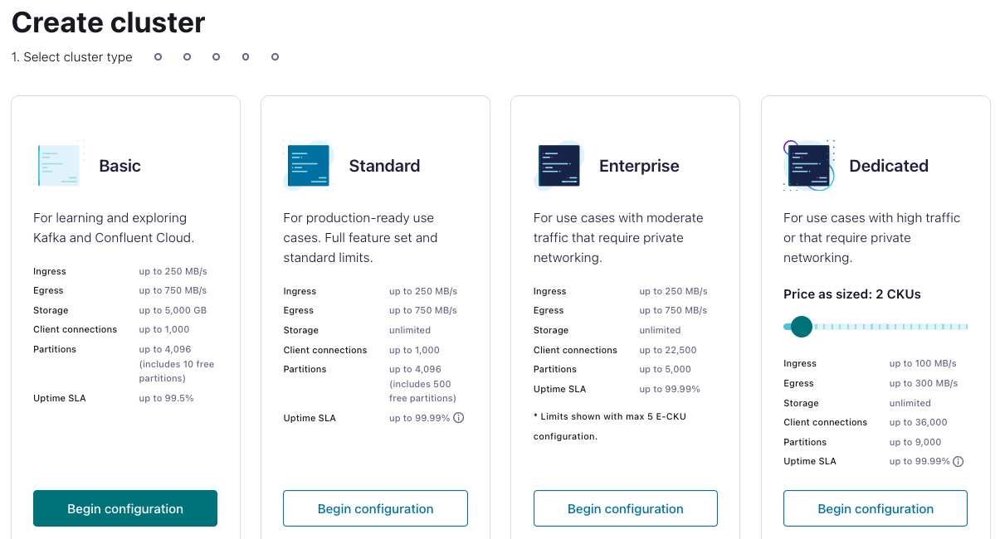
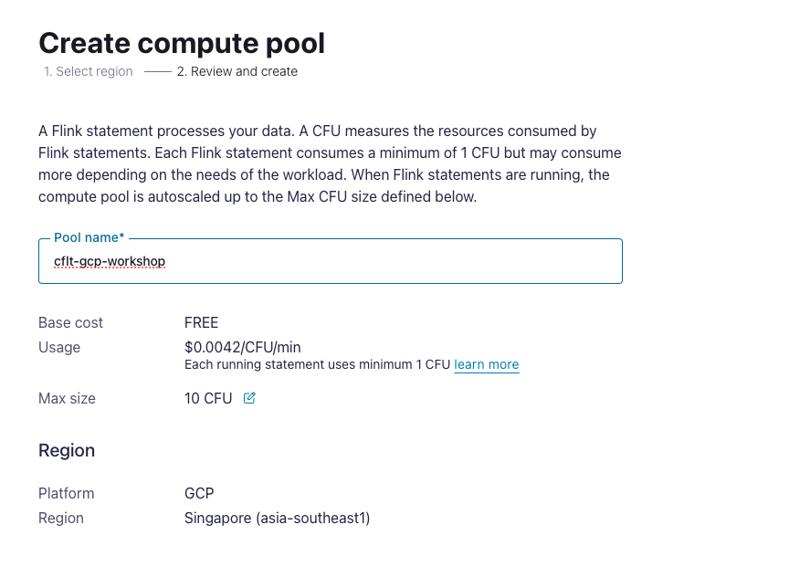
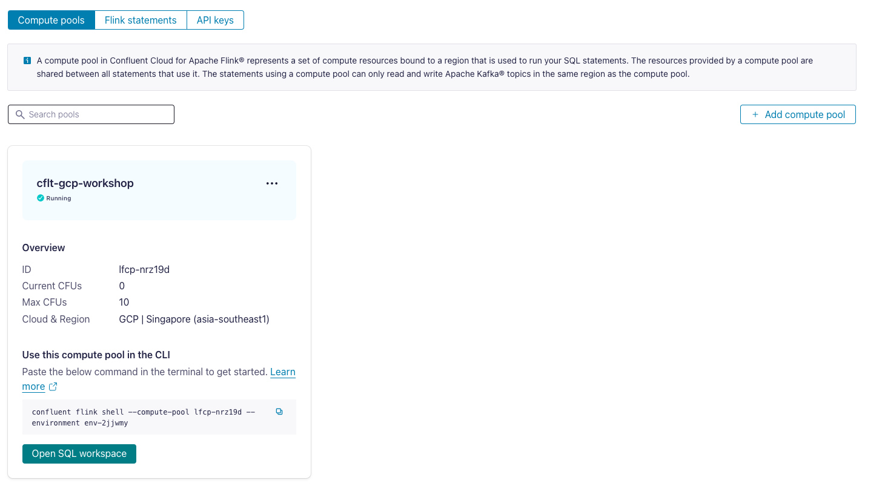
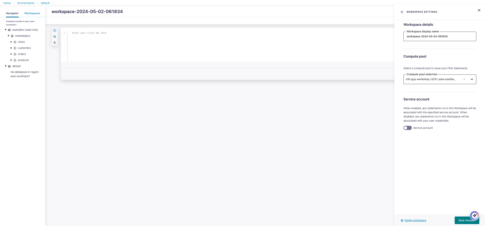
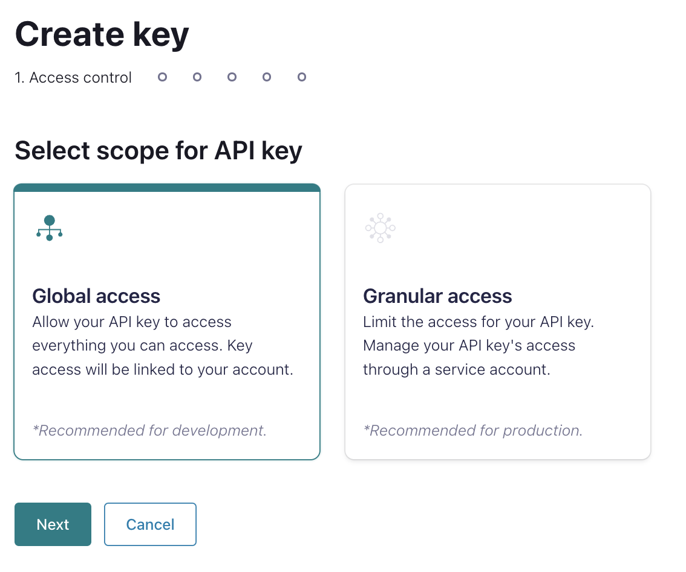
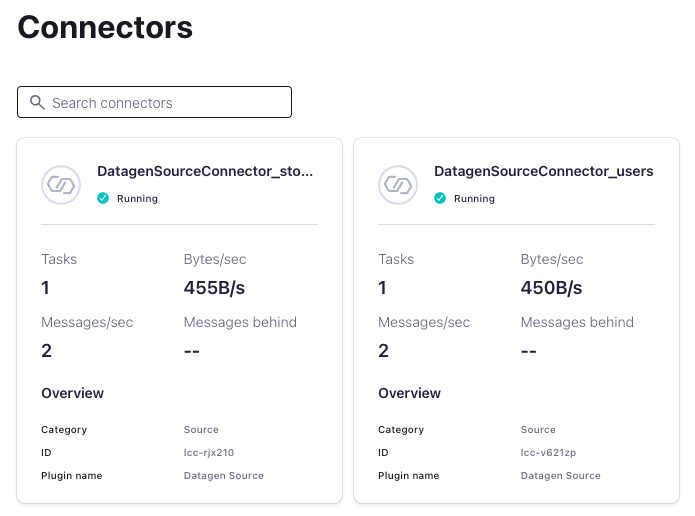
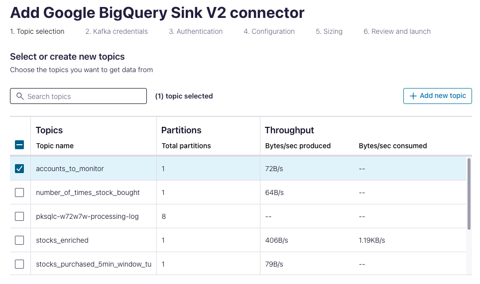
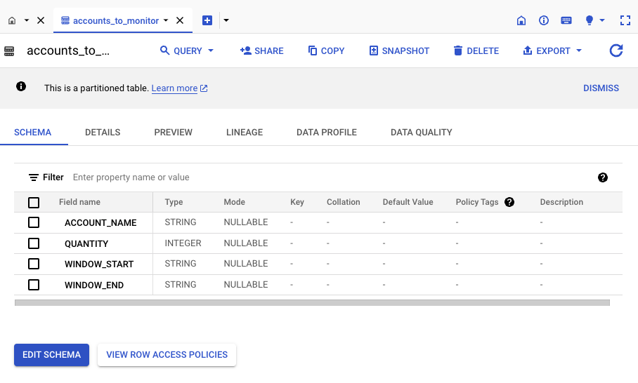
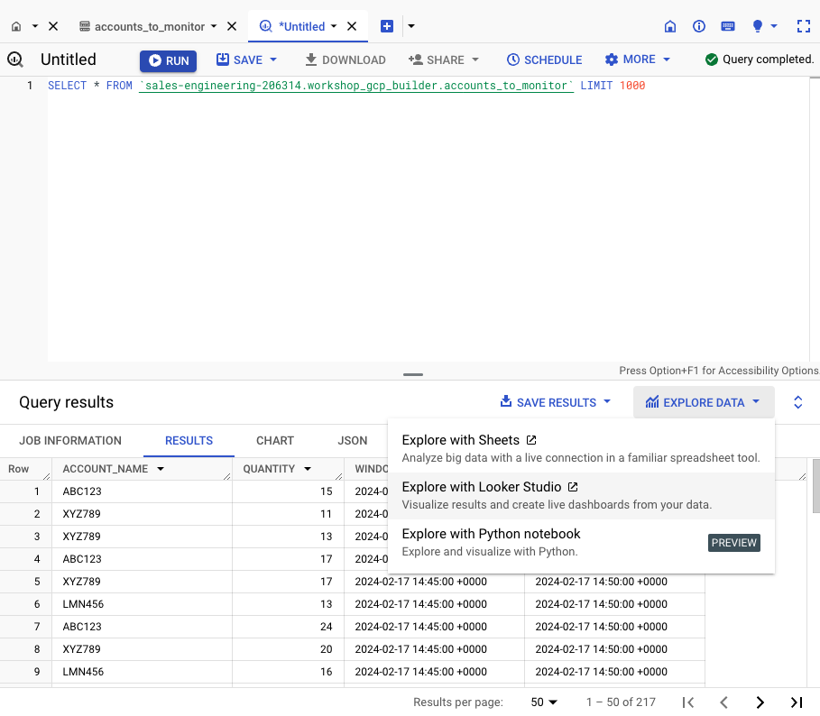

<div align="center">
    
</div>

# <div align="center">Confluent x Google Cloud Data Streaming BUILDER Lab</div>

<br>

## **Agenda**
1. [Log into Confluent Cloud](#step-1)
2. [Create an Environment and Cluster](#step-2)
3. [Create Flink Compute Pool](#step-3)
4. [Create Topics and walk through Confluent Cloud Dashboard](#step-4)
5. [Create an API Key Pair](#step-5)
6. [Create Datagen Connectors for Users and Stocks](#step-6)
7. [Flink Queries](#step-7)
8. [Flink Aggregations](#step-8)
9. [Flink Windowing Functions](#step-9)
10. [Fraud Detection](#step-10)
11. [Check Flink Queries](#step-11)
12. [Connect BigQuery sink to Confluent Cloud](#step-12)
13. [Clean Up Resources](#step-13)
14. [Confluent Resources and Further Testing](#step-14)

***

## **Architecture**

<div align="center" padding=25px>
    
</div>

***

## **Prerequisites**

1. Create a Confluent Cloud Account.
    - Sign up for a Confluent Cloud account [here](https://www.confluent.io/confluent-cloud/tryfree/).
    - Once you have signed up and logged in, click on the menu icon at the upper right hand corner, click on “Billing & payment”, then enter payment details under “Payment details & contacts”. A screenshot of the billing UI is included below.

> **Note:** You will create resources during this workshop that will incur costs. When you sign up for a Confluent Cloud account, you will get free credits to use in Confluent Cloud. This will cover the cost of resources created during the workshop. More details on the specifics can be found [here](https://www.confluent.io/confluent-cloud/tryfree/).

<div align="center" padding=25px>
    
</div>

***

## **Objective**

In this hands-on lab, participants will learn and explore how to leverage Confluent Cloud, powered by Kora Engine, to build a real-time streaming analytics use case and activate the power of data with Google Cloud services such as BigQuery, AutoML, Looker Studio etc.

During the session, we will explore:
- The common challenges of Apache Kafka Deployments
- How you can easily activate Confluent Cloud on Google Cloud Marketplace
- How to connect Google Cloud Services with Confluent Cloud
- The benefits of Confluent Cloud for production workloads on Google Cloud

***


## <a name="step-1"></a>Log into Confluent Cloud

1. Log into [Confluent Cloud](https://confluent.cloud) and enter your email and password.

<div align="center" padding=25px>
    
</div>

2. If you are logging in for the first time, you will see a self-guided wizard that walks you through spinning up a cluster. Please minimize this as you will walk through those steps in this workshop. 

***

## <a name="step-2"></a>Create an Environment and Cluster

An environment contains clusters and its deployed components such as Apache Flink, Connectors, ksqlDB, and Schema Registry. You have the ability to create different environments based on your company's requirements. For example, you can use environments to separate Development/Testing, Pre-Production, and Production clusters. 

1. Click **+ Add Environment**. Specify an **Environment Name** and Click **Create**. 

>**Note:** There is a *default* environment ready in your account upon account creation. You can use this *default* environment for the purpose of this workshop if you do not wish to create an additional environment.

<div align="center" padding=25px>
    
</div>

2. Select **Essentials** for Stream Governance Packages, click **Begin configuration**.

<div align="center" padding=25px>
    
</div>

3. Select **GCP Sydney Region** for Stream Governance Essentials, click **Continue**.

<div align="center" padding=25px>
    
</div>

4. Now that you have an environment, click **Create Cluster**. 

> **Note:** Confluent Cloud clusters are available in 3 types: Basic, Standard, and Dedicated. Basic is intended for development use cases so you will use that for the workshop. Basic clusters only support single zone availability. Standard and Dedicated clusters are intended for production use and support Multi-zone deployments. If you are interested in learning more about the different types of clusters and their associated features and limits, refer to this [documentation](https://docs.confluent.io/current/cloud/clusters/cluster-types.html).

5. Chose the **Basic** cluster type. 

<div align="center" padding=25px>
    
</div>

6. Click **Begin Configuration**. 
7. Choose GCP as Cloud Provider and your preferred, region (Singapore/ asia-southeast1) , and Uptime SLA is default. 

<div align="center" padding=25px>
    
</div>

8. Specify a **Cluster Name**. For the purpose of this lab, any name will work here. 

<div align="center" padding=25px>
    
</div>

9. View the associated *Configuration & Cost*, *Usage Limits*, and *Uptime SLA* information before launching. 
10. Click **Launch Cluster**. 

***

## <a name="step-3"></a>Create a Flink Compute Pool

1. On the navigation menu, select **Flink** and click **Create Compute Pool**.

<div align="center" padding=25px>
    
</div>

2. Select **Region** and then **Continue**.
<div align="center" padding=25px>
    
</div>

3. Name you **Pool Name**. Click **Create**.

<div align="center" padding=25px>
    
</div>

> **Note:** The capacity of a compute pool is measured in CFUs. Compute pools expand and shrink automatically based on the resources required by the statements using them. A compute pool without any running statements scale down to zero. The maximum size of a compute pool is configured during creation. 

4. Flink Compute pools will be ready shortly. You can click **Open SQL workspace** when the pool is ready to use.

<div align="center" padding=25px>
    
</div>

5. Change your workspace name by clicking **settings button**. Click **Save changes** after you update the workspace name.

<div align="center" padding=25px>
    
</div>

6. Set the default Catalog as your environment name.

<div align="center" padding=25px>
    
</div>

7. Set the default Database as your cluster name.

<div align="center" padding=25px>
    
</div>

***

***

## <a name="step-4"></a>Creates Topic and Walk Through Cloud Dashboard

1. On the navigation menu, you will see **Cluster Overview**. 

> **Note:** This section shows Cluster Metrics, such as Throughput and Storage. This page also shows the number of Topics, Partitions, Connectors, and ksqlDB Applications.  Below is an example of the metrics dashboard once you have data flowing through Confluent Cloud. 

<div align="center" padding=25px>
    
</div>

2. Click on **Cluster Settings**. This is where you can find your *Cluster ID, Bootstrap Server, Cloud Details, Cluster Type,* and *Capacity Limits*.
3. On the same navigation menu, select **Topics** and click **Create Topic**. 
4. Enter **users_topic** as the topic name, **1** as the number of partitions, and then click **Create with defaults**. 

<div align="center" padding=25px>
    
</div>

5. Repeat the previous step and create a second topic name **stocks_topic** and **1** as the number of partitions.

> **Note:** Topics have many configurable parameters. A complete list of those configurations for Confluent Cloud can be found [here](https://docs.confluent.io/cloud/current/using/broker-config.html). If you are interested in viewing the default configurations, you can view them in the Topic Summary on the right side. 

7. After topic creation, the **Topics UI** allows you to monitor production and consumption throughput metrics and the configuration parameters for your topics. When you begin sending messages to Confluent Cloud, you will be able to view those messages and message schemas.
8. Below is a look at the topic, **users_topic**, but you need to send data to this topic before you see any metrics.

<div align="center" padding=25px>
    
</div>

***


## <a name="step-5"></a>Create an API Key

1. Click **API Keys** on the navigation menu. 
2. Click **Create Key** in order to create your first API Key. If you have an existing API Key select **+ Add Key** to create another API Key.

<div align="center" padding=25px>
    
</div>

3. Select **Global Access** and then click **Next**. 
4. Copy or save your API Key and Secret somewhere. You will need these later on in the lab, you will not be able to view the secret again once you close this dialogue. 
5. After creating and saving the API key, you will see this API key in the Confluent Cloud UI in the **API Keys** section. If you don’t see the API key populate right away, refresh the browser.

***

## <a name="step-6"></a>Create Datagen Connectors for Users and Stocks

The next step is to produce sample data using the Datagen Source connector. You will create three Datagen Source connectors. One connector will send sample customer data to **users_topic** topic, the other connector will send sample product data to **stocks_topic** topic.

1. First, you will create the connector that will send data to **users_topic**. From the Confluent Cloud UI, click on the **Connectors** tab on the navigation menu. Click on the **Datagen Source** icon.

<div align="center" padding=25px>
    
</div>

2. Enter the following configuration details. The remaining fields can be left blank.

<div align="center">

| setting                            | value                        |
|------------------------------------|------------------------------|
| name                               | DatagenSourceConnector_users |
| api key                            | [*from step 5* ](#step-5)    |
| api secret                         | [*from step 5* ](#step-5)    |
| topic                              | users_topic                  |
| output message format              | AVRO                         |
| quickstart                         | Users                        |
| max interval between messages (ms) | 1000                         |
| tasks                              | 1                            |
</div>

<br>

<div align="center" padding=25px>
    
    
</div>

3. Click on **Show advanced configurations** and complete the necessary fields and click **Continue**.

<div align="center" padding=25px>
    
</div>
   
4. Before launching the connector, you should see something similar to the following. If everything looks similar, select **Launch**. 

<div align="center" padding=25px>
    
</div>

5. Next, create the second connector that will send data to **stocks_topic**. Click on **+ Add Connector** and then the **datagen Source** icon again. 

6. Enter the following configuration details. The remaining fields can be left blank. 

<div align="center">

| setting                            | value                        |
|------------------------------------|------------------------------|
| name                               | DatagenSourceConnector_stocks|
| api key                            | [*from step 5* ](#step-5)    |
| api secret                         | [*from step 5* ](#step-5)    |
| topic                              | stocks_topic                 |
| output message format              | AVRO                         |
| quickstart                         | Stocks trade                 |
| max interval between messages (ms) | 1000                         |
| tasks                              | 1                            |
</div>

<br> 

7. Review the output again and then select **Launch**.

> **Note:** It may take a few moments for the connectors to launch. Check the status and when both are ready, the status should show *running*. <br> <div align="center"></div>

> **Note:** If the connectors fails, there are a few different ways to troubleshoot the error:
> * Click on the *Connector Name*. You will see a play and pause button on this page. Click on the play button.
> * Click on the *Connector Name*, go to *Settings*, and re-enter your API key and secret. Double check there are no extra spaces at the beginning or end of the key and secret that you may have accidentally copied and pasted.
> * If neither of these steps work, try creating another Datagen connector.


8. You can view the sample data flowing into topics in real time. Navigate to  the **Topics** tab and then click on the **users_topic**. You can view the production and consumption throughput metrics here.

9. Click on **Messages**.

* You should now be able to see the messages within the UI. You can view the specific messages by clicking the icon. 

<div align="center">
    
</div> 

* The message details should look something like the following. 

<div align="center">
    
</div>

***

## <a name="step-7"></a>Flink Queries
Kafka topics and schemas are always in sync with our Flink cluster. Any topic created in Kafka is visible directly as a table in Flink, and any table created in Flink is visible as a topic in Kafka. Effectively, Flink provides a SQL interface on top of Confluent Cloud.

Following mappings exist:
| Kafka          | Flink     | 
| ------------   | --------- |
| Environment    | Catalog   | 
| Cluster        | Database  |
| Topic + Schema | Table     |

1. Familiarize with **Flink SQL** Basics.
```sql
SHOW CATALOGS;
```

```
SHOW DATABASES;
```

```sql
SHOW TABLES;
```
<div align="center">
    
</div>

Understand how the table `stocks_topic` was created:

```sql
SHOW CREATE TABLE stocks_topic;
```

You can find more information about all DDL Statements [here.](https://docs.confluent.io/cloud/current/flink/reference/statements/overview.html)

Let us first check the table schema for our `stocks_topic` catalog. This should be the same as the topic schema in Schema Registry.
```sql
DESCRIBE stocks_topic;
```

2. Let's check if any product records exist in the table.
```sql
SELECT * FROM stocks_topic;
```

3. Check if the `users_topic` schema  exists. 
```sql
DESCRIBE users_topic;
```

4. Check the customers in Texas whose name start with `B`.
```sql
SELECT * FROM users_topic
  WHERE `userid` = 'User_8' AND `gender` LIKE 'MA%';
```

5. Check the first five stocks trades for one customer.
```sql
SELECT side,
       quantity,
       symbol,
       $rowtime AS ingestion_time
  FROM stocks_topic
  WHERE userid = 'User_8'
  LIMIT 5;
```


6. Find the message timestamps for all stocks trades of one user.
```sql
SELECT side,
       quantity,
       symbol,
       $rowtime AS ingestion_time
  FROM stocks_topic
  WHERE userid = 'User_8';
```


7. Enrich Stocks Trades information with Users Topic. Create a new table for enriched order information..
```sql
CREATE TABLE stocks_trades_enriched_user_detail(
  userid STRING,
  regionid STRING, 
  gender STRING, 
  side STRING, 
  quantity INT, 
  symbol STRING, 
  price INT, 
  account STRING
)  DISTRIBUTED INTO 3 BUCKETS WITH (
    'changelog.mode' = 'retract'
);
```

8. Insert joined data from 2 tables into the new table. Keep this query running.
```sql
INSERT INTO stocks_trades_enriched_user_detail
     SELECT ut.userid AS userid, 
           regionid, 
           gender, 
           side, 
           quantity, 
           symbol, 
           price, 
           account
    FROM stocks_topic st
    LEFT JOIN users_topic ut
    ON st.userid = ut.userid;
```
9. Add Flink Statement windows by click (+). Check the enriched table by running this query.
```sql
select * from stocks_trades_enriched_user_detail;
```
<div align="center">
    
</div> 


***

## <a name="step-8"></a>Flink Aggregations
1. Find the number of users records.
```sql
SELECT COUNT(userid) AS num_records
FROM users_topic;
```

2. Find the number of unique users records.
```sql
SELECT COUNT(DISTINCT userid) AS num_customers
FROM users_topic;
```

3. For each userid, find the number of stock symbol, average quantity and maximum model price. 
```sql
SELECT userid as user_id, 
       COUNT(DISTINCT symbol) as stock_by_symbol,
       ROUND(AVG(quantity),2) as avg_quantity,
       MAX(price) as max_price
FROM stocks_topic
GROUP BY userid;
```
4. Running query to aggregate the data by counting buys of stocks. 
```sql
SELECT symbol,
       COUNT(quantity) AS total_times_bought
FROM stocks_topic
WHERE side = 'BUY'
GROUP BY symbol
```

5. Create new table number_of_times_stock_bought to store the result. 
```sql
CREATE TABLE number_of_times_stock_bought(
  symbol STRING,
  total_times_bought BIGINT,
  PRIMARY KEY (symbol) NOT ENFORCED
) DISTRIBUTED INTO 3 BUCKETS;
```

6. Insert all the aggregate the data by counting buys of stocks to the number_of_times_stock_bought table. 
```sql
INSERT INTO number_of_times_stock_bought
SELECT symbol,
       COUNT(quantity) AS total_times_bought
FROM stocks_topic
WHERE side = 'BUY'
GROUP BY symbol
```
7. Add Flink Statement windows by click (+). Running query to the number_of_times_stock_bought table. 
```sql
select * from number_of_times_stock_bought;
```
8. Next, create a table that calculates the total number of stocks purchased per symbol.  
```sql
SELECT symbol,
           SUM(quantity) AS total_quantity
FROM stocks_topic
WHERE side = 'BUY'
GROUP BY symbol
```
9. Create new table total_stock_purchased to store the result. 
```sql
CREATE TABLE total_stock_purchased(
  symbol STRING,
  total_quantity BIGINT,
  PRIMARY KEY (symbol) NOT ENFORCED
) DISTRIBUTED INTO 3 BUCKETS;
```

10. Insert all the aggregate the data by counting buys of stocks to the number_of_times_stock_bought table. 
```sql
INSERT INTO total_stock_purchased
SELECT symbol,
       SUM(quantity) AS total_quantity 
FROM stocks_topic
WHERE side = 'BUY'
GROUP BY symbol
```
11. Add Flink Statement windows by click (+). Check the result by running query to the total_stock_purchased table. 
```sql
select * from total_stock_purchased;
```
> **Note:** Check this [link](https://docs.confluent.io/cloud/current/flink/reference/functions/aggregate-functions.html) for more information about Flink aggregation functions.

***

## <a name="step-9"></a>Flink Windowing Functions
Windows are central to processing infinite streams. Windows split the stream into “buckets” of finite size, over which you can apply computations. This document focuses on how windowing is performed in Confluent Cloud for Apache Flink and how you can benefit from windowed functions.

Flink provides several window table-valued functions (TVF) to divide the elements of your table into windows, including:

a. [Tumble Windows](https://docs.confluent.io/cloud/current/flink/reference/queries/window-tvf.html#flink-sql-window-tvfs-tumble)
<br> 
b. [Hop Windows](https://docs.confluent.io/cloud/current/flink/reference/queries/window-tvf.html#flink-sql-window-tvfs-hop)
<br> 
c. [Cumulate Windows](https://docs.confluent.io/cloud/current/flink/reference/queries/window-tvf.html#flink-sql-window-tvfs-cumulate)
<br> 

1. Find the amount of stocks trades for five minute intervals (tumbling window aggregation).
```sql
SELECT window_end,
       COUNT(side) AS num_orders
FROM TABLE(
  TUMBLE(TABLE stocks_topic, DESCRIPTOR(`$rowtime`), INTERVAL '5' MINUTES))
GROUP BY window_end;
```

2. Find the amount of stocks trades for ten minute intervals advanced by five minutes (hopping window aggregation).
```sql
SELECT window_start,
       window_end,
       COUNT(side) AS num_orders
FROM TABLE(
  HOP(TABLE stocks_topic, DESCRIPTOR(`$rowtime`), INTERVAL '5' MINUTES, INTERVAL '10' MINUTES))
GROUP BY window_start, window_end;
```

> **Note:** Check this [link](https://docs.confluent.io/cloud/current/flink/reference/queries/window-tvf.html) for the detailed information about Flink Window aggregations.

***

## <a name="step-10"></a>Fraud Detection

After we walked through a few examples on how to use Flink for Windowing, Tumble Windows and Hop Windows, We will use it including how to use it for anomaly or fraud detection. Flink enables aggregation operations on tables, as you saw in the previous step, and you have the ability to set time boundaries named windows. A window has a start time and an end time, which you access in your queries by using WINDOWSTART and WINDOWEND. When using Windowing, aggregate functions are applied only to the records that occur within the specified time window. 

1. Create table stocks_purchased_today
```sql
CREATE TABLE stocks_purchased_today(
  symbol STRING,
  window_start TIMESTAMP,
  window_end TIMESTAMP,
  quantity BIGINT,
  PRIMARY KEY (symbol, window_start,window_end) NOT ENFORCED
) DISTRIBUTED INTO 3 BUCKETS;
```

2. Insert data into the new table created above.
```sql
insert into stocks_purchased_today
SELECT symbol,window_start,
  window_end,     
  COUNT(*) AS quantity
FROM TABLE(
  TUMBLE(TABLE stocks_topic, DESCRIPTOR(`$rowtime`), INTERVAL '5' MINUTES))
GROUP BY symbol,window_end,window_start;
```

3. Add Flink Statement windows by click (+). Once you have created the windowed table, and you have inserted the data , use the Flink Workspace to query the table. If you construct the statement on your own, make sure it looks like the following..
```sql
select * from stocks_purchased_today
```

4. Going along with the theme of fraud detection, create a table named accounts_to_monitor with accounts to monitor based on their activity during a given time frame. In the Flink Workspace , paste the following statement and run the query. Change XXX with your random number.
```sql
CREATE TABLE accounts_to_monitor_XXX(
  window_start_key TIMESTAMP,
  window_end_key TIMESTAMP,
  accountid STRING,
  window_start TIMESTAMP ,
  window_end TIMESTAMP,
  account STRING,
  quantity BIGINT,
  PRIMARY KEY (window_start_key,window_end_key,accountid) NOT ENFORCED
) DISTRIBUTED INTO 3 BUCKETS;
```
5. Insert data into the new table created above.
```sql
INSERT INTO accounts_to_monitor_XXX
SELECT window_start as window_start_key,
  window_end as window_end_key,
  account as accountid,
  window_start,
  window_end,
  account, 
  COUNT(*) AS quantity
FROM TABLE(
  TUMBLE(TABLE stocks_topic, DESCRIPTOR(`$rowtime`), INTERVAL '5' MINUTES))
GROUP BY window_end,window_start,account
HAVING COUNT(*)>10;
```
6. Add Flink Statement windows by click (+). Verify the result.
  ```sql
Select * from  accounts_to_monitor_XXX;
``` 
***

## <a name="step-11"></a>Check Flink Queries

Building on our Fraud Detection example from the last step, let’s say our fraud service wants to check on high frequency accounts. Then we can monitor the activity for a suspicious account. 


1. In the Flink Statement Editor. We run this query in the Editor to see how our accounts are behaving.  

```sql
SELECT * FROM accounts_to_monitor_XXX
     WHERE quantity > 100;
```
2. Once we have identified a potential troublemaker, we can create an ephemeral push query to monitor future trades from our **STOCKS_ENRICHED** stream. This will continue to push trades to the fraud service for further analysis until it is stopped. 

```sql
SELECT * FROM stocks_trades_enriched_user_detail 
	WHERE account = 'ABC123';
```

***

## <a name="step-12"></a>Connect BigQuery sink to Confluent Cloud

The next step is to sink data from Confluent Cloud into BigQuery using the [fully-managed BigQuery Sink connector](https://docs.confluent.io/cloud/current/connectors/cc-gcp-bigquery-storage-sink.html). The connector will send real time data on **accounts_to_monitor** into BigQuery.

1. First, you will create the connector that will automatically create a BigQuery table and populate that table with the data from the promotions topic within Confluent Cloud. From the Confluent Cloud UI, click on the Connectors tab on the navigation menu and select **+Add connector**. Search and click on the BigQuery Sink icon.

<div align="center">
    
</div>

2. Enter the following configuration details. The remaining fields can be left blank.

<div align="center">

| Setting                | Value                              |
|------------------------|------------------------------------|
| `Topics `              | accounts_to_monitor_XXX            |
| `Kafka API Key`        | From step 5                        |
| `Kafka API Secret`     | From step 5                        |
| `Authentication method`| Google cloud service account       |
| `GCP Credential file`  | Upload your_gcp_credential_json_file |
| `Project ID `          | your_project_ID                    |
| `Dataset`		 | accounts_to_monitor                |
| `Ingestion Mode`       | streaming                          |
| `Input Kafka format`   | AVRO                               |
| `Sanitze topics `      | true                               |
| `Sanitize field name`  | true                               |
| `Auto create table`    | PARTITION by INGESTION TIME        |
| `Partitioning type`    | DAY                                |
| `Max poll interval (ms)`| 60000                              |
| `Tasks`                | 1                                  |
| `Name`                 | BigQueryStorageSinkConnector_accounts_to_monitor    |


</div>

- Topic Selection
<div align="center">
    
</div>

<br>

- Authentication
<div align="center">
    
</div>

3. Click on **Next**.

4. Before launching the connector, you will be brought to the summary page.  Once you have reviewed the configs and everything looks good, select **Launch**.

<div align="center">
    
</div>

5. This should return you to the main Connectors landing page. Wait for your newly created connector to change status from **Provisioning** to **Running**.

6. Shortly after, please switch over to the BigQuery page within Google Console to show that a table matching the topic name you used when creating the BigQuery connector in Confluent Cloud has been created within the dataset that you have provided.  Clicking the table name should open a BigQuery editor for it.

<div align="center">
    
</div>

7. Query results in Bigquery.

<div align="center">
    
</div>

8. Explore data in Looker Studio.

<div align="center">
    
</div>

<br>

- Looker Studio
<div align="center">
    
</div>

***

## <a name="step-13"></a>Clean Up Resources

Deleting the resources you created during this workshop will prevent you from incurring additional charges. 

1. The first item to delete is the Apache Flink Compute Pool. Select the **Delete** button under **Actions** and enter the **Application Name** to confirm the deletion. 

<div align="center">
    
</div>

2. Delete the BigQuery sink connector by navigating to **Connectors** in the navigation panel, clicking your connector name, then clicking the trash can icon in the upper right and entering the connector name to confirm the deletion.

<div align="center">
    
</div>

3. Next, delete the Datagen Source connectors for **users** and **stocks**. 

4. Delete the Cluster by going to the **Settings** tab and then selecting **Delete cluster**.

<div align="center">
    
</div>

5. Delete the Environment by expanding right hand menu and going to **Environments** tab and then clicking on **Delete** for the associated Environment you would like to delete

*** 

## <a name="step-14"></a>Confluent Resources and Further Testing

Here are some links to check out if you are interested in further testing:
- [Confluent Cloud Documentation](https://docs.confluent.io/cloud/current/overview.html)
- [Best Practices for Developing Apache Kafka Applications on Confluent Cloud](https://assets.confluent.io/m/14397e757459a58d/original/20200205-WP-Best_Practices_for_Developing_Apache_Kafka_Applications_on_Confluent_Cloud.pdf)


