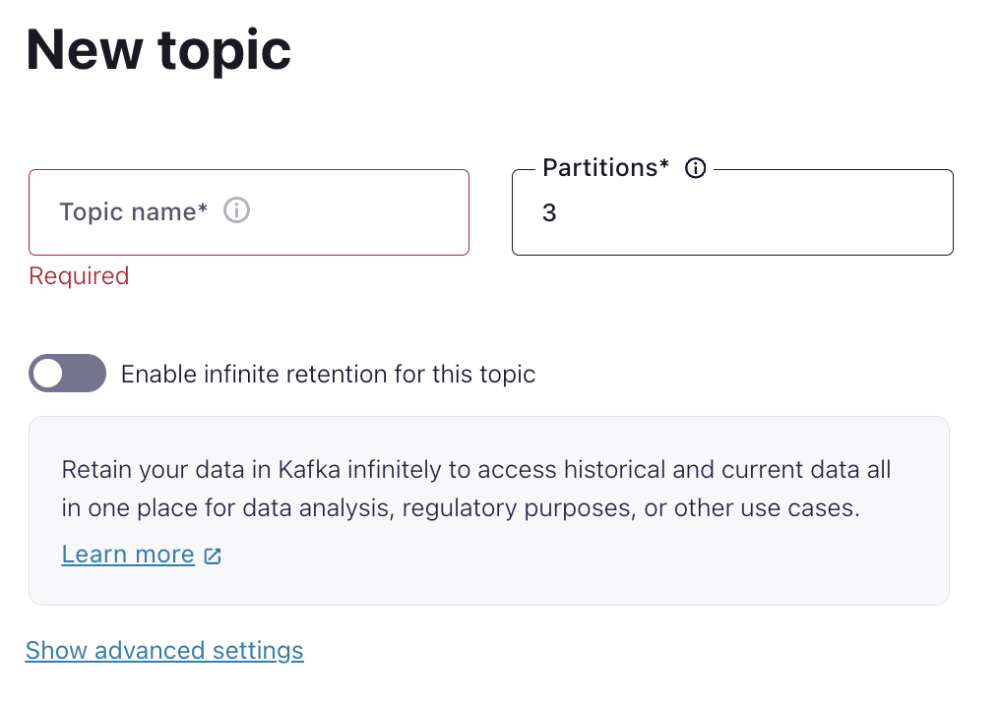
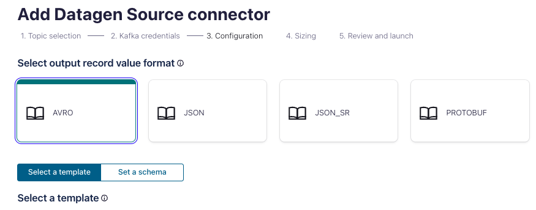
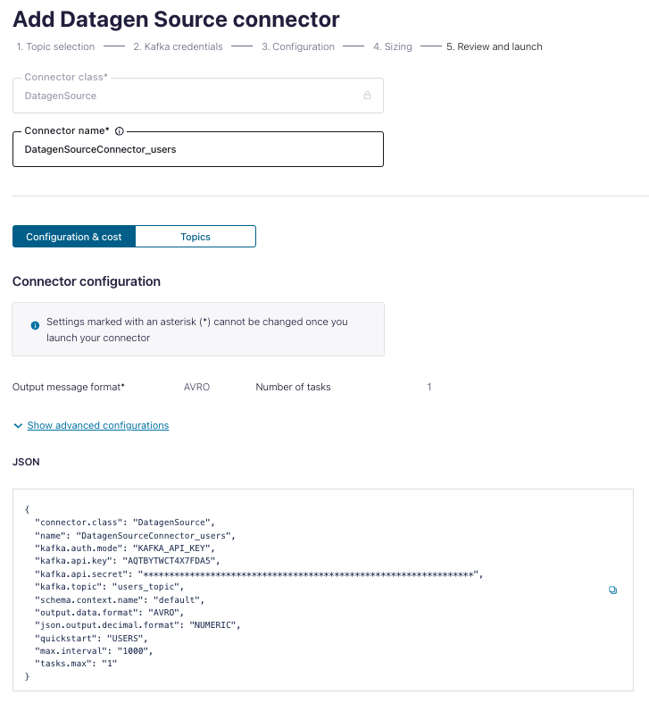
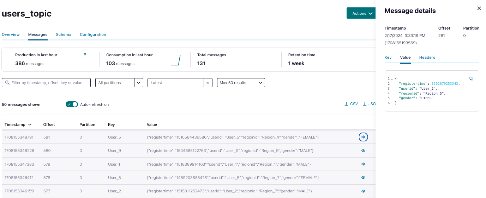
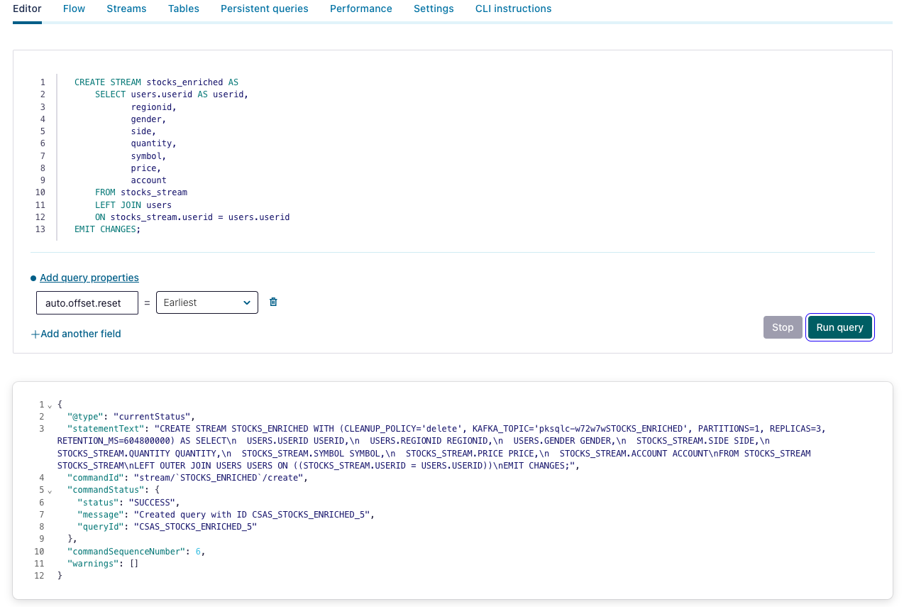

<div align="center">
    
</div>

# <div align="center">Confluent x Google Cloud Data Streaming BUILDER Live Lab</div>

## Introduction

In this hands-on lab, participants will learn and explore how to leverage Confluent Cloud, powered by Kora Engine, to build a real-time streaming analytics use case and activate the power of data with Google Cloud services such as BigQuery, AutoML, Data Studio etc.

During the session, we will explore:
- The common challenges of Apache Kafka Deployments
- How you can easily activate Confluent Cloud on Google Cloud Marketplace
- How to connect Google Cloud Services with Confluent Cloud
- The benefits of Confluent Cloud for production workloads on Google Cloud


<br>

## **Agenda**
1. [Log into Confluent Cloud](#step-1)
2. [Create an Environment and Cluster](#step-2)
3. [Create ksqlDB Application](#step-3)
4. [Create Topics and walk through Confluent Cloud Dashboard](#step-4)
5. [Create an API Key Pair](#step-5)
6. [Create Datagen Connectors for Users and Stocks](#step-6)
7. [Create a Stream and a Table](#step-7)
8. [Create a Persistent Query](#step-8)
9. [Aggregate data](#step-9)
10. [Windowing Operations and Fraud Detection](#step-10)
11. [Pull Queries](#step-11)
12. [Clean Up Resources](#step-12)
13. [Confluent Resources and Further Testing](#step-13)

***

## **Prerequisites**
<br>

1. Create a Confluent Cloud Account.
    - Sign up for a Confluent Cloud account [here](https://www.confluent.io/confluent-cloud/tryfree/).
    - Once you have signed up and logged in, click on the menu icon at the upper right hand corner, click on “Billing & payment”, then enter payment details under “Payment details & contacts”. A screenshot of the billing UI is included below.

> **Note:** You will create resources during this workshop that will incur costs. When you sign up for a Confluent Cloud account, you will get free credits to use in Confluent Cloud. This will cover the cost of resources created during the workshop. More details on the specifics can be found [here](https://www.confluent.io/confluent-cloud/tryfree/).

<div align="center" padding=25px>
    
</div>

***

## **Objective**

<br>

Welcome to “Enable Real-Time Data Transformations and Stream Processing with Apache Flink on Confluent Cloud”! In this workshop, you will learn how to build stream processing applications using Apache Flink on Confluent Cloud as well as learn about the use cases Apache Flink unlocks: streaming ETL, data discovery and enrichment, anomaly detection, and more.

In this workshop, you will have learned how to leverage Apache Flink to perform continuous transformations, create materialized views, and serve lookups against these materialized views all with the data you already have in Confluent Cloud.

***


## <a name="step-1"></a>Log into Confluent Cloud

1. Log into [Confluent Cloud](https://confluent.cloud) and enter your email and password.

<div align="center" padding=25px>
    
</div>

2. If you are logging in for the first time, you will see a self-guided wizard that walks you through spinning up a cluster. Please minimize this as you will walk through those steps in this workshop. 

***

## <a name="step-2"></a>Create an Environment and Cluster

An environment contains clusters and its deployed components such as Apache Flink, Connectors, ksqlDB, and Schema Registry. You have the ability to create different environments based on your company's requirements. For example, you can use environments to separate Development/Testing, Pre-Production, and Production clusters. 

1. Click **+ Add Environment**. Specify an **Environment Name** and Click **Create**. 

>**Note:** There is a *default* environment ready in your account upon account creation. You can use this *default* environment for the purpose of this workshop if you do not wish to create an additional environment.

<div align="center" padding=25px>
    
</div>

2. Select **Essentials** for Stream Governance Packages, click **Begin configuration**.

<div align="center" padding=25px>
    
</div>

3. Select **GCP Sydney Region** for Stream Governance Essentials, click **Continue**.

<div align="center" padding=25px>
    
</div>

4. Now that you have an environment, click **Create Cluster**. 

> **Note:** Confluent Cloud clusters are available in 3 types: Basic, Standard, and Dedicated. Basic is intended for development use cases so you will use that for the workshop. Basic clusters only support single zone availability. Standard and Dedicated clusters are intended for production use and support Multi-zone deployments. If you are interested in learning more about the different types of clusters and their associated features and limits, refer to this [documentation](https://docs.confluent.io/current/cloud/clusters/cluster-types.html).

5. Chose the **Basic** cluster type. 

<div align="center" padding=25px>
    
</div>

6. Click **Begin Configuration**. 
7. Choose GCP as Cloud Provider and your preferred, region, and availability zone accordingly. 
8. Specify a **Cluster Name**. For the purpose of this lab, any name will work here. 

<div align="center" padding=25px>
    
</div>

9. View the associated *Configuration & Cost*, *Usage Limits*, and *Uptime SLA* information before launching. 
10. Click **Launch Cluster**. 

***

## <a name="step-3"></a>Create a ksqlDB Application

1. On the navigation menu, select **ksqlDB** and click **Create Application Myself**. 
2. Select **Global Access** and then **Continue**.
3. Name you ksqlDB application and set the streaming units to **1**. Click **Launch Application!**

> **Note:** A Confluent Streaming Unit is the unit of pricing for Confluent Cloud ksqlDB. A CSU is an abstract unit that represents the size of your kSQL cluster and scales linearly. 

<div align="center" padding=25px>
    
</div>

***

## <a name="step-4"></a>Creates Topic and Walk Through Cloud Dashboard

1. On the navigation menu, you will see **Cluster Overview**. 

> **Note:** This section shows Cluster Metrics, such as Throughput and Storage. This page also shows the number of Topics, Partitions, Connectors, and ksqlDB Applications.  Below is an example of the metrics dashboard once you have data flowing through Confluent Cloud. 

<div align="center" padding=25px>
    
</div>

2. Click on **Cluster Settings**. This is where you can find your *Cluster ID, Bootstrap Server, Cloud Details, Cluster Type,* and *Capacity Limits*.
3. On the same navigation menu, select **Topics** and click **Create Topic**. 
4. Enter **users_topic** as the topic name, **1** as the number of partitions, and then click **Create with defaults**. 

<div align="center" padding=25px>
    
</div>

5. Repeat the previous step and create a second topic name **stocks_topic** and **1** as the number of partitions.

> **Note:** Topics have many configurable parameters. A complete list of those configurations for Confluent Cloud can be found [here](https://docs.confluent.io/cloud/current/using/broker-config.html). If you are interested in viewing the default configurations, you can view them in the Topic Summary on the right side. 

7. After topic creation, the **Topics UI** allows you to monitor production and consumption throughput metrics and the configuration parameters for your topics. When you begin sending messages to Confluent Cloud, you will be able to view those messages and message schemas.
8. Below is a look at the topic, **users_topic**, but you need to send data to this topic before you see any metrics.

<div align="center" padding=25px>
    
</div>

***


## <a name="step-5"></a>Create an API Key

1. Click **API Keys** on the navigation menu. 
2. Click **Create Key** in order to create your first API Key. If you have an existing API Key select **+ Add Key** to create another API Key.

<div align="center" padding=25px>
    
</div>

3. Select **Global Access** and then click **Next**. 
4. Copy or save your API Key and Secret somewhere. You will need these later on in the lab, you will not be able to view the secret again once you close this dialogue. 
5. After creating and saving the API key, you will see this API key in the Confluent Cloud UI in the **API Keys** section. If you don’t see the API key populate right away, refresh the browser.

***

## <a name="step-6"></a>Create Datagen Connectors for Users and Stocks

The next step is to produce sample data using the Datagen Source connector. You will create three Datagen Source connectors. One connector will send sample customer data to **users_topic** topic, the other connector will send sample product data to **stocks_topic** topic.

1. First, you will create the connector that will send data to **users_topic**. From the Confluent Cloud UI, click on the **Connectors** tab on the navigation menu. Click on the **Datagen Source** icon.

<div align="center" padding=25px>
    
</div>

2. Enter the following configuration details. The remaining fields can be left blank.

<div align="center">

| setting                            | value                        |
|------------------------------------|------------------------------|
| name                               | DatagenSourceConnector_users |
| api key                            | [*from step 5* ](#step-5)    |
| api secret                         | [*from step 5* ](#step-5)    |
| topic                              | users_topic                  |
| output message format              | AVRO                         |
| quickstart                         | Users                        |
| max interval between messages (ms) | 1000                         |
| tasks                              | 1                            |
</div>

<br>

<div align="center" padding=25px>
    
    
</div>

3. Click on **Show advanced configurations** and complete the necessary fields and click **Continue**.

<div align="center" padding=25px>
    
</div>
   
4. Before launching the connector, you should see something similar to the following. If everything looks similar, select **Launch**. 

<div align="center" padding=25px>
    
</div>

5. Next, create the second connector that will send data to **stocks_topic**. Click on **+ Add Connector** and then the **datagen Source** icon again. 

6. Enter the following configuration details. The remaining fields can be left blank. 

<div align="center">

| setting                            | value                        |
|------------------------------------|------------------------------|
| name                               | DatagenSourceConnector_stocks|
| api key                            | [*from step 5* ](#step-5)    |
| api secret                         | [*from step 5* ](#step-5)    |
| topic                              | stocks_topic                 |
| output message format              | AVRO                         |
| quickstart                         | Stocks trade                 |
| max interval between messages (ms) | 1000                         |
| tasks                              | 1                            |
</div>

<br> 

7. Review the output again and then select **Launch**.

> **Note:** It may take a few moments for the connectors to launch. Check the status and when both are ready, the status should show *running*. <br> <div align="center"></div>

> **Note:** If the connectors fails, there are a few different ways to troubleshoot the error:
> * Click on the *Connector Name*. You will see a play and pause button on this page. Click on the play button.
> * Click on the *Connector Name*, go to *Settings*, and re-enter your API key and secret. Double check there are no extra spaces at the beginning or end of the key and secret that you may have accidentally copied and pasted.
> * If neither of these steps work, try creating another Datagen connector.


8. You can view the sample data flowing into topics in real time. Navigate to  the **Topics** tab and then click on the **users_topic**. You can view the production and consumption throughput metrics here.

9. Click on **Messages**.

* You should now be able to see the messages within the UI. You can view the specific messages by clicking the icon. 

<div align="center">
    
</div> 

* The message details should look something like the following. 

<div align="center">
    
</div>

***

## <a name="step-7"></a>Create a Stream and a Table

Now that you are producing a continuous stream of data to **users_topic** and **stocks_topic**, you will use ksqlDB to understand the data better by performing continuous transformations, masking certain fields, and creating new derived topics with the enriched data.

You will start by creating a stream and table, which will be the foundation for your transformations in the upcoming steps.

A *stream* provides immutable data. It is append only for new events; existing events cannot be changed. Streams are persistent, durable, and fault tolerant. Events in a stream can be keyed.

A *table* provides mutable data. New events—rows—can be inserted, and existing rows can be updated and deleted. Like streams, tables are persistent, durable, and fault tolerant. A table behaves much like an RDBMS materialized view because it is being changed automatically as soon as any of its input streams or tables change, rather than letting you directly run insert, update, or delete operations against it.

To learn more about *streams* and *tables*, the following resources are recommended:
- [Streams and Tables in Apache Kafka: A Primer](https://www.confluent.io/blog/kafka-streams-tables-part-1-event-streaming/)
- [ksqlDB: Data Definition](https://docs.ksqldb.io/en/latest/reference/sql/data-definition/)

<br>

1. Navigate back to the **ksqlDB** tab and click on your application name. This will bring us to the ksqlDB editor. 

> **Note:** You can interact with ksqlDB through the **Editor**. You can create a stream by using the `CREATE STREAM` statement and a table using the `CREATE TABLE` statement. <br><br>To write streaming queries against **users_topic** and **stocks_topic**, you will need to register the topics with ksqlDB as a stream and/or table. 

2. First, create a **Stream** by registering the **stocks_topic** as a stream called **stocks_stream**. 

```sql
CREATE STREAM stocks_stream (
    side varchar, 
    quantity int, 
    symbol varchar, 
    price int, 
    account varchar, 
    userid varchar
) 
WITH (kafka_topic='stocks_topic', value_format='AVRO');
```

<div align="center">
    
</div>

<div align="center">
    
</div>


3. Next, go to the **Streams** tab at the top and click on **STOCKS_STREAM**. This provides information on the stream, output topic (including replication, partitions, and key and value serialization), and schemas.

<div align="center">
    
</div>

4. Click on **Query Stream** which will take you back to the **Editor**. You will see the following query auto-populated in the editor which may be already running by default. If not, click on **Run query**. To see data already in the topic, you can set the `auto.offset.reset=earliest` property before clicking **Run query**. <br> <br> Optionally, you can navigate to the editor and construct the select statement on your own, which should look like the following.

```sql
SELECT * FROM STOCKS_STREAM EMIT CHANGES;
```

5. You should see the following data within your **STOCKS_STREAM** stream.

<div align="center">
    
</div>

6. Click **Stop**. 
7. Next, create a **Table** by registering the **users_topic** as a table named **users**. Copy the following code into the **Editor** and click **Run**. 

```sql
CREATE TABLE users (
    userid varchar PRIMARY KEY, 
    registertime bigint, 
    gender varchar, 
    regionid varchar
) 
WITH (KAFKA_TOPIC='users_topic', VALUE_FORMAT='AVRO');
```

8. Once you have created the **USERS** table, repeat what you did above with **STOCKS_STREAMS** and query the **USERS** table. This time, select the **Tables** tab and then select the **USERS** table. You can also set the `auto.offset.reset=earliest`. Like above, if you prefer to construct the statement on your own, make sure it looks like the following. 

```sql
SELECT * FROM USERS EMIT CHANGES;
```

 * You should see the following data in the messages output.

<div align="center">
    
</div>

> **Note:** Note: If the output does not show up immediately, you may have done everything correctly and it just needs a moment. Setting `auto.offset.reset=earliest` also helps output data faster since the messages are already in the topics.

9. Stop the query by clicking **Stop**. 

***

## <a name="step-8"></a>Create a Persistent Query

A *Persistent Query* runs indefinitely as it processes rows of events and writes to a new topic. You can create persistent queries by deriving new streams and new tables from existing streams or tables.

1. Create a **Persistent Query** named **stocks_enriched** by left joining the stream (**STOCKS_STREAM**) and table (**USERS**). Navigate to the **Editor** and paste the following command.

```sql
CREATE STREAM stocks_enriched AS
    SELECT users.userid AS userid, 
           regionid, 
           gender, 
           side, 
           quantity, 
           symbol, 
           price, 
           account
    FROM stocks_stream
    LEFT JOIN users
    ON stocks_stream.userid = users.userid
EMIT CHANGES;
```

<div align="center">
    
</div> 

2. Using the **Editor**, query the new stream. You can either type in a select statement or you can navigate to the stream and select the query button, similar to how you did it in a previous step. You can also choose to set `auto.offset.reset=earliest`. Your statement should be the following. 

```sql
SELECT * FROM STOCKS_ENRICHED EMIT CHANGES;
```
* The output from the select statement should be similar to the following: <br> 

<div align="center">
    
</div> 

> **Note:** Now that you have a stream of records from the left join of the **USERS** table and **STOCKS_STREAM** stream, you can view the relationship between user and trades in real-time.

4. Next, view the topic created when you created the persistent query with the left join. Navigate to the **Topics** tab on the left hand menu and then select the topic prefixed with a unique ID followed by **STOCKS_ENRICHED**. It should resemble **pksqlc-xxxxxSTOCKS_ENRICHED**. 

<div align="center">
    
</div>

5. Navigate to **Consumers** on the left hand menu and find the group that corresponds with your **STOCKS_ENRICHED** stream. See the screenshot below as an example. This view shows how well your persistent query is keeping up with the incoming data. You can monitor the consumer lag, current and end offsets, and which topics it is consuming from.

<div align="center">
    
</div>


