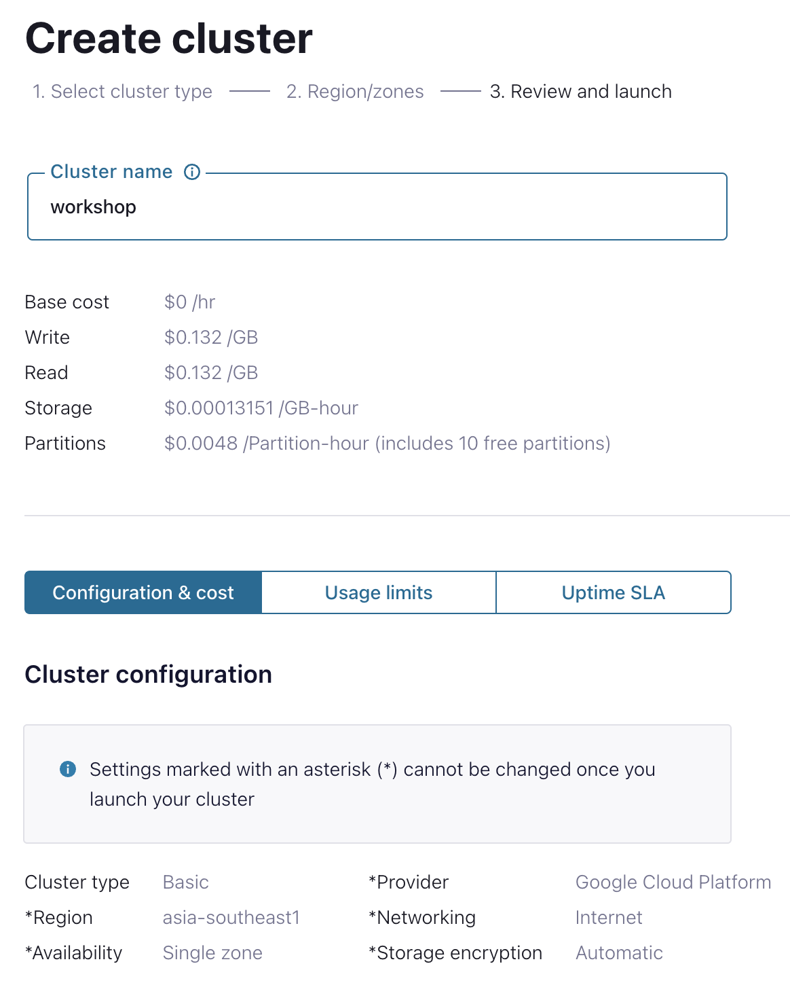

    

# 
Confluent x Google Cloud Data Streaming BUILDER Live Lab

## Introduction

In this hands-on lab, participants will learn and explore how to leverage Confluent Cloud, powered by Kora Engine, to build a real-time streaming analytics use case and activate the power of data with Google Cloud services such as BigQuery, AutoML, Data Studio etc.

During the session, we will explore:
- The common challenges of Apache Kafka Deployments
- How you can easily activate Confluent Cloud on Google Cloud Marketplace
- How to connect Google Cloud Services with Confluent Cloud
- The benefits of Confluent Cloud for production workloads on Google Cloud

 

## **Agenda**
1. [Log into Confluent Cloud](#step-1)
2. [Create an Environment and Cluster](#step-2)
3. [Create ksqlDB Application](#step-3)
4. [Create Topics and walk through Confluent Cloud Dashboard](#step-4)
5. [Create an API Key Pair](#step-5)
6. [Create Datagen Connectors for Users and Stocks](#step-6)
7. [Create a Stream and a Table](#step-7)
8. [Create a Persistent Query](#step-8)
9. [Aggregate data](#step-9)
10. [Windowing Operations and Fraud Detection](#step-10)
11. [Pull Queries](#step-11)
12. [Clean Up Resources](#step-12)
13. [Confluent Resources and Further Testing](#step-13)

***

## **Prerequisites**
 

1. Create a Confluent Cloud Account.
    - Sign up for a Confluent Cloud account [here](https://www.confluent.io/confluent-cloud/tryfree/).
    - Once you have signed up and logged in, click on the menu icon at the upper right hand corner, click on “Billing & payment”, then enter payment details under “Payment details & contacts”. A screenshot of the billing UI is included below.

> **Note:** You will create resources during this workshop that will incur costs. When you sign up for a Confluent Cloud account, you will get free credits to use in Confluent Cloud. This will cover the cost of resources created during the workshop. More details on the specifics can be found [here](https://www.confluent.io/confluent-cloud/tryfree/).

    

***

## **Objective**

 

Welcome to “Enable Real-Time Data Transformations and Stream Processing with Apache Flink on Confluent Cloud”! In this workshop, you will learn how to build stream processing applications using Apache Flink on Confluent Cloud as well as learn about the use cases Apache Flink unlocks: streaming ETL, data discovery and enrichment, anomaly detection, and more.

In this workshop, you will have learned how to leverage Apache Flink to perform continuous transformations, create materialized views, and serve lookups against these materialized views all with the data you already have in Confluent Cloud.

***

## Log into Confluent Cloud

1. Log into [Confluent Cloud](https://confluent.cloud) and enter your email and password.

    

2. If you are logging in for the first time, you will see a self-guided wizard that walks you through spinning up a cluster. Please minimize this as you will walk through those steps in this workshop. 

***

## Create an Environment and Cluster

An environment contains clusters and its deployed components such as Apache Flink, Connectors, ksqlDB, and Schema Registry. You have the ability to create different environments based on your company's requirements. For example, you can use environments to separate Development/Testing, Pre-Production, and Production clusters. 

1. Click **+ Add Environment**. Specify an **Environment Name** and Click **Create**. 

>**Note:** There is a *default* environment ready in your account upon account creation. You can use this *default* environment for the purpose of this workshop if you do not wish to create an additional environment.

    

2. Select **Essentials** for Stream Governance Packages, click **Begin configuration**.

    

3. Select **GCP Sydney Region** for Stream Governance Essentials, click **Continue**.

    

4. Now that you have an environment, click **Create Cluster**. 

> **Note:** Confluent Cloud clusters are available in 3 types: Basic, Standard, and Dedicated. Basic is intended for development use cases so you will use that for the workshop. Basic clusters only support single zone availability. Standard and Dedicated clusters are intended for production use and support Multi-zone deployments. If you are interested in learning more about the different types of clusters and their associated features and limits, refer to this [documentation](https://docs.confluent.io/current/cloud/clusters/cluster-types.html).

5. Chose the **Basic** cluster type. 

    

6. Click **Begin Configuration**. 
7. Choose GCP as Cloud Provider and your preferred, region, and availability zone accordingly. 
8. Specify a **Cluster Name**. For the purpose of this lab, any name will work here. 

    

9. View the associated *Configuration & Cost*, *Usage Limits*, and *Uptime SLA* information before launching. 
10. Click **Launch Cluster**. 

***

## Create a ksqlDB Application

1. On the navigation menu, select **ksqlDB** and click **Create Application Myself**. 
2. Select **Global Access** and then **Continue**.
3. Name you ksqlDB application and set the streaming units to **1**. Click **Launch Application!**

> **Note:** A Confluent Streaming Unit is the unit of pricing for Confluent Cloud ksqlDB. A CSU is an abstract unit that represents the size of your kSQL cluster and scales linearly. 

    

