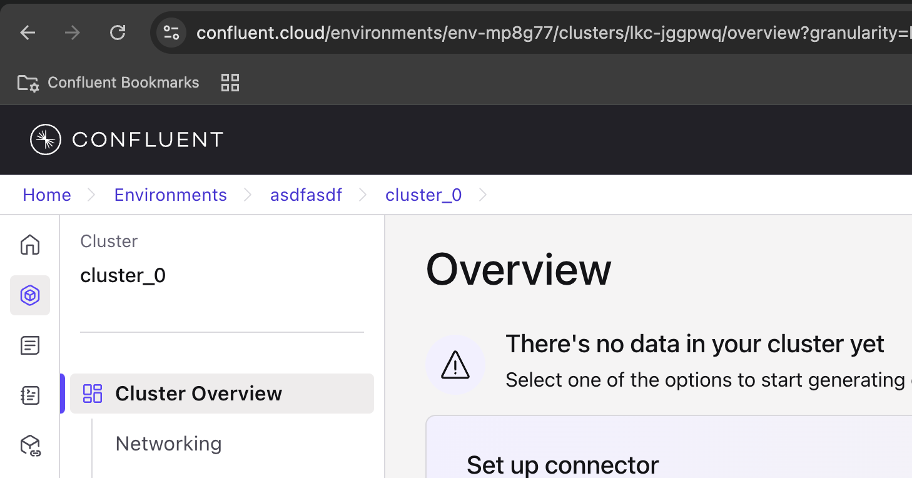
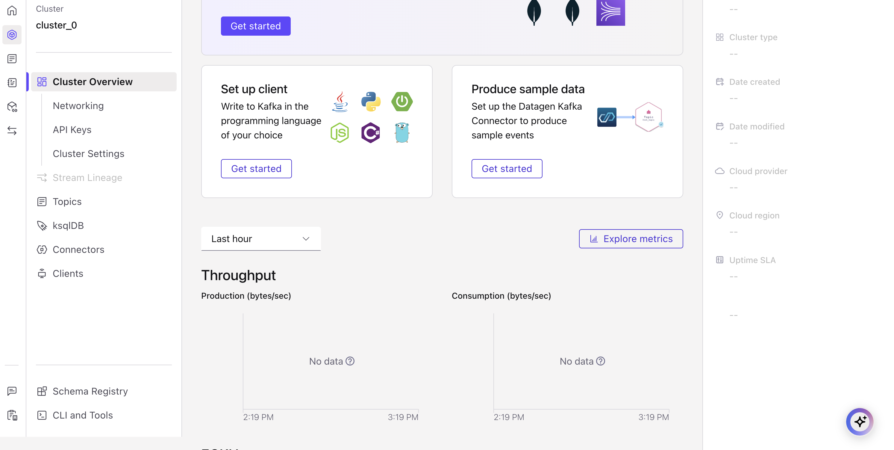

<div align="center" padding=25px>
    
</div>

# <div align="center">Seamlessly Connect Sources and Sinks to Confluent Cloud</div>


<div align="center">
    
</div>


Let’s say you have a database, or object storage such as AWS S3, Azure Blob Storage, or Google Cloud Storage, or a data warehouse such as Snowflake. How do you connect these data systems to your architecture?

There are 2 options: <br>

1. Develop your own connectors using the Kafka Connect framework (this requires a lot of development time and effort).  
2. You can leverage the 180+ connectors Confluent offers out-of-the-box which allows you to configure your sources and sinks in a few, simple steps. To view the complete list of connectors that Confluent offers, please see [Confluent Hub](https://www.confluent.io/hub/).

With Confluent’s connectors, your data systems can communicate with your services, completing your data pipeline. 

In this demo, we will show you power of Confluent Cloud and by the end you will know how to:

- Set up a Confluent Cloud environment and securely link to the fully managed Kafka clusters
- Review Schema Registries and Data Contracts that protect your Kafka streams and connectors from downstream errors
- Easily debug faulty Kafka Events to improve your data pipelines fault tolerance
- Set up a fully managed Connector in CC to see how easy CC makes moving your data from application to application
- Set up a self-managed Connector allowing you to integrate any Connector


*** 

## **Prerequisites**

<details><summary>Sign up for Confluent Cloud</summary>


Sign-up for a Confluent Cloud account [here](https://www.confluent.io/confluent-cloud/tryfree/)
Once you have signed up and logged in, click on the menu icon at the upper right hand corner, click on "Billing & payment", then enter payment details under “Payment details & contacts”. A screenshot of the billing UI is included below.

    > **Note:** You will create resources during this workshop that will incur costs. When you sign up for a Confluent Cloud account, you will get free credits to use in Confluent Cloud. This will cover the cost of resources created during the workshop. More details on the specifics can be found [here](https://www.confluent.io/confluent-cloud/tryfree/).

</details><br>

<details><summary>Ensure Local Ports Work</summary>


Ports 443 and 9092 need to be open to the public internet for outbound traffic. To check, try accessing the following from your web browser:

- [check port 443](http://portquiz.net:443)
- [check port 9092](http://portquiz.net:9092)


</details><br>

<details><summary>Command Line Access</summary>

This workshop requires access to a command line interface.
* **Mac users:** The standard Terminal application or iTerm2 are recommended.
* **Windows users:** The built-in Command Prompt or Git BASH are recommended.  


</details><br>

<details><summary>Git Installation</summary>


Git access, see [here](https://git-scm.com/book/en/v2/Getting-Started-Installing-Git) for installation instructions. After installation, verify that the installation was successful with the following command:
 ```bash
 # Check the git version
 git --version
 ```

</details><br>

<details><summary>Docker Desktop Installation</summary>


This workshop requires `docker`. Download *Docker Desktop* [here](https://www.docker.com/products/docker-desktop). After installation, verify that the installation was successful with the following command:
 ```bash
 # Check the docker version
 docker --version
 ```
> **Note:** You will be deploying Confluent Platform services and connecting them to Confluent Cloud. There are multiple ways to install Confluent Platform, which you can view in [On-Premises Deployments](https://docs.confluent.io/platform/current/installation/installing_cp/overview.html). In order to make the set up easier for those running different operating systems during the workshop, you will walk through setting up Confluent Platform using Docker. You can accomplish the steps in this lab guide using any of the other deployment methods.


</details><br>

<details><summary>Cloud Platform Access Key And Bucket Creation</summary>

**Note:** This demo will be done with AWS, but CC supports GCP and Azure

AWS / Azure / GCP account - You will be creating a fully-managed sink connector to an object storage. 
 - Access Key/Credentials
     - AWS: [Access Keys](https://docs.aws.amazon.com/general/latest/gr/aws-sec-cred-types.html#access-keys-and-secret-access-keys)
     - Azure: [Manage account access keys](https://docs.microsoft.com/en-us/azure/storage/common/storage-account-keys-manage?tabs=azure-portal)
     - GCP:  [Creating and managing service accounts](https://cloud.google.com/iam/docs/creating-managing-service-accounts)


 - Bucket/Container Name - Create the object storage before the workshop and have the name of the bucket/container ready.


 - Region - Note which region you are deploying your object storage resource in. You will need to know during the workshop.


 - IAM Policy configured for bucket access; This should allow the AWS access keys created to have full access to the bucket
     - AWS: Follow the directions outlined in [IAM Policy for S3](https://docs.confluent.io/cloud/current/connectors/cc-s3-sink.html#cc-s3-bucket-policy)
     - GCP:  Your GCP service account role must have permission to create new objects in the GCS bucket. For example, the Storage Admin role can be selected for this purpose. If you are concerned about security and do not want to use the Storage Admin role, only use the storage.objects.get and storage.objects.create roles. Also, note that the Storage Object Admin role does not work for this purpose.


</details><br>

<details><summary>Demo Repository Setup</summary>

Clone Confluent's Commercial SE workshop repository to your machine to access useful files. 
 > **Note:** This repository contains **all** of the workshops and workshop series Confluent's Commercial SE team has created. Be sure to navigate to the correct sub-folder to use the right content.
 ```bash
 # clone the Commercial SE workshop repository
 git clone https://github.com/confluentinc/commercial-workshops.git
 ```
 Navigate to the correct sub-folder to access this labs content. This should act as your working directory for the remainder of the lab. 
 ```bash 
 # navigate to the correct sub-folder
 cd commercial-workshops/series-getting-started-with-cc/workshop-connectors/
 ```

</details>

---


## **Demo**

All necessary configs will be created from resources in Confluent Cloud after the environment is setup.

The only files needed to provision infrastructure  for the Demo are **setup.properties** and  **docker-compose.yml**; they are found in the `commercial-workshops/series-getting-started-with-cc/workshop-connectors` directory of this project.

You will use **setup.properties** in order to export configs from your Confluent Cloud account as environment variables for three containers: `connect`, `control-center`, and `postgres` that will be managed via the **docker-compose.yml** file.

This will launch a PostgreSQL database and 2 Confluent Platform components - a Connect cluster and Confluent Control Center. Control Center is used to monitor your Confluent deployment. The file will not provision the brokers because you will be using the cluster you created in Confluent Cloud.

You will use `control-center` to configure `connect` to do change data capture from `postgres` before sending this data to Confluent Cloud via a self-managed connector.    
 
The docker-compose.yml also has parameterized the values to connect to your Confluent Cloud instance, including the bootstrap servers and security configuration. You could fill in these Confluent Cloud credentials manually, but a more programmatic method is to create a local file with configuration parameters to connect to your clusters. To make it a lot easier and faster, you will use this method.

You will be using Docker & AWS S3 during this workshop. Alternatively, you can set up these Confluent Platform components and connect them to Confluent Cloud by installing Confluent Platform as a local installation.

---
### Confluent Cloud Setup

<details><summary>Log in to Confluent Cloud</summary>

1. Log in to [Confluent Cloud](https://confluent.cloud) and enter your email and password.

<div align="center" padding=25px>
    
</div>

2. If you are logging in for the first time, you will see a self-guided wizard that walks you through spinning up a cluster. Please minimize this as you will walk through those steps in this workshop. 

</details><br>


<details><summary>Create an Environment and Cluster</summary>


1. Log in to [Confluent Cloud](https://confluent.cloud) and enter your email and password.

An environment contains clusters and its deployed components such as Connectors, ksqlDB, and Schema Registry. You have the ability to create different environments based on your company's requirements. Confluent has seen companies use environments to separate Development/Testing, Pre-Production, and Production clusters.

1. Click **+ Add Environment**. Specify an **Environment Name** , Specify **Advanced** and Click **Create**. 

    
<div align="center" padding=25px>
    
</div>

2. Now that you have an environment you will automatically be sent to the **Create cluster** view

<div align="center" padding=25px>
    
</div>

    **Note:** Confluent Cloud clusters are available in many types: Basic, Standard, Enterprise, Dedicated and Freight. Basic is intended for development use cases so you will use that for the workshop. Basic clusters only support single zone availability. Enterprise clusters are the preferred cluster type for production use and support Multi-zone deployments.

3. Specify a **Cluster Name** - this name will not matter


4. Choose the **Standard** Cluster Type. [Cluster Type Docuemntation](https://docs.confluent.io/current/cloud/clusters/cluster-types.html)


5. Choose your preferred Cloud Provider (AWS, GCP, or Azure), Region, and Availability Zone.
     * **Choose the cloud provider you have your object storage set up with; AWS is used in this Demo**
     * **Choose the same region where your object storage resource is deployed**


6. Leave all other configs on default setting
   * **Uptime SLA**
   * **Encryption**


7. View the associated Configuration & Cost, Usage Limits, and Uptime SLA information before launching.


8. Click **Launch cluster**


</details><br>


<details><summary>Create Kafka Cluster API Keys</summary>


1. Select **API keys** on the navigation menu. 


2. If this is your first API key within your cluster, click **Create key**. If you have set up API keys in your cluster in the past and already have an existing API key, click **+ Add key**.
    <div align="center" padding=25px>
       
    </div>


3. Select **My account**, then click **Next**.
    <div align="center" padding=25px>
       
    </div>


4. Save your API key and secret - you will need these during the workshop.


5. After creating and saving the API key, you will see this API key in the Confluent Cloud UI in the **API keys** tab. If you don’t see the API key populate right away, refresh the browser. 
    <div align="center" padding=25px>
       
    </div>


</details><br>


<details><summary>Create Schema Registry API Key</summary>


A topic contains messages, and each message is a key-value pair. The message key or the message value (or both) can be serialized as JSON, Avro, or Protobuf. A schema defines the structure of the data format. 

Confluent Cloud Schema Registry is used to manage schemas and it defines a scope in which schemas can evolve. It stores a versioned history of all schemas, provides multiple compatibility settings, and allows schemas to evolve according to these compatibility settings. It is also fully-managed.

You will be exploring Confluent Cloud Schema Registry in more detail towards the end of the workshop. Schema Registry is automatically enabled in the advanced cluster.

Before we can use it we must create an API key for the Schema Registry.

1. Select the name of the environment link in the top left of the cluster menu to return to the environment menu
  <div align="center">
      
  </div>

2. Scroll down on the menu on the right will show **Stream Governance API**
  <div align="center">
      
  </div>

3. Take note of the **Endpoint** variable; it will be used later


4. Under the **Credentials** variable select the **+ Add key** button; you will be taken to an API key page
  <div align="center">
      
  </div>

5. Select **Create key**


6. Select **Download and continue**; this key will be used later


</details><br>


<details><summary>Create Confluent Cloud Topics for Source Connector</summary>


1. On the left hand side navigation menu, you will see **Cluster Overview**.

    This page shows clust info such as
    * Cluster Metrics
    * Throughput
    * ECKU usage
    * Storage. 
    * Topics
    * Partitions
    * Connectors
    * ksqlDB Cluster
   
       <div align="center" padding=25px>
                 
               
       </div>


2. Click on **Cluster Settings**. This is an important tab that should be noted. This is where you can find your cluster ID, bootstrap server, cloud details, cluster type, and capacity limits. 


3. Copy and save the bootstrap server - you will use it later in the workshop.


4. On that same navigation menu, select **Topics** and click **Create Topic**. 


5. Enter **postgres.inventory.customers** as the Topic name and **1** as the Number of partitions, then click on **Create with defaults**
       <div align="center" padding=25px>
          
       </div>
      
6. After this you will be redirected to a **Data contract** card, select **skip**
       <div align="center" padding=25px>
             
       </div>

This topic is the name of a tables within the Postgres database that will be tracked by your DB Connector you will be setting up in a later section.

    >       **Note:** Topics have many configurable parameters that dictate how messages are handled. A complete list of those configurations for Confluent Cloud can be found [here](https://docs.confluent.io/cloud/current/using/broker-config.html).  If you are interested in viewing the default configurations, you can view them in the Topic Summary on the right side. 

7. After creation, the **Topics UI** allows you to monitor production and consumption throughput metrics and the configuration parameters for your topics. When you begin sending messages to Confluent Cloud, you will be able to view those messages and message schemas. 


</details>


---
### Setup Local Services


<details><summary>Set Environment Variables</summary>


1. Ensure you have the demo GitHub downloaded

    **Note:** you should have already cloned the repository during the Prerequisites step. If you have not, start by cloning Confluent's Commercial SE workshop repository.

    ```bash
    # Clone Confluent's Commercial SE Workshop repo
    git clone https://github.com/confluentinc/commercial-workshops
    ```

2. Navigate to the sub-directory for this lab.
    ```bash
    # Navigate to 'workshop-connectors'
    cd commercial-workshops/series-getting-started-with-cc/workshop-connectors
    ```

3. Configure relevant variables in `setup.properties`

    * Open the `setup.properties` file 
    * Set the following properties in the file to variables you have already created; other variables remain unchanged

   | property                 | created in step                                                                 | example value                                                      |
    |--------------------------|---------------------------------------------------------------------------------|--------------------------------------------------------------------|
    | `BOOTSTRAP_SERVERS`      | [*create an environment and cluster*](#create-an-environment-and-kafka-cluster) | "pkc-921jm.us-east-2.aws.confluent.cloud:9092"                     |
    | `CLOUD_KEY`              | [*create an api key pair*](#create-an-api-key-pair)                             | "ZVXK6O3FBT56VWI3"                                                 |
    | `CLOUD_SECRET`           | [*create an api key pair*](#create-an-api-key-pair)                             | "W9ao5EfxqQGm4HxIJDShfKVgirS7cXL4hhhnWRX6s662xA6mVzEZEEhYQy/MHlxY" |
    | `SCHEMA_REGISTRY_KEY`    | [*enable schema registry*](#enable-schema-registry)                             | "ZVXK6O3FBT56VWI3"                                                 |
   | `SCHEMA_REGISTRY_SECRET` | [*enable schema registry*](#enable-schema-registry)                             | "W9ao5EfxqQGm4HxIJDShfKVgirS7cXL4hhhnWRX6s662xA6mVzEZEEhYQy/MHlxY" |
   | `SCHEMA_REGISTRY_URL`    | [*enable schema registry*](#enable-schema-registry)                             | "https://psrc-lq2dm.us-east-2.aws.confluent.cloud"                 |


4. Save the file and et the `setup.properties` file as local environment variables
     
    ```bash
    # export the variables to the console
    source setup.properties
    ```
      
5. Validate your credentials to Confluent Cloud Schema Registry
    ```bash
    curl -u $SCHEMA_REGISTRY_BASIC_AUTH_USER_INFO $SCHEMA_REGISTRY_URL/subjects
    ```

    If successful, your output will return: `[] %`


</details><br>


<details><summary>Setup control-center, connect and postgres</summary>

1. Start Docker Desktop


2. To bring up all of the services, run one of following commands 
    ```bash
    docker compose up -d
    ```
   **OR**   --- (some systems use `docker compose` and other use `docker-compose`)

   ```bash
   docker-compose up -d
   ```


3. **Optional** Within Docker Desktop, go to Dashboard. Check if the services, including the PostgreSQL database, are all running successfully. This will take about 5 minutes


4. Open a browser and go to **http://localhost:9021/** to access [Confluent Control Center](http://localhost:9021/). This may take about 5 minutes to load.

    <div align="center">
       
    </div>


    Note: You will notice that the UI looks very similar to the Confluent Cloud dashboard. 

You have successfully installed and run a Confluent Control Center (C3), Confluent Platform node and, PostgreSQL DB locally. Confluent Control Center (C3) is connected to Confluent Cloud. You are now ready to create a Postgres DB Source Connector to send events to your Confluent Cloud Kafka Cluster. 


</details><br>


<details><summary>Create Postgres Source Connector</summary>


You have seen and worked within the Confluent Cloud Dashboard in the previous steps. Because you have Confluent Platform services deployed, you can use Confluent Control Center (C3) to manage and monitor Confluent Platform, and it is also connected to Confluent Cloud from your set up. You will see confirmation that Control Center is indeed connected to Confluent Cloud and streaming Kafka events via the Postgres DB Connector by the end of this step.

1. Open a browser and go to **http://localhost:9021/** to access Confluent Control Center. It may take a couple of minutes to finish setting up; this can be monitored from the Docker Desktop.

    <div align="center">
       
    </div>

      `You will notice that the UI looks very similar to the Confluent Cloud dashboard.`


2. Click on the cluster, then click on **Topics**, and you should notice the **postgres.inventory.customers** topic that you had created in Confluent Cloud in Step 3. This is your first confirmation that Control Center and local Connect cluster are successfully connected to Confluent Cloud.

    <div align="center">
       
    </div>


3. Click on **Connect**. You will see a cluster already here named **connectcloud**. If not, please refresh the page. This is your local Connect cluster that you have running in Docker. 

    <div align="center">
       
    </div>


4. Click on **connectcloud**, **Add Connector**, and then on the **PostgresConnector Source** tile. 

    <div align="center">
       
    </div>

5. Fill in the following configuration details; Most can be left blank

   | Name           | Section           | Value          |
   |----------------|-------------------|----------------|
   | `Name`         | None - at the top | PostgresSource |
   | `Tasks.max`    | Common            | 1              |
   | `Topic Prefix` | Postgres          | postgres       |
   | `Hostname`     | Postgres          | postgres       |
   | `Port`         | Postgres          | 5432           |
   | `User`         | Postgres          | postgres       |
   | `Password`     | Postgres          | confluent2021  |
   | `Database`     | Postgres          | postgres       |
   
      **Note:** If you have networking rules that may not allow for connection to *postgres*, then use *docker.for.mac.host.internal* or *0.0.0.0* as the hostname for Mac and use *docker.for.win.localhost* or *postgres*(container name) for Windows.


6. Scroll down to the very bottom of the page, click on **Next**, review the configuration details, then click on **Launch.**
    
   <div align="center">
       
    </div>


7. Verify that the connector is running.

    <div align="center">
       
    </div>

</details>

---

### CC Final Touches


<details><summary>Validate Connector streaming to Topics</summary>


1. Return to the Confluent Cloud UI, click on your cluster tile, then on **Topics**, then on the topic **postgres.inventory.customers**. You will now confirm that your PostgreSQL connector is working by checking to see if data is being produced to our Confluent Cloud cluster. You will see data being produced under the **Production** tile. 

   **Note:** This may take about 5 minutes to load and will return to zero after the initial spike

    <div align="center">
       
    </div>


2. Another way to confirm is to view the messages within the **Messages** Section within the **postgres.inventory.customers** Topic view (which we are already on)
	

3. You should now be able to see the messages within the UI. 

    <div align="center">
       
    </div>


</details><br>


<details><summary>Confluent Cloud Schema Registry and Data Contracts</summary>


In this final section of the workshop, you will explore Confluent Cloud Schema Registry, which is used to manage and store a versioned history of all of your schemas. Confluent Cloud Schema Registry is fully-managed and supports JSON, Avro, and Protobuf.

1. Earlier, you enabled Schema Registry. Click on **Topics**, then **postgres.inventory.customers**, and then **Data contracts**.


2. Here you can see the schema value for your topic, **postgres.inventory.customers**. The following is an example of what your schema may look like. Note that it shows the Format (AVRO), Compatibility Mode (Default is set as Backward), Schema ID, and Version. 

    <div align="center">
       
    </div>


3. If you click on the **Evolve** , you can view and change the compatibility setting and version history. The compatibility setting is currently set as backward compatible, which is the default. Backward compatibility means that consumers using the new schema can read data produced with the last schema. There are several different options for the compatibility setting, which you can read more about here: [Schema Evolution and Compatibility](https://docs.confluent.io/platform/current/schema-registry/avro.html#)


4. Return to your environment.


5. Click on **Data contracts** to view a searchable list of all your schemas available in your Confluent Cloud environment.


6. Click on the pencil icon next to **Compatibility mode** to see all the ways manage relationships between V1 and Vn on Data Contracts.

    <div align="center">
       
    </div>


</details>


---

### Fully Managed S3 Sink Connector in CC

<details><summary>Fully-Managed AWS S3 Sink / Azure Blob Storage Sink / Google Cloud Storage Sink Connectors</summary>


In this step, you will set up a fully-managed connector to an object storage. You can find the official documentation on how to set up these connectors here:

- [Amazon S3 Sink Connector for Confluent Cloud](https://docs.confluent.io/cloud/current/connectors/cc-s3-sink.html#cc-s3-connect-sink)

- [Azure Blob Storage Sink Connector for Confluent Cloud](https://docs.confluent.io/cloud/current/connectors/cc-azure-blob-sink.html#cc-azure-blob-sink)

- [Google Cloud Storage Sink Connector for Confluent Cloud](https://docs.confluent.io/cloud/current/connectors/cc-gcs-sink.html#cc-gcs-connect-sink)

> **Note:** With fully-managed connectors, Confluent hosts and manages the Connect cluster and connector for you. Simply configure the connector of your choice to stream events between Confluent Cloud and your external systems. Confluent offers 30+ fully-managed connectors, with more on the way! You can view the full list [here](https://docs.confluent.io/cloud/current/connectors/index.html). 


1. Within Confluent Cloud, click on **Connectors**. You should see a list of connectors; type your connector name

    <div align="center">
       
    </div>


2. Click on connector tile for the Amazon S3 Sink, Google Cloud Storage Sink, or Azure Blob Storage Sink. 
    <div align="center">
       
       
       
    </div>

3. In the next view select the **postgres.inventory.customer** topic and click **Continue**


4. In the next view click **My account**, select **Generate API key & download**, then click the **Continue** button
    <div align="center">
       
    </div>
   

5. In the next view you will configure the S3 Credentials:


    <div align="center">
       
    </div>
   > **Note:**
       For credentials, choose one of the following depending on the cloud provider hosting your Confluent Cloud cluster:

       GCP:
       - You download service account [credentials as a JSON file](https://cloud.google.com/iam/docs/creating-managing-service-account-keys). These credentials are used when setting up the connector configuration. Upload your GCP credentials JSON file.

       AWS:
       - Your Amazon Access Key ID and Amazon Secret Access Key can be found in your AWS account under your security credentials

       Azure:
       - Your Azure Blob Storage Account Name will be the same as your [Azure block blob storage account](https://docs.microsoft.com/en-gb/azure/storage/blobs/storage-blob-create-account-block-blob), and your Azure Blob Storage Account Key will be your Azure [Azure storage account access key](https://docs.microsoft.com/en-us/azure/storage/common/storage-account-keys-manage?tabs=azure-portal)

   1. In the **AWS S3 Region** dropdown select the region the bucket is deployed to
   2. In the **Authentication Method** dropdown select `Access Keys` as the Authentication method
   3. In the **Amazon Access Key ID** textbox enter the AWS API key created with necessary permissions
   4. In the **Amazon Secret Access Key** textbox enter the AWS API secret created with necessary bucket permissions
   5. In the **Bucket name** textbox enter the name of the bucket you configured
   6. Click the **Continue** button 


6. In the next view you will configure the Connectors format and time batch size

    <div align="center">
       
    </div>
    
    1. In the `Input Kafka record value format` select section select `Arvo`
    2. In the `Output message format` select section select `Arvo`
    3. In the `Time interval` dropdown select `HOURLY`
    4. In the `Flush size` textbox leave the value `1000`
    5. Click the `Continue` button


7. In the next view task size will be configured
    13. In the `Tasks` text box leave the value `1`
    14. Select the `Continue` button 


8. In the next view Select `Continue`; Finally press the `Launch` button to deploy the connector
    <div align="center">
       
    </div>


9. View the connector, its status, and metrics on the **Connectors** page. by clicking the connectors tile

    <div align="center">  
       
    </div>


10. Now let’s check on your bucket. Here is an example of what it will look like for S3. Notice the organizational method here is by year, month, day, and hour. 

    <div align="center">
       
    </div>

    > **Note:** The following scenario describes one of the ways records may be flushed to storage, depending on the configuration settings you chose: You use the default setting of 1000 for Flush Size and the partitioner is set to hourly. 500 records arrive at one partition from 2:00pm to 3:00pm. At 3:00pm, an additional 5 records arrive at the partition. You will see 500 records in storage at 3:00pm. 


</details><br>

<details><summary>Handling Connector Errors with DLQ (Dead Letter Queue)</summary>


1. Finally, you will be going over error handling with Connectors. An invalid record may occur for a number of reasons. With Connect, errors that may occur are typically serialization and deserialization (serde) errors. For example, an error occurs when a record arrives at the sink connector in JSON format, but the sink connector configuration is expecting another format, like AVRO. 

    In Confluent Cloud, the connector does not stop when serde errors occur. Instead, the connector continues processing records and sends the errors to a [Dead Letter Queue (DLQ)](https://www.confluent.io/blog/kafka-connect-deep-dive-error-handling-dead-letter-queues/). You can use the record headers in a DLQ topic record to identify and troubleshoot an error when it occurs. Typically, these are configuration errors that can be easily corrected. 


2. When you launch a sink connector in Confluent Cloud, the DLQ topic is automatically created. The topic is named **dlq-<connector-ID>**. Click on **Topics** and find your dead letter queue topic. 
    <div align="center">
       
    </div>

    **Note:** You are not expecting any errors in your data so your DLQ topic should be empty. 


3. You can walk through what it would look like if there were any errors by producing a message in JSON format when you are actually expecting Avro. Click on the **postgres.inventory.customers** topic, then click on **Messages**.


4. Click on the **Actions** dropdown in the top right & select **Produce new message**.


5. Either enter the data as shown in the following screenshot or enter any data you would like to, and then click on **Produce**.

   - Key TextBox Info
   ```json
   {
      "JUNK_STR": "HI_DLQ",
      "JUNK_LIST": [1,2,3]
   }
   ```
   - Value Textbox Info
   ```json
   null
   ```
    <div align="center">
       
    </div>


6. Navigate back to your DLQ topic and you will see the message in the incorrect format. Open the record and select **Header**. 


       Each DLQ record header contains the name of the topic with the error, the error exception, and a stack trace (along with other information). If you have any errors, you can review the DLQ record header to identify any configuration changes you need to make to correct errors.
   
       > **Note:** this message will not land in your bucket. 


</details>


---


#### Cleanup


<details><summary>Clean Up Resources</summary>


Deleting the resources you created during this workshop will prevent you from incurring additional charges. It is quite easy as well

1. Delete the demo environment
   1. In the UI, click the environment name in the top right
   2. Scroll to the bottom of the page and on the bottom right select **Delete Environment**
   3. Type the name of the enviroment in the card that pops up
   4. Select **Continue**


2. Delete your object storage bucket/container.


3. Finally, go to the Docker Dashboard, and stop the containers running.

</details><br>


<details><summary>Confluent Resources and Further Testing</summary>


* [Confluent Cloud Documentation](https://docs.confluent.io/cloud/current/overview.html)

* [Confluent Connectors](https://www.confluent.io/hub/) - A recommended next step after the workshop is to deploy a connector of your choice.

* [Confluent Cloud Schema Registry](https://docs.confluent.io/cloud/current/client-apps/schemas-manage.html#)

* [Best Practices for Developing Apache Kafka Applications on Confluent Cloud](https://assets.confluent.io/m/14397e757459a58d/original/20200205-WP-Best_Practices_for_Developing_Apache_Kafka_Applications_on_Confluent_Cloud.pdf) 

* [Confluent Cloud Demos and Examples](https://docs.confluent.io/platform/current/tutorials/examples/ccloud/docs/ccloud-demos-overview.html)

* [Kafka Connect Deep Dive – Error Handling and Dead Letter Queues](https://www.confluent.io/blog/kafka-connect-deep-dive-error-handling-dead-letter-queues/)


</details>