<div align="center" padding=25px>
    
</div>

# <div align="center">Enable Real-Time Data Transformations and Stream Processing with Apache Flink on Confluent Cloud</div>
## <div align="center">Lab Guide</div>
<br>

## **Agenda**
1. [Log into Confluent Cloud](#step-1)
2. [Create an Environment and Cluster](#step-2)
3. [Create Flink Compute Pool](#step-3)
4. [Create Topics and walk through Confluent Cloud Dashboard](#step-4)
5. [Create an API Key Pair](#step-5)
6. [Create Datagen Connectors for Customers, Products and Orders](#step-6)
7. [Flink Basics](#step-7)
8. [Flink Aggregations](#step-8)
9. [Flink Windowing Functions](#step-9)
10. [Flink Tables - Primary Key](#step-10)
11. [Flink Joins](#step-11)
12. [Customer Loyalty Level Calculation](#step-12)
13. [Create Promotional Campaigns](#step-13)
14. [Flink Monitoring](#step-14)
15. [Clean Up Resources](#step-15)
16. [Confluent Resources and Further Testing](#step-16)

***

## **Prerequisites**
<br>

1. Create a Confluent Cloud Account.
    - Sign up for a Confluent Cloud account [here](https://www.confluent.io/confluent-cloud/tryfree/).
    - Once you have signed up and logged in, click on the menu icon at the upper right hand corner, click on “Billing & payment”, then enter payment details under “Payment details & contacts”. A screenshot of the billing UI is included below.

> **Note:** You will create resources during this workshop that will incur costs. When you sign up for a Confluent Cloud account, you will get free credits to use in Confluent Cloud. This will cover the cost of resources created during the workshop. More details on the specifics can be found [here](https://www.confluent.io/confluent-cloud/tryfree/).

<div align="center" padding=25px>
    
</div>

***

## **Objective**

<br>

Welcome to “Enable Real-Time Data Transformations and Stream Processing with Apache Flink on Confluent Cloud”! In this workshop, you will learn how to build stream processing applications using Apache Flink on Confluent Cloud as well as learn about the use cases Apache Flink unlocks: streaming ETL, data discovery and enrichment, anomaly detection, and more.

In this workshop, you will have learned how to leverage Apache Flink to perform continuous transformations, create materialized views, and serve lookups against these materialized views all with the data you already have in Confluent Cloud.

***


## <a name="step-1"></a>Log into Confluent Cloud

1. Log into [Confluent Cloud](https://confluent.cloud) and enter your email and password.

<div align="center" padding=25px>
    
</div>

2. If you are logging in for the first time, you will see a self-guided wizard that walks you through spinning up a cluster. Please minimize this as you will walk through those steps in this workshop. 

***

## <a name="step-2"></a>Create an Environment and Cluster

An environment contains clusters and its deployed components such as Apache Flink, Connectors, ksqlDB, and Schema Registry. You have the ability to create different environments based on your company's requirements. For example, you can use environments to separate Development/Testing, Pre-Production, and Production clusters. 

1. Click **+ Add Environment**. Specify an **Environment Name** and Click **Create**. 

>**Note:** There is a *default* environment ready in your account upon account creation. You can use this *default* environment for the purpose of this workshop if you do not wish to create an additional environment.

<div align="center" padding=25px>
    
</div>

2. Select **Essentials** for Stream Governance Packages, click **Begin configuration**.

<div align="center" padding=25px>
    
</div>

3. Select **AWS Sydney Region** for Stream Governance Essentials, click **Continue**.

<div align="center" padding=25px>
    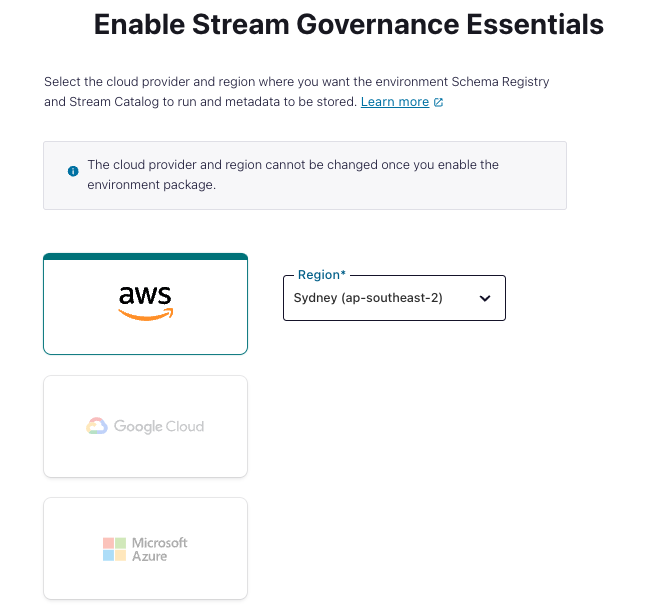
</div>

4. Now that you have an environment, click **Create Cluster**. 

> **Note:** Confluent Cloud clusters are available in 3 types: Basic, Standard, and Dedicated. Basic is intended for development use cases so you will use that for the workshop. Basic clusters only support single zone availability. Standard and Dedicated clusters are intended for production use and support Multi-zone deployments. If you are interested in learning more about the different types of clusters and their associated features and limits, refer to this [documentation](https://docs.confluent.io/current/cloud/clusters/cluster-types.html).

5. Chose the **Basic** cluster type. 

<div align="center" padding=25px>
    
</div>

6. Click **Begin Configuration**. 
7. Choose your preferred Cloud Provider (AWS, GCP, or Azure), region, and availability zone. 
8. Specify a **Cluster Name**. For the purpose of this lab, any name will work here. 

<div align="center" padding=25px>
    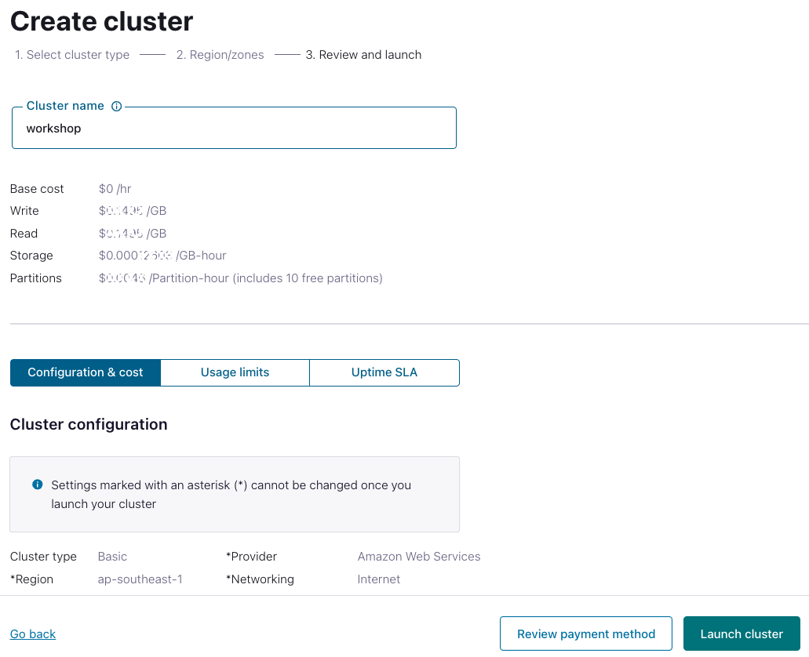
</div>

9. View the associated *Configuration & Cost*, *Usage Limits*, and *Uptime SLA* information before launching. 
10. Click **Launch Cluster**. 

***

## <a name="step-3"></a>Create a Flink Compute Pool

1. On the navigation menu, select **Flink** and click **Create Compute Pool**.

<div align="center" padding=25px>
    
</div>

2. Select **Region** and then **Continue**.
<div align="center" padding=25px>
    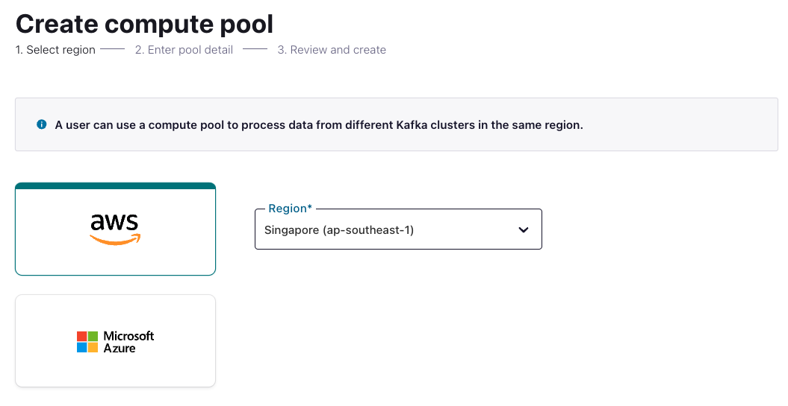
</div>

3. Name you Pool Name and set the capacity units (CFUs) to **5**. Click **Finish**.

<div align="center" padding=25px>
    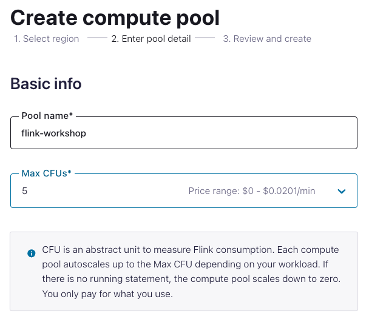
</div>

> **Note:** The capacity of a compute pool is measured in CFUs. Compute pools expand and shrink automatically based on the resources required by the statements using them. A compute pool without any running statements scale down to zero. The maximum size of a compute pool is configured during creation. 

4. Flink Compute pools will be ready shortly. You can click **Open SQL workspace** when the pool is ready to use.

<div align="center" padding=25px>
    
</div>

5. Change your workspace name by clicking **settings button**. Click **Save changes** after you update the workspace name.

<div align="center" padding=25px>
    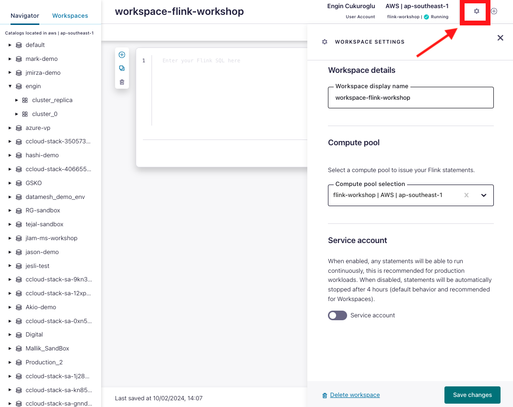
</div>

6. Set the default Catalog as your environment name.

<div align="center" padding=25px>
    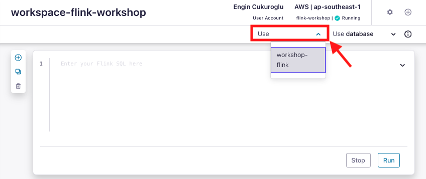
</div>

7. Set the default Database as your cluster name.

<div align="center" padding=25px>
    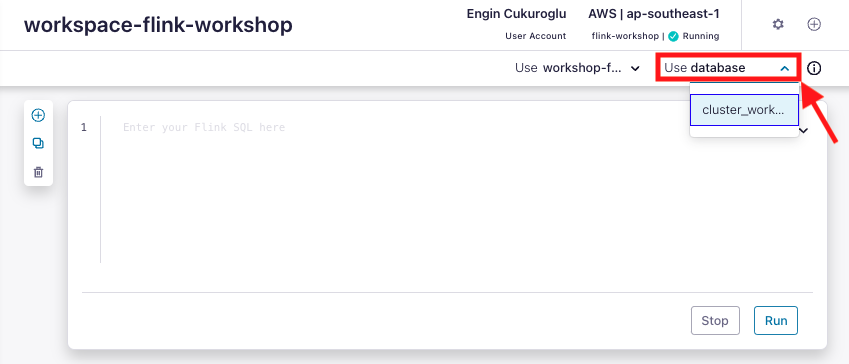
</div>

***

## <a name="step-4"></a>Creates Topic and Walk Through Cloud Dashboard

1. On the navigation menu, you will see **Cluster Overview**. 

> **Note:** This section shows Cluster Metrics, such as Throughput and Storage. This page also shows the number of Topics, Partitions, Connectors, and ksqlDB Applications.  Below is an example of the metrics dashboard once you have data flowing through Confluent Cloud. 

<div align="center" padding=25px>
    
</div>

2. Click on **Cluster Settings**. This is where you can find your *Cluster ID, Bootstrap Server, Cloud Details, Cluster Type,* and *Capacity Limits*.
3. On the same navigation menu, select **Topics** and click **Create Topic**. 
4. Enter **shoe_products** as the topic name, **3** as the number of partitions, and then click **Create with defaults**. 

<div align="center" padding=25px>
    
</div>

5. Repeat the previous step and create a second topic name **shoe_customers** and **3** as the number of partitions.
   
6. Repeat the previous step and create a second topic name **shoe_orders** and **3** as the number of partitions.

> **Note:** Topics have many configurable parameters. A complete list of those configurations for Confluent Cloud can be found [here](https://docs.confluent.io/cloud/current/using/broker-config.html). If you are interested in viewing the default configurations, you can view them in the Topic Summary on the right side. 

7. After topic creation, the **Topics UI** allows you to monitor production and consumption throughput metrics and the configuration parameters for your topics. When you begin sending messages to Confluent Cloud, you will be able to view those messages and message schemas.
8. Below is a look at the topic, **shoe_orders**, but you need to send data to this topic before you see any metrics.

<div align="center" padding=25px>
    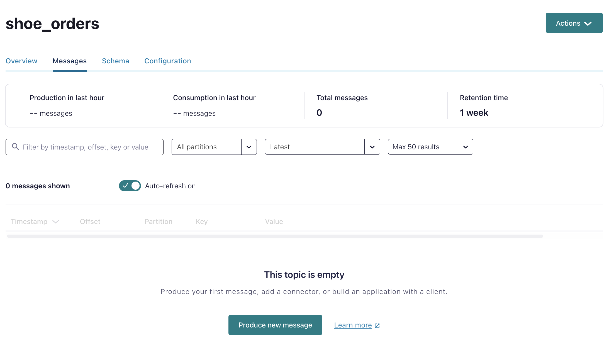
</div>

***

## <a name="step-5"></a>Create an API Key

1. Click **API Keys** on the navigation menu. 
2. Click **Create Key** in order to create your first API Key. If you have an existing API Key select **+ Add Key** to create another API Key.

<div align="center" padding=25px>
    
</div>

3. Select **Global Access** and then click **Next**. 
4. Copy or save your API Key and Secret somewhere. You will need these later on in the lab, you will not be able to view the secret again once you close this dialogue. 
5. After creating and saving the API key, you will see this API key in the Confluent Cloud UI in the **API Keys** section. If you don’t see the API key populate right away, refresh the browser.

***

## <a name="step-6"></a>Create Datagen Connectors for Customers, Products and Orders

The next step is to produce sample data using the Datagen Source connector. You will create three Datagen Source connectors. One connector will send sample customer data to **shoe_customers** topic, the other connector will send sample product data to **shoe_products** topic, and final connector will send sample order data to **shoe_orders** topic.

1. First, you will create the connector that will send data to **shoe_customers**. From the Confluent Cloud UI, click on the **Connectors** tab on the navigation menu. Click on the **Datagen Source** icon.

<div align="center" padding=25px>
    
</div>

2. Enter the following configuration details. The remaining fields can be left blank.

<div align="center">

| setting                            | value                        |
|------------------------------------|------------------------------|
| name                               | DatagenSourceConnector_shoe_customers |
| api key                            | [*from step 5* ](#step-5)    |
| api secret                         | [*from step 5* ](#step-5)    |
| topic                              | shoe_customers               |
| output message format              | AVRO                         |
| quickstart                         | Shoe customers               |
| max interval between messages (ms) | 1000                         |
| tasks                              | 1                            |
</div>

<br>

<div align="center" padding=25px>
    
    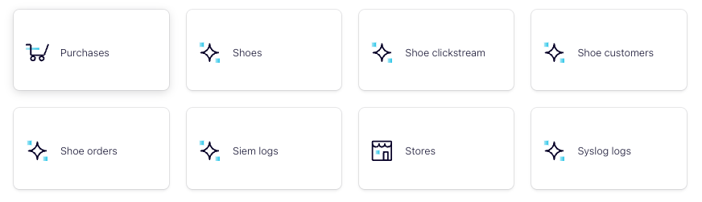
</div>

3. Click on **Show advanced configurations** and complete the necessary fields and click **Continue**.

<div align="center" padding=25px>
    
</div>
   
4. Before launching the connector, you should see something similar to the following. If everything looks similar, select **Launch**. 

<div align="center" padding=25px>
    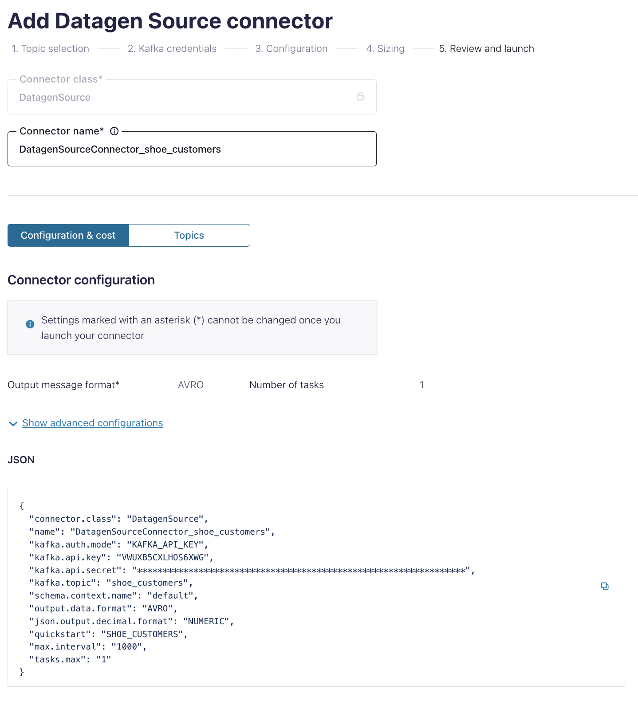
</div>

5. Next, create the second connector that will send data to **shoe_products**. Click on **+ Add Connector** and then the **datagen Source** icon again. 

6. Enter the following configuration details. The remaining fields can be left blank. 

<div align="center">

| setting                            | value                        |
|------------------------------------|------------------------------|
| name                               | DatagenSourceConnector_shoe_products |
| api key                            | [*from step 5* ](#step-5)    |
| api secret                         | [*from step 5* ](#step-5)    |
| topic                              | shoe_products                |
| output message format              | AVRO                         |
| quickstart                         | Shoes                        |
| max interval between messages (ms) | 1000                         |
| tasks                              | 1                            |
</div>

<br> 

7. Review the output again and then select **Launch**.

8. Next, create the second connector that will send data to **shoe_orders**. Click on **+ Add Connector** and then the **datagen Source** icon again. 

9. Enter the following configuration details. The remaining fields can be left blank. 

<div align="center">

| setting                            | value                        |
|------------------------------------|------------------------------|
| name                               | DatagenSourceConnector_shoe_orders |
| api key                            | [*from step 5* ](#step-5)    |
| api secret                         | [*from step 5* ](#step-5)    |
| topic                              | shoe_orders                  |
| output message format              | AVRO                         |
| quickstart                         | Shoe orders                  |
| max interval between messages (ms) | 1000                         |
| tasks                              | 1                            |
</div>

<br> 

10. Review the output again and then select **Launch**.

> **Note:** It may take a few moments for the connectors to launch. Check the status and when both are ready, the status should show *running*. <br> <div align="center">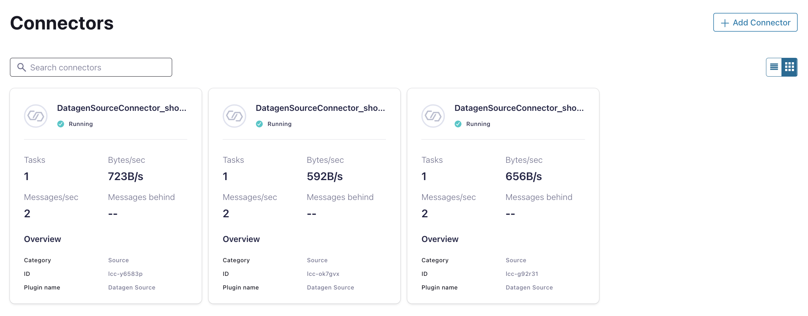</div>

> **Note:** If the connectors fails, there are a few different ways to troubleshoot the error:
> * Click on the *Connector Name*. You will see a play and pause button on this page. Click on the play button.
> * Click on the *Connector Name*, go to *Settings*, and re-enter your API key and secret. Double check there are no extra spaces at the beginning or end of the key and secret that you may have accidentally copied and pasted.
> * If neither of these steps work, try creating another Datagen connector.


11. You can view the sample data flowing into topics in real time. Navigate to  the **Topics** tab and then click on the **shoe_customers**. You can view the production and consumption throughput metrics here.

12. Click on **Messages**.

* You should now be able to see the messages within the UI. You can view the specific messages by clicking the icon. 

<div align="center">
    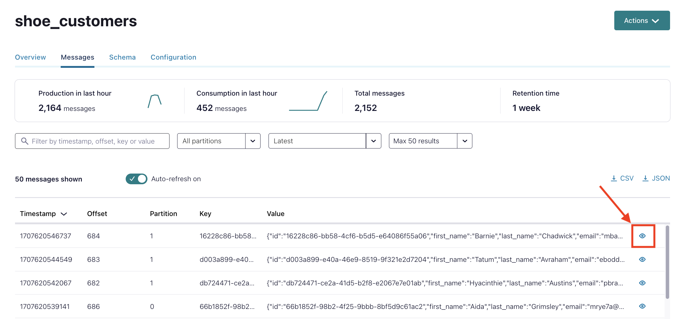
</div> 

* The message details should look something like the following. 

<div align="center">
    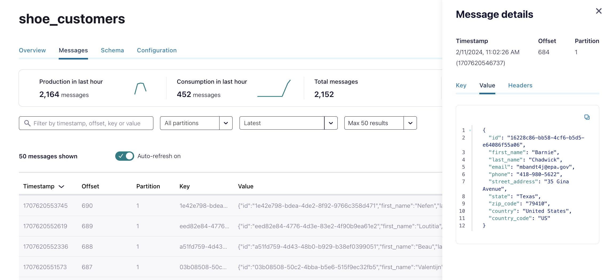
</div>

***

## <a name="step-7"></a>Flink Basics
Kafka topics and schemas are always in sync with our Flink cluster. Any topic created in Kafka is visible directly as a table in Flink, and any table created in Flink is visible as a topic in Kafka. Effectively, Flink provides a SQL interface on top of Confluent Cloud.

Following mappings exist:
| Kafka          | Flink     | 
| ------------   | --------- |
| Environment    | Catalog   | 
| Cluster        | Database  |
| Topic + Schema | Table     |

1. Familiarize with **Flink SQL** Basics.
```sql
SHOW CATALOGS;
```

```
SHOW DATABASES;
```

```sql
SHOW TABLES;
```
<div align="center">
    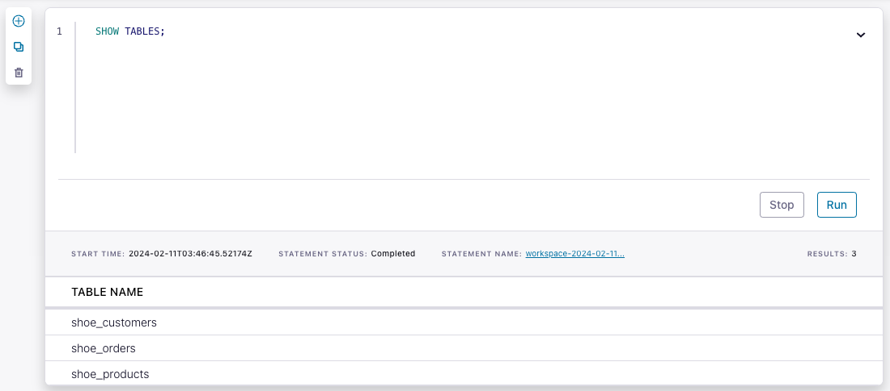
</div>

Understand how the table `shoe_products` was created:

```sql
SHOW CREATE TABLE shoe_products;
```

<div align="center">
    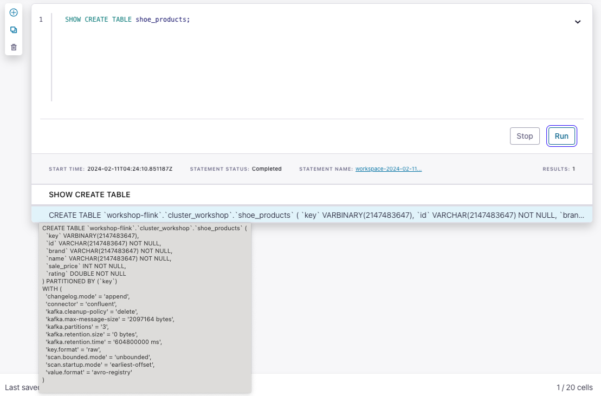
</div>

You can find more information about all DDL Statements [here.](https://docs.confluent.io/cloud/current/flink/reference/statements/overview.html)

Let us first check the table schema for our `shoe_products` catalog. This should be the same as the topic schema in Schema Registry.
```sql
DESCRIBE shoe_products;
```

2. Let's check if any product records exist in the table.
```sql
SELECT * FROM shoe_products;
```

3. Check if the `shoe_customers` schema  exists. 
```sql
DESCRIBE shoe_customers;
```

4. Check the customers in Texas whose name start with `B`.
```sql
SELECT * FROM shoe_customers
  WHERE `state` = 'Texas' AND `last_name` LIKE 'B%';
```

5. Check the first ten orders for one customer.
```sql
SELECT order_id,
       product_id,
       customer_id,
       $rowtime AS ingestion_time
  FROM shoe_orders
  WHERE customer_id = 'b523f7f3-0338-4f1f-a951-a387beeb8b6a'
  LIMIT 10;
```

6. Find the message timestamps for all orders of one customer.
```sql
SELECT order_id,
       customer_id,
       $rowtime AS ingestion_time
FROM shoe_orders
WHERE customer_id = 'b523f7f3-0338-4f1f-a951-a387beeb8b6a';
```

<div align="center">
    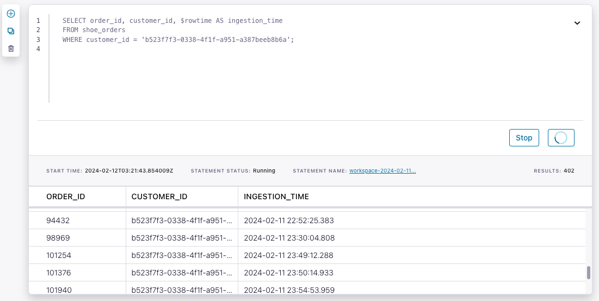
</div>

***

## <a name="step-8"></a>Flink Aggregations
1. Find the number of customers records.
```sql
SELECT COUNT(id) AS num_records
FROM shoe_customers;
```

2. Find the number of unique customers records.
```sql
SELECT COUNT(DISTINCT id) AS num_customers
FROM shoe_customers;
```

3. For each shoe brand, find the number of shoe models, average rating and maximum model price. 
```sql
SELECT brand as brand_name, 
       COUNT(DISTINCT name) as models_by_brand,
       ROUND(AVG(rating),2) as avg_rating,
       MAX(sale_price) as max_price
FROM shoe_products
GROUP BY brand;
```

<div align="center">
    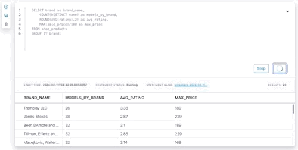
</div>

> **Note:** Check this [link](https://docs.confluent.io/cloud/current/flink/reference/functions/aggregate-functions.html) for more information about Flink aggregation functions.

***

## <a name="step-9"></a>Flink Windowing Functions
Windows are central to processing infinite streams. Windows split the stream into “buckets” of finite size, over which you can apply computations. This document focuses on how windowing is performed in Confluent Cloud for Apache Flink and how you can benefit from windowed functions.

Flink provides several window table-valued functions (TVF) to divide the elements of your table into windows, including:

a. [Tumble Windows](https://docs.confluent.io/cloud/current/flink/reference/queries/window-tvf.html#flink-sql-window-tvfs-tumble)
<br> 
b. [Hop Windows](https://docs.confluent.io/cloud/current/flink/reference/queries/window-tvf.html#flink-sql-window-tvfs-hop)
<br> 
c. [Cumulate Windows](https://docs.confluent.io/cloud/current/flink/reference/queries/window-tvf.html#flink-sql-window-tvfs-cumulate)
<br> 

1. Find the amount of orders for one minute intervals (tumbling window aggregation).
```sql
SELECT window_end,
       COUNT(DISTINCT order_id) AS num_orders
FROM TABLE(
  TUMBLE(TABLE shoe_orders, DESCRIPTOR(`$rowtime`), INTERVAL '1' MINUTES))
GROUP BY window_end;
```

<div align="center">
    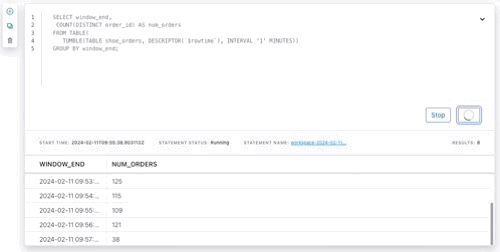
</div>

2. Find the amount of orders for ten minute intervals advanced by five minutes (hopping window aggregation).
```sql
SELECT window_start,
       window_end,
       COUNT(DISTINCT order_id) AS num_orders
FROM TABLE(
  HOP(TABLE shoe_orders, DESCRIPTOR(`$rowtime`), INTERVAL '5' MINUTES, INTERVAL '10' MINUTES))
GROUP BY window_start, window_end;
```

> **Note:** Check this [link](https://docs.confluent.io/cloud/current/flink/reference/queries/window-tvf.html) for the detailed information about Flink Window aggregations.

***

## <a name="step-10"></a>Flink Tables - Primary Key
A primary key constraint is a hint for Flink SQL to leverage for optimizations which specifies that a column or a set of columns in a table or a view are unique and they do not contain null. No columns in a primary key can be nullable. A primary key uniquely identifies a row in a table.
For more details please check this [link.](https://docs.confluent.io/cloud/current/flink/reference/statements/create-table.html#primary-key-constraint)

1. Create a new table that will store unique customers only.
```sql
CREATE TABLE shoe_customers_keyed (
  customer_id STRING,
  first_name STRING,
  last_name STRING,
  email STRING,
  PRIMARY KEY (customer_id) NOT ENFORCED
) DISTRIBUTED BY (customer_id) INTO 3 BUCKETS;
```

2. Compare the new table `shoe_customers_keyed` with `shoe_customers`.
```sql
SHOW CREATE TABLE shoe_customers;
```
```sql
SHOW CREATE TABLE shoe_customers_keyed;
```

<div align="center">
    
</div>

By creating a table with Primary Key option, you changed the changelog-mode to upsert which means that all rows with same primary key are related and must be partitioned together.
For more details please check this [link.](https://docs.confluent.io/cloud/current/flink/reference/statements/create-table.html#changelog-mode)

3. Create a new Flink job to copy customer data from the original table to the new table.
```sql
INSERT INTO shoe_customers_keyed
  SELECT id,
         first_name,
         last_name,
         email
    FROM shoe_customers;
```

4. Show the number of customers in `shoe_customers_keyed`.
```sql
SELECT COUNT(*) as number_of_customers
FROM shoe_customers_keyed;
```

5. Look up one specific customer in the keyed Table (shoe_customers_keyed).
```sql
SELECT * 
FROM shoe_customers_keyed  
WHERE customer_id = 'b523f7f3-0338-4f1f-a951-a387beeb8b6a';
```

6. Look up the specific customer change history in non-keyed Table (shoe_customers).
```sql
SELECT *
FROM shoe_customers
WHERE id = 'b523f7f3-0338-4f1f-a951-a387beeb8b6a';
```

7. Product Catalog Table also requires unique rows for each item.
Create a new table in order to have the latest information of each product. 
It is useful when you need to know the latest price of the product for analytic purposes or you need to populate latest product information while joining with other tables.
```sql
CREATE TABLE shoe_products_keyed(
  product_id STRING,
  brand STRING,
  `model` STRING,
  sale_price INT,
  rating DOUBLE,
  PRIMARY KEY (product_id) NOT ENFORCED
) DISTRIBUTED BY (product_id) INTO 3 BUCKETS;
```

8. Create a new Flink job to copy product data from the original table to the new table. 
```sql
INSERT INTO shoe_products_keyed
  SELECT id,
         brand,
         `name`,
         sale_price,
         rating 
    FROM shoe_products;
```

9. Check if only a single record is returned for some product.
```sql
SELECT * 
FROM shoe_products_keyed  
WHERE product_id = '0fd15be0-8b95-4f19-b90b-53aabf4c49df';
```

***

## <a name="step-11"></a>Flink Joins
Flink supports complex and flexible join operations over dynamic tables. There are a number of different types of joins to account for the wide variety of semantics that queries may require.

By default, the order of joins is not optimized. Tables are joined in the order in which they are specified in the FROM clause.

You can tweak the performance of your join queries, by listing the tables with the lowest update frequency first and the tables with the highest update frequency last. Make sure to specify tables in an order that doesn’t yield a cross join (Cartesian product), which aren’t supported and would cause a query to fail.
For more details please check this [link.](https://docs.confluent.io/cloud/current/flink/reference/queries/joins.html)

1. Join orders with non-keyed customer records (Regular Join).
```sql
SELECT order_id,
       shoe_orders.`$rowtime` as ingestion_time,
       first_name,
       last_name
FROM shoe_orders
INNER JOIN shoe_customers 
ON shoe_orders.customer_id = shoe_customers.id
WHERE customer_id = 'b523f7f3-0338-4f1f-a951-a387beeb8b6a';
```

<div align="center">
    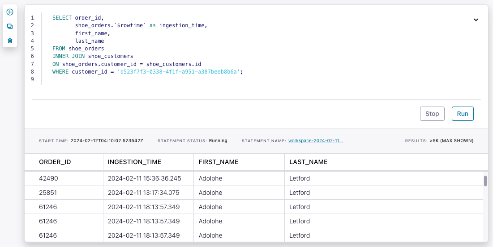
</div>

> **Note:** As expected the result has duplicated entries because of the non-keyed records.

2. Join orders with non-keyed customer records in some time windows (Interval Join).
   Find orders of a specific customer in 1 hour interval after the last update of customer information. 
```sql
SELECT order_id,
       shoe_orders.`$rowtime` as order_time,
       shoe_customers.`$rowtime` as customer_info_update_time,
       first_name,
       last_name
FROM shoe_orders
INNER JOIN shoe_customers
ON shoe_orders.customer_id = shoe_customers.id
WHERE customer_id = 'b523f7f3-0338-4f1f-a951-a387beeb8b6a'
      AND
      shoe_orders.`$rowtime`
        BETWEEN
         shoe_customers.`$rowtime`
         AND
         shoe_customers.`$rowtime` + INTERVAL '1' HOUR;
```

<div align="center">
    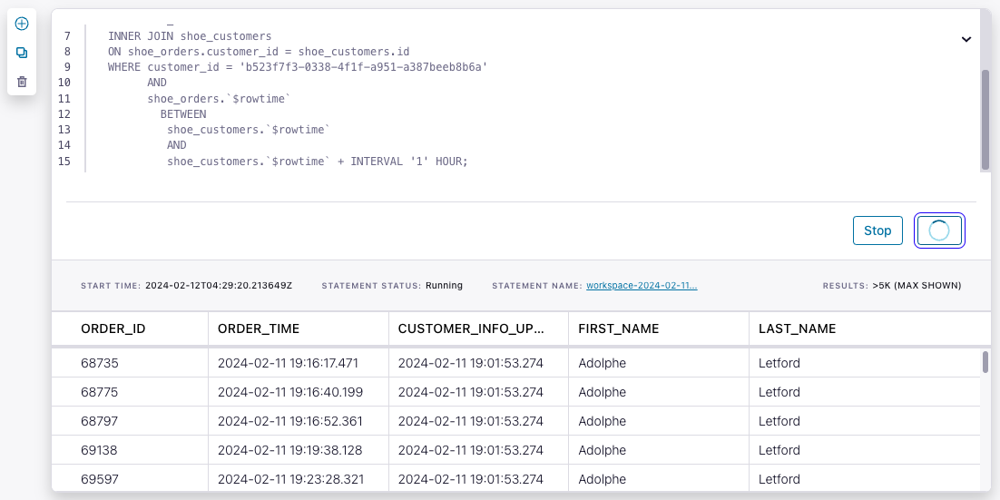
</div>

3. Join orders with keyed customer records (Regular Join with Keyed Table).
```sql
SELECT order_id,
       shoe_orders.`$rowtime` as ingestion_time,
       first_name,
       last_name
FROM shoe_orders
INNER JOIN shoe_customers_keyed 
ON shoe_orders.customer_id = shoe_customers_keyed.customer_id
WHERE shoe_customers_keyed.customer_id = 'b523f7f3-0338-4f1f-a951-a387beeb8b6a';
```

<div align="center">
    
</div>

> **Note:** As expected the number of rows is lesser than the non-keyed table join. The duplicate entries are eliminated.

4. Join orders with keyed customer records at the time when order was created  (Temporal Join with Keyed Table).
   Find orders of a specific customer with the latest customer information at the point of order creation.
```sql
SELECT order_id,
       shoe_orders.`$rowtime` as order_time,
       shoe_customers_keyed.`$rowtime` as customer_info_update_time,
       first_name,
       last_name
FROM shoe_orders
INNER JOIN shoe_customers_keyed FOR SYSTEM_TIME AS OF shoe_orders.`$rowtime`
ON shoe_orders.customer_id = shoe_customers_keyed.customer_id
WHERE shoe_customers_keyed.customer_id = 'b523f7f3-0338-4f1f-a951-a387beeb8b6a';
```

<div align="center">
    
</div>

> **Note:** There might be empty result set if keyed customers tables was created after the order records were ingested in the shoe_orders topic.

> **Note:** For more details of temporal joins please check this [link.](https://docs.confluent.io/cloud/current/flink/reference/queries/joins.html#temporal-joins)

5. Enrich Order information with Customer and Product Table.
   Create a new table for enriched order information.
```sql
CREATE TABLE shoe_orders_enriched_customer_product(
  order_id INT,
  first_name STRING,
  last_name STRING,
  email STRING,
  brand STRING,
  `model` STRING,
  sale_price INT,
  rating DOUBLE
) DISTRIBUTED BY (order_id) INTO 3 BUCKETS
WITH (
    'changelog.mode' = 'retract'
);
```

Insert joined data from 3 tables into the new table.
```sql
INSERT INTO shoe_orders_enriched_customer_product(
  order_id,
  first_name,
  last_name,
  email,
  brand,
  `model`,
  sale_price,
  rating)
SELECT
  so.order_id,
  sc.first_name,
  sc.last_name,
  sc.email,
  sp.brand,
  sp.`model`,
  sp.sale_price,
  sp.rating
FROM 
  shoe_orders so
  INNER JOIN shoe_customers_keyed sc 
    ON so.customer_id = sc.customer_id
  INNER JOIN shoe_products_keyed sp
    ON so.product_id = sp.product_id;
```

Verify that the data was joined successfully.
```sql
SELECT * FROM shoe_orders_enriched_customer_product;
```

<div align="center">
    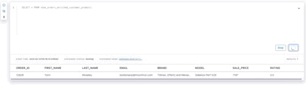
</div>


***

## <a name="step-12"></a>Customer Loyalty Level Calculation
1. Calculate loyalty levels of each customer
```sql
SELECT
  email,
  SUM(sale_price) AS total,
  CASE
    WHEN SUM(sale_price) > 700000 THEN 'GOLD'
    WHEN SUM(sale_price) > 70000 THEN 'SILVER'
    WHEN SUM(sale_price) > 7000 THEN 'BRONZE'
    ELSE 'CLIMBING'
  END AS loyalty_level
FROM shoe_orders_enriched_customer_product
GROUP BY email;
```

<div align="center">
    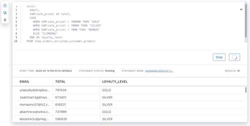
</div>


2. Create a new table that will store the loyalty levels if the customers.
```sql
CREATE TABLE shoe_loyalty_levels(
  email STRING,
  total BIGINT,
  loyalty_level STRING,
  PRIMARY KEY (email) NOT ENFORCED
) DISTRIBUTED BY (email) INTO 3 BUCKETS ;
```

3. Insert the calculated loyal levels into the new table.
```sql
INSERT INTO shoe_loyalty_levels(
 email,
 total,
 loyalty_level)
SELECT
  email,
  SUM(sale_price) AS total,
  CASE
    WHEN SUM(sale_price) > 700000 THEN 'GOLD'
    WHEN SUM(sale_price) > 70000 THEN 'SILVER'
    WHEN SUM(sale_price) > 7000 THEN 'BRONZE'
    ELSE 'CLIMBING'
  END AS loyalty_level
FROM shoe_orders_enriched_customer_product
GROUP BY email;
```

4. Verify the results.
```sql
SELECT *
FROM shoe_loyalty_levels;
```

<div align="center">
    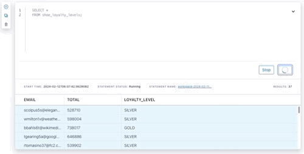
</div>

***

## <a name="step-13"></a>Create Promotional Campaigns
Create special promotions based on the enriched orders table.
1. Find eligible customers who order **'Jones-Stokes'** shoes **10th time**.
```sql
SELECT
   email,
   COUNT(*) AS total,
   (COUNT(*) % 10) AS sequence,
   (COUNT(*) % 10) = 0 AS next_one_free
FROM shoe_orders_enriched_customer_product
WHERE brand = 'Jones-Stokes'
GROUP BY email;
```

2. Find eligible customers who ordered **'Braun-Bruen'** and **'Will Inc'** in total more than **10**.
```sql
SELECT
   email,
   COLLECT(brand) AS products,
   'bundle_offer' AS promotion_name
FROM shoe_orders_enriched_customer_product
WHERE brand IN ('Braun-Bruen', 'Will Inc')
GROUP BY email
HAVING COUNT(DISTINCT brand) = 2 AND COUNT(brand) > 10;
```

3. Create a table for promotion notifications.
```sql
CREATE TABLE shoe_promotions(
  email STRING,
  promotion_name STRING,
  PRIMARY KEY (email) NOT ENFORCED
) DISTRIBUTED BY (email) INTO 3 BUCKETS;
```

4. Insert all the promotional information to the shoe_promotions table.  
```sql
INSERT INTO shoe_promotions
SELECT
   email,
   'next_free' AS promotion_name
FROM shoe_orders_enriched_customer_product
WHERE brand = 'Jones-Stokes'
GROUP BY email
HAVING COUNT(*) % 10 = 0;

INSERT INTO shoe_promotions
SELECT
   email,
   'bundle_offer' AS promotion_name
FROM shoe_orders_enriched_customer_product
WHERE brand IN ('Braun-Bruen', 'Will Inc')
GROUP BY email
HAVING COUNT(DISTINCT brand) = 2 AND COUNT(brand) > 10;
```

5. Verify the results.
```sql
SELECT *
FROM shoe_promotions;
```

<div align="center">
    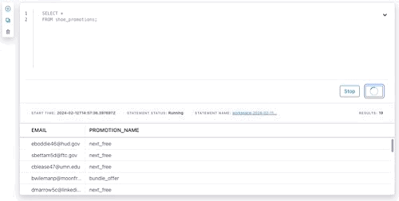
</div>

***

## <a name="step-14"></a>Flink Monitoring
1. Status of all the Flink Jobs is available under **Flink Statements** Tab.
   
<div align="center">
    
</div>

2. Compute pool utilization is available by clicking **Compute Pool tile**.

<div align="center">
    
</div>

3. Utilization information.

<div align="center">
    
</div>

<br> 


***

## <a name="step-15"></a>Clean Up Resources

Deleting the resources you created during this workshop will prevent you from incurring additional charges. 

1. The first item to delete is the Apache Flink Compute Pool. Select the **Delete** button under **Actions** and enter the **Application Name** to confirm the deletion. 

<div align="center">
    
</div>

2. Next, delete the Datagen Source connectors for **shoe_orders**, **shoe_products** and **shoe_customers**. Navigate to the **Connectors** tab and select each connector. In the settings tab, you will see a **trash** icon on the bottom of the page. Click the icon and enter the **Connector Name**.

<div align="center">
    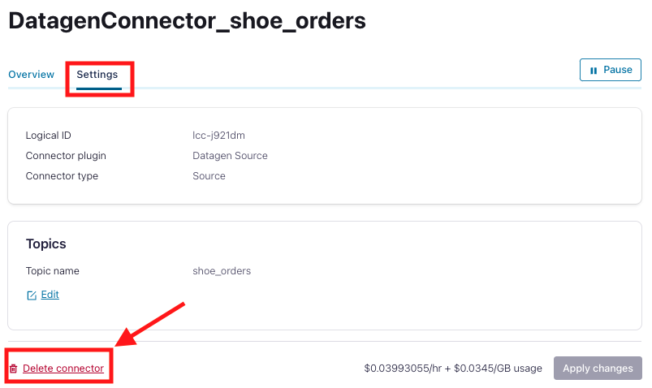
</div>

3. Finally, under **Cluster Settings**, select the **Delete Cluster** button at the bottom. Enter the **Cluster Name** and select **Confirm**. 

<div align="center">
    
</div>

*** 

## <a name="step-16"></a>Confluent Resources and Further Testing

Here are some links to check out if you are interested in further testing:
- [Confluent Cloud Documentation](https://docs.confluent.io/cloud/current/overview.html)
- [Apache Flink 101](https://developer.confluent.io/courses/apache-flink/intro/)
- [Stream Processing with Confluent Cloud for Apache Flink](https://docs.confluent.io/cloud/current/flink/index.html)
- [Flink SQL Reference](https://docs.confluent.io/cloud/current/flink/reference/overview.html)
- [Flink SQL Functions](https://docs.confluent.io/cloud/current/flink/reference/functions/overview.html)

***
