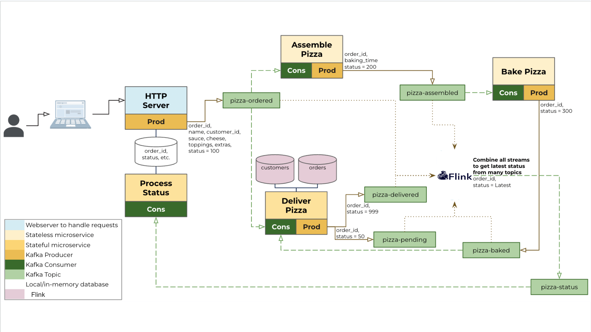
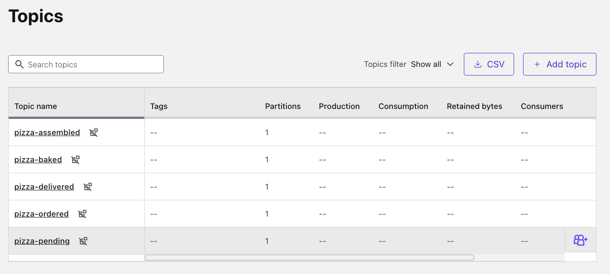
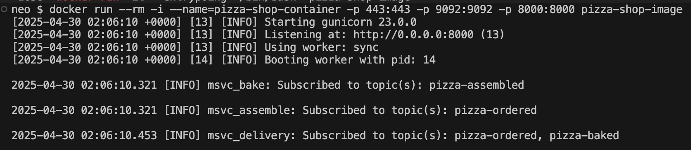
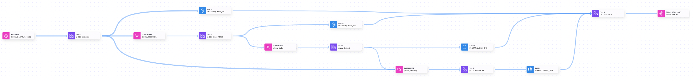

<!-- TODO
Add more details about Flink
Add more details about Stream Lineage, including how to navigate to it from Flink workspace
 -->

<div align="center">
    
</div>

#  Building Event Driven Microservices with Confluent 

## **Introduction**

Dive into the world of event-driven architecture with this hands-on workshop! You'll run a pre-built pizza delivery ecosystem using the CQRS pattern, all powered by Confluent Cloud. Who doesn't love pizza and microservices? :blush:

## **Objectives**

This workshop is perfect for those looking to build Event Driven Architecture and get started with Confluent Cloud.

In this workshop you will:

- Understand the key concepts of event-driven architecture
- Experience firsthand how Confluent Cloud simplifies building event-driven microservices
- Use a pre-built Python microservices application to process pizza orders
- Aggregate data in real-time with Flink SQL

By the end, you'll have gained practical experience with:

- Getting started with key features from Confluent Cloud
- Running a scalable and robust event-driven system

Knowledge of Python is NOT mandatory.

## **Table of Contents**

- [Key Concepts](#key-concepts)
- [Architecture Overview](#architecture-overview)
- [Prerequisites](#prerequisites)
- [Workshop Steps](#workshop-steps)
  1. [Log Into Confluent Cloud](#step-1)
  2. [Create Environment and Cluster](#step-2)
  3. [Setup Flink](#step-3)
  4. [Create Kafka Topics](#step-4)
  5. [Create API Key Pair](#step-5)
  6. [Configure Kafka Client](#step-6)
  7. [Create Stream Processing with Flink](#step-7)
  8. [Run the Microservices](#step-8)
  9. [Use the Application](#step-9)
  10. [View Stream Lineage](#step-10)
  11. [Stop the Demo](#step-11)
  12. [Clean Up Resources](#step-12)
- [Troubleshooting](#troubleshooting)
- [Advanced Concepts](#advanced-concepts)
- [Further Resources](#confluent-resources-and-further-testing)

## **Key Concepts**

### CQRS and Event Sourcing

*CQRS* (Command Query Responsibility Segregation) and *Event Sourcing* are powerful architectural patterns that work brilliantly together. Here's why they matter for modern applications:

- **CQRS:** Divides your application into command (write) and query (read) purviews
- **Event Sourcing:** Records all changes to application state as a sequence of events

In this pizza shop use case, CQRS elegantly separates the order creation system (command) from the status tracking system (query), allowing each to be optimized for its specific purpose without interference.

Event sourcing captures every state change in the pizza's journey as immutable events, creating a complete and reliable history that enables accurate status tracking and simplified recovery from failures.

Together, these patterns form a robust foundation for the microservices architecture, where each pizza-related event flows through Kafka topics as the source of truth, and Flink SQL transforms these distributed events into a unified status view that powers the customer-facing experience with real-time updates.

## **Architecture Overview**

### <div align="center">High level view</div>

Here's how your pizza shop microservices architecture breaks down:

#### Web Application (`webapp.py`)

- Enables users to login, customize pizzas, place orders, and track status
- Acts as the *Command* portion of the CQRS pattern
- Uses `SQLite3` as the materialized view (in a production system, this would be a distributed database)

#### Four Microservices

The pizza order flows through these services:

1. **Assemble the pizza** (`msvc_assemble.py`) - Prepares the pizza based on the order
2. **Bake the pizza** (`msvc_bake.py`) - Cooks the pizza for the specified time
3. **Deliver the pizza** (`msvc_delivery.py`) - Manages delivery logistics
4. **Process status** (`msvc_status.py`) - Updates the web application with order status (acts as the *Query* portion of CQRS)

**All communication** between services occurs via Apache Kafka topics.

### <div align="center">Technical Architecture</div>



> [!NOTE]
> **Local and Cloud Components**
>
> This workshop uses a hybrid architecture:
>
> - Kafka cluster and Flink run on Confluent Cloud
> - Microservices and web server run in a docker container on your local machine

## **Prerequisites**

Follow these steps to get set up to run this workshop:

### 1. Confluent Cloud Account

- Sign-up [here](https://www.confluent.io/confluent-cloud/tryfree/?utm_medium=commercial-workshop-microservices).
- New signups receive $400 to spend during the first 30 days (no credit card required).
- Click on the menu icon at top right → "Billing & payment" to see your credits.

> [!NOTE]
> Resources created during this workshop will incur costs covered by your free credits.

### 2. Local Environment Setup

#### Network Requirements

Ensure ports `443` and `9092` allow outbound traffic to the internet

Test with these commands:

```curl
curl portquiz.net:443
```

and

```curl
curl portquiz.net:9092
```

#### Required Software

- Install [Docker Desktop](https://docs.docker.com/desktop/)
- Install [git](https://git-scm.com/downloads)

#### Get the Workshop Code

```shell
# Clone the repository
git clone https://github.com/confluentinc/commercial-workshops.git

# Navigate to workshop directory
cd commercial-workshops/series-getting-started-with-cc/workshop-microservices
```

## **Workshop Steps**

### <a name="step-1"></a>Step 1: Log Into Confluent Cloud

1. Access [Confluent Cloud](https://confluent.cloud) and sign in.
2. If you're logging in for the first time, you may see a wizard - minimize it to follow this guide.

### <a name="step-2"></a>Step 2: Create Environment and Cluster

An environment is a container for Confluent clusters and components like Connect, Flink, and Schema Registry.

1. Select **Environments** from the left navigation
2. Click **+ Add cloud environment**
3. Enter a name like `pizza-shop-env`
4. Select **Essentials** under Stream Governance package
5. Click **Create**
6. Name your cluster `pizza-shop-cluster`
7. Select **Basic** cluster type

> [!NOTE]
> **Cluster Types**
>
> - **Basic**: For development (single-zone, lowest cost)
> - **Standard/Dedicated/Enterprise/Freight**: For production with multi-zone deployments
>
> Choose **Basic** for this workshop to keep costs low.

8. Select a region with $0/hr pricing
9. Select **99.9%** Uptime SLA
10. Click **Launch cluster**

### <a name="step-3"></a>Step 3: Setup Flink

1. Click your environment name at the top of the page
2. Click **Flink**
3. Click **Create compute pool**
4. Select the same cloud provider and region as your Kafka cluster
5. Click **Continue**
6. Name your pool `pizza-shop-flink`
7. Set Max size to 10 CFU
8. Click **Create**

> [!NOTE]
> **Confluent Flink Units (CFU)**
>
> CFUs measure processing resources for Flink computations. Each SQL statement you run consumes at least 1 CFU-minute, so you'll be able to monitor exactly how resources are being used.
> [Learn more about CFU billing](https://docs.confluent.io/cloud/current/flink/operate-and-deploy/flink-billing.html)

### <a name="step-4"></a>Step 4: Create Kafka Topics

1. Navigate to your cluster's **Topics** section
2. Click **Create topic**
3. Create `pizza-ordered` topic with 1 partition
4. Click **Create with defaults**
5. Skip the Data Contract prompt if it appears
6. Repeat to create these additional topics (all with 1 partition):
   - `pizza-pending`
   - `pizza-assembled`
   - `pizza-baked`
   - `pizza-delivered`

Your Topics page should now look like this:


### <a name="step-5"></a>Step 5: Create an API Key Pair

1. Select **API keys** under Cluster Overview
2. Click **Create key** or **+ Add key**
3. Select **My account** and click **Next**
4. Enter `pizza-shop-api-key` as the description
5. Click **Download and continue**
   - Save the key details securely - you'll need them in the next step

### <a name="step-6"></a>Step 6: Configure Kafka Client

Open the file `config_kafka/example.ini` and make these changes:

1. Replace `{{ HOST:PORT }}` with your cluster's bootstrap server URL
2. Replace `{{ CLUSTER_API_KEY }}` with your API key
3. Replace `{{ CLUSTER_API_SECRET }}` with your API secret

Your updated `config_kafka/example.ini` file should look like:

```ini
[kafka]
bootstrap.servers = pkc-###xx.region.cloud_provider.confluent.cloud:9092
security.protocol = SASL_SSL
sasl.mechanisms = PLAIN
sasl.username = XXXXXXXXXXXXXX
sasl.password = XXXXXXXX####XX##X#XXXXXXXXX###
```

### <a name="step-7"></a>Step 7: Create Stream Processing with Flink

Now that we have your infrastructure and topics in place, let's add some real-time stream processing power with Flink SQL!

Apache Flink in Confluent Cloud provides real-time stream processing capabilities for your pizza shop, transforming disjointed events from multiple topics into a cohesive view of each order's journey.

With Flink SQL, you can easily aggregate data across the entire pizza preparation process—from order placement through assembly, baking, and delivery—creating a unified status table that powers real-time customer updates.

This powerful stream processing enables operators to monitor the health of the delivery pipeline, detect stuck orders, and improve the customer experience without requiring deep technical knowledge of distributed systems or programming expertise.

> [!NOTE]
> **Flink mapping to Confluent**
>
> In Confluent, clusters map to Flink databases and Kafka topics map to Flink tables.

Follow these steps to create a real-time aggregate view of your pizza orders:

1. Navigate to your Flink compute pool.
2. Click **Open SQL workspace**.
3. Select your `pizza-shop-cluster` from the Database dropdown.

Now execute these Flink SQL statements:

```sql
/* Create a table to track pizza status */
CREATE TABLE `pizza-status` (
  orderid STRING,
  status INT,
  `timestamp` BIGINT,
  PRIMARY KEY (orderid) NOT ENFORCED
)
```

```sql
/* Combine data from all pizza-related topics */
INSERT INTO `pizza-status`
SELECT
  CAST(`key` AS STRING) AS order_id,
  CAST(JSON_VALUE(CAST(val AS STRING), '$.status') AS INT) AS status,
  CAST(JSON_VALUE(CAST(val AS STRING), '$.timestamp') AS BIGINT) AS `timestamp`
FROM `pizza-ordered`
UNION ALL
SELECT
  CAST(`key` AS STRING) AS order_id,
  CAST(JSON_VALUE(CAST(val AS STRING), '$.status') AS INT) AS status,
  CAST(JSON_VALUE(CAST(val AS STRING), '$.timestamp') AS BIGINT) AS `timestamp`
FROM `pizza-assembled`
UNION ALL
SELECT
  CAST(`key` AS STRING) AS order_id,
  CAST(JSON_VALUE(CAST(val AS STRING), '$.status') AS INT) AS status,
  CAST(JSON_VALUE(CAST(val AS STRING), '$.timestamp') AS BIGINT) AS `timestamp`
FROM `pizza-baked`
UNION ALL
SELECT
  CAST(`key` AS STRING) AS order_id,
  CAST(JSON_VALUE(CAST(val AS STRING), '$.status') AS INT) AS status,
  CAST(JSON_VALUE(CAST(val AS STRING), '$.timestamp') AS BIGINT) AS `timestamp`
FROM `pizza-delivered`;
```

You can view the results with this query:

```sql
SELECT * FROM `pizza-status`;
```

> [!NOTE]
> **Empty Results**
>
> Results will only appear after you start sending pizza orders through the microservices application in the next two steps!

### <a name="step-8"></a>Step 8: Run the Microservices

Let's build and launch your microservices locally with Docker:

```shell
# Build the Docker image - this may take a few minutes
docker build -t pizza-shop-image -f Dockerfile .

# Run the container in interactive mode (recommended for this workshop)
docker run --rm --interactive --name=pizza-shop-container -p 443:443 -p 9092:9092 -p 8000:8000 pizza-shop-image

# Alternatively, run in background (detached mode)
# docker run --rm --detach --name=pizza-shop-container -p 443:443 -p 9092:9092 -p 8000:8000 pizza-shop-image
```

When successfully started, you'll see output like this:



> [!NOTE]
> **Production vs Demo**
>
> For simplicity, this demo runs one instance of each microservice. In production, you would likely run multiple instances to match the number of partitions in your topics.

### <a name="step-9"></a>Step 9: Use the Application

1. Open your browser and navigate to http://127.0.0.1:8000.
2. Login (any text input for the username will work).
3. Customize your pizza and submit your order!

Watch the event-driven magic happen as your order flows through the system:

1. **Order Submission**: The web app produces a message to `pizza-ordered`.
2. **Assembly**: The assembly service prepares the pizza and sends a message to `pizza-assembled`.
3. **Baking**: The baking service simulates cooking time and sends a message to `pizza-baked`.
4. **Delivery**: The delivery service simulates delivery and sends a message to `pizza-delivered`.
5. **Status Updates**: The status service tracks all state changes via `pizza-status`.

You can watch the order status update in real-time on the order details page.

### <a name="step-10"></a>Step 10: View Stream Lineage

[Stream Lineage](https://docs.confluent.io/cloud/current/stream-governance/stream-lineage.html) in Confluent Cloud provides a visual map of your pizza journey, showing how data flows from order placement through assembly, baking, and delivery.

This visualization helps you identify where bottlenecks might occur in the pizza-making process, troubleshoot delivery delays, and understand the complete lifecycle of each order across your microservices.

With *Stream Lineage*, you can easily monitor the health of your pizza shop operations, ensure order quality, and better explain the event-driven architecture to stakeholders unfamiliar with distributed systems.

Follow these steps to view *Stream Lineage*:

1. Go back to Confluent Cloud
2. Click **Stream Lineage** in the left navigation
2.




### <a name="step-11"></a>Step 11: Stop the Demo

```shell
# Stop the container
docker stop pizza-shop-container

# Remove the image
docker rmi pizza-shop-image
```

## <a name="step-12"></a>Step 12: Clean Up Resources

To avoid continued charges:

1. Delete your Flink Compute Pool
   - Navigate to Flink in Confluent Cloud
   - Scroll to bottom and click **Delete pool**
   - Enter the pool name and click **Confirm**

2. Delete your Cluster
   - Navigate to Cluster Settings
   - Scroll to bottom and click **Delete cluster**
   - Enter the cluster name and click **Continue**

3. Delete your Environment
   - Navigate to Environment Overview
   - Click **Delete Environment** in the right menu
   - Enter the environment name and click **Continue**

## **Troubleshooting**

### Schema Registry Message Format Issues

If you encounter errors like:

```shell
UnicodeDecodeError: 'utf-8' codec can't decode byte 0x86 in position 3: invalid start byte
```

This error happens because of a serialization format mismatch. When you see keys beginning with `\x00\x00\x01\x86`, they're using Confluent's Schema Registry wire format (which includes schema metadata), but your consumer is expecting plain UTF-8 encoded strings.

**Solution:** This can be solved by adding contracts to your data via the [Schema Registry](https://www.confluent.io/product/confluent-platform/data-compatibility/), which is out of scope for this version of the workshop but may get added at a later date.

### Docker Container Exits Immediately

If your container exits after starting:

- Verify all required topics exist in Confluent Cloud
- Ensure your Kafka configuration has correct credentials

## **Advanced Concepts**

### Stateful Microservices

The **Deliver Pizza** service demonstrates a stateful design with two steps:

1. Receive early warning when order is placed (`pizza-ordered` topic)
2. Receive notification when pizza is baked (`pizza-baked` topic)

Because these events come from different topics, their ordering is not guaranteed. The service must handle cases where events arrive out of chronological order, especially after restarts.

### Order Status Watchdog

The **Process Status** service includes a watchdog to monitor stuck orders. In a production system, this helps:

- Identify failed or stalled processes
- Alert operators to issues
- Trigger recovery mechanisms
- Provide accurate status to customers

## **Congratulations!**

You've successfully deployed and interacted with a complete event-driven microservices application using Confluent Cloud!

This pattern can be extended to all kinds of real-world applications beyond pizza delivery - from financial transactions, to IoT systems, to customer experiences.

Ready to keep learning? Check out these additional resources:

## **Confluent Resources and Further Testing**

- Confluent Cloud [Basics](https://docs.confluent.io/cloud/current/client-apps/cloud-basics.html)
- Confluent Cloud [Quickstart](https://docs.confluent.io/cloud/current/get-started/index.html)
- Confluent Cloud Flink [Quickstart](https://docs.confluent.io/cloud/current/get-started/flink.html)
- Confluent Cloud [Demos/Examples](https://docs.confluent.io/platform/current/tutorials/examples/ccloud/docs/ccloud-demos-overview.html)
- Flink [Tutorials](https://kafka-tutorials.confluent.io/)
- Stream Lineage [video](https://developer.confluent.io/courses/governing-data-streams/stream-lineage/)
- Full repository of Connectors within [Confluent Hub](https://www.confluent.io/hub/)
