<div align="center">
    
</div>

# <div align="center">Enable Real-Time Data Transformations and Stream Processing with Apache Flink</div>

<br>

## Agenda

1. [Log into Confluent Cloud](#step-1)
2. [Create an Environment and Cluster](#step-2)
3. [Create Flink Compute Pool](#step-3)
4. [Create Topics and walk through Confluent Cloud Dashboard](#step-4)
5. [Create an API Key Pair](#step-5)
6. [Create Datagen Connectors for Users and Stocks](#step-6)
7. [Flink Queries](#step-7)
8. [Flink Aggregations](#step-8)
9. [Flink Windowing Functions](#step-9)
10. [Fraud Detection](#step-10)
11. [Check Flink Queries](#step-11)
12. [Connect BigQuery sink to Confluent Cloud](#step-12)
13. [Clean Up Resources](#step-13)
14. [Confluent Resources and Further Testing](#step-14)

***

## **Architecture**

<div align="center" padding=25px>
    
</div>

***

## **Prerequisites**

1. Create a Confluent Cloud Account.
    - Sign up for a Confluent Cloud account [here](https://www.confluent.io/confluent-cloud/tryfree/).
    - Once you have signed up and logged in, click on the menu icon at the upper right-hand corner, click on "Billing & payment", then enter payment details under "Payment details & contacts". A screenshot of the billing UI is included below.

> [!Note]
> You will create resources during this workshop that will incur costs. When you sign up for a Confluent Cloud account, you will get free credits to use in Confluent Cloud. This will cover the cost of resources created during the workshop. More details on the specifics can be found [here](https://www.confluent.io/confluent-cloud/tryfree/).

<div align="center" padding=25px>
    
</div>

## **Objective**

In this hands-on lab, participants will learn and explore how to leverage Confluent Cloud, powered by the Kora Engine, to build a real-time streaming analytics use case and activate the power of data with Google Cloud services such as BigQuery, AutoML, Looker Studio etc.

During the session, we will explore:

- The common challenges of Apache Kafka Deployments
- How you can easily activate Confluent Cloud on Google Cloud Marketplace
- How to connect Google Cloud Services with Confluent Cloud
- The benefits of Confluent Cloud for production workloads on Google Cloud

***

## <a name="step-1"></a>Log into Confluent Cloud

1. Log into [Confluent Cloud](https://confluent.cloud) and enter your email and password.

<div align="center" padding=25px>
    
</div>

2. If you are logging in for the first time, you will see a self-guided wizard that walks you through spinning up a cluster. Please minimize this as you will walk through those steps in this workshop.

***

## <a name="step-2"></a>Create an Environment and Cluster

An environment contains clusters and its deployed components such as Apache Flink, Connectors, ksqlDB, and Schema Registry. You have the ability to create different environments based on your company's requirements. For example, you can use environments to separate Development/Testing, Pre-Production, and Production clusters.

1. Click the **+ Add cloud environment** button and a modal will appear.
2. Enter an **Environment Name**, like `stream-processing-workshop`.
3. Select **Essentials** under *Stream Governance package* and click **Create**.

> [!Note]
> There is a *default* environment ready in your account upon account creation. You can use this *default* environment for the purpose of this workshop if you do not wish to create an additional environment.

<div align="center" padding=25px>
    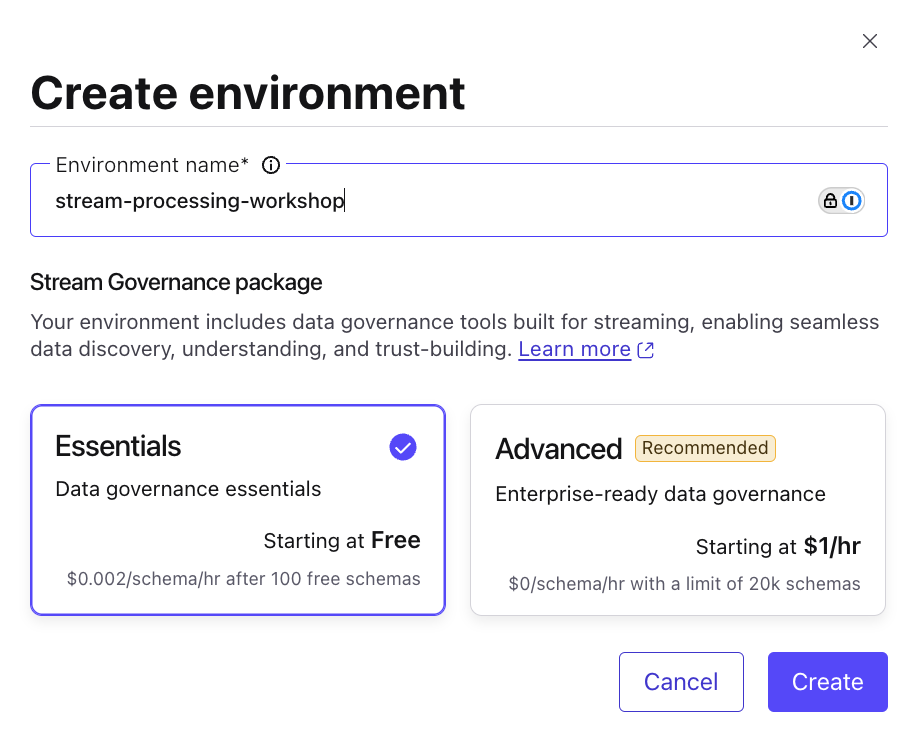
</div>

4. Next, you can start creating a cluster by entering in a name (e.g. `flink-cluster`)
5. Select the `Basic` cluster type
6. Choose `Google Cloud` as your provider
7. Select `Las Vegas (us-west4`) as the region **Create Cluster**.
8. Keep the default selections for *Uptime SLA*, *Networking*, and *Encryption*

<div align="center" padding=25px>
    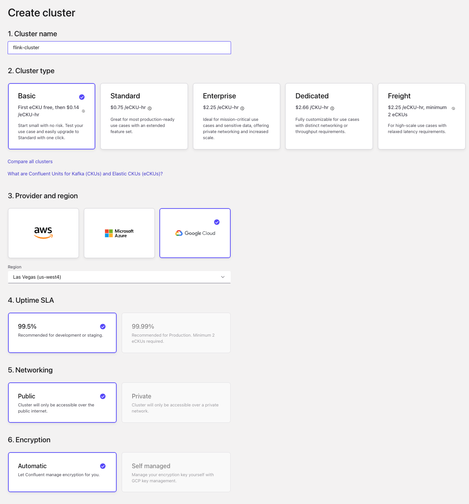
</div>

9. Click **Launch Cluster**.

> [!Note]
> **Confluent Cluster Types**
>
> Confluent Cloud clusters are available in 5 types: *Basic*, *Standard*, *Enterprise*, *Dedicated*, and *Freight*. `Basic` is intended for development use cases so you will use that for this workshop.
>
> If you are interested in learning more about the different types of clusters and their associated features and limits, refer to this [documentation](https://docs.confluent.io/current/cloud/clusters/cluster-types.html).

## <a name="step-3"></a>Create a Flink Compute Pool

1. Click on the link with your environment name in the navigation bookmark links at the top of your screen.
2. Select the **Flink** tab and click **Create Compute Pool**.

<div align="center" padding=25px>
    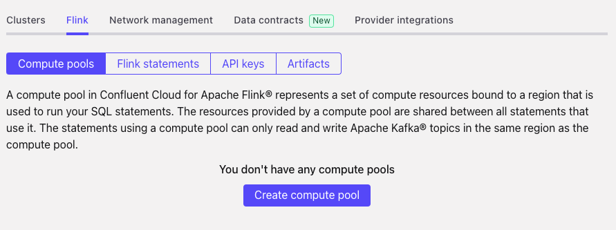
</div>

3. Select `Las Vegas (us-west4)` as the **Region** and then click **Continue**.

<div align="center" padding=25px>
    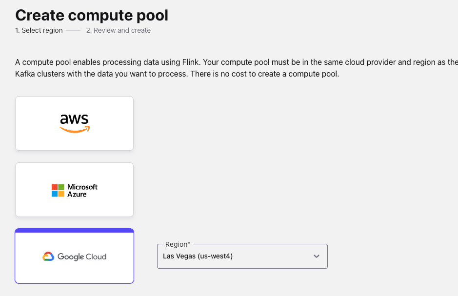
</div>

4. Enter a name for your pool (e.g. `flink-workshop-pool`) and click **Create**.

<div align="center" padding=25px>
    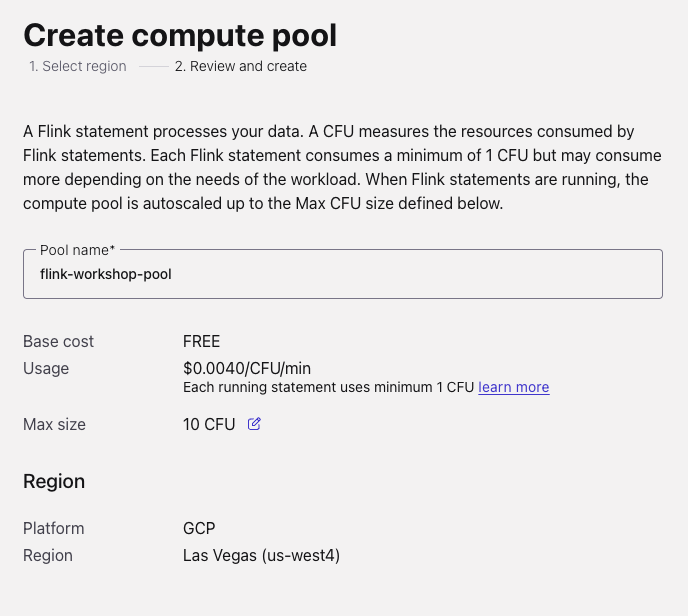
</div>

> [!Note]
> **Compute Pool Capacity**
>
> The capacity of a compute pool is measured in CFUs. Compute pools expand and shrink automatically based on the resources required by the statements using them.
>
> A compute pool without any running statements scale down to zero. The maximum size of a compute pool is configured during creation.

5. Flink Compute pools will be ready shortly. You can click **Open SQL workspace** button when the pool is ready to use.

<div align="center" padding=25px>
    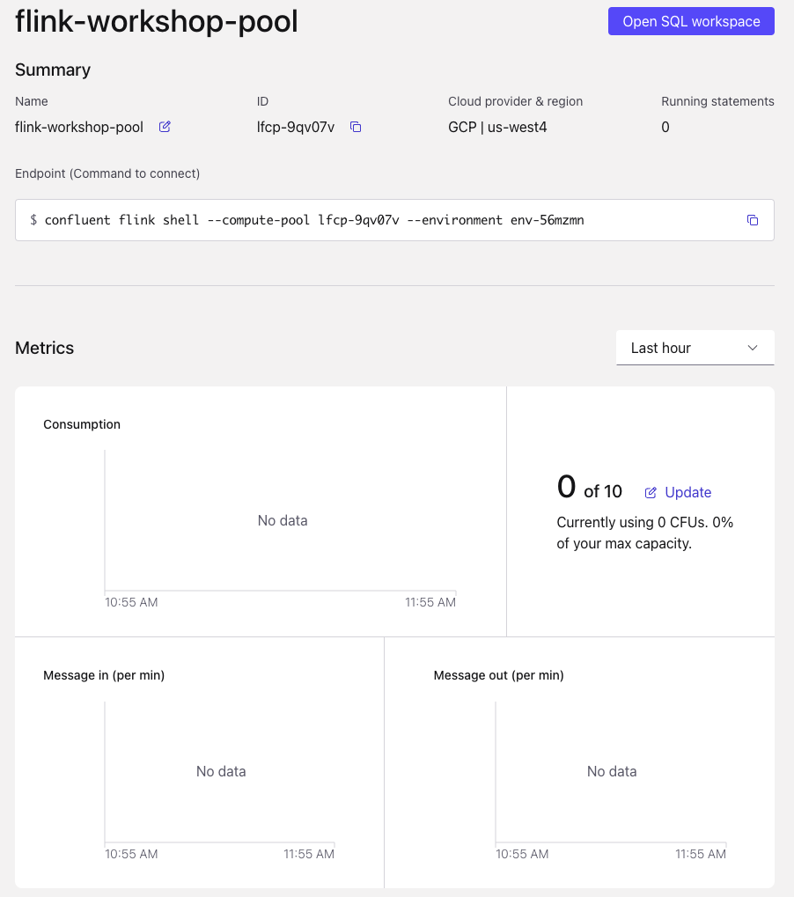
</div>

6. Change your workspace name by clicking the **settings icon** in the top right of your screen and entering a new name, something like `flink-workspace`. Click **Save changes** after you have finished.

<div align="center" padding=25px>
    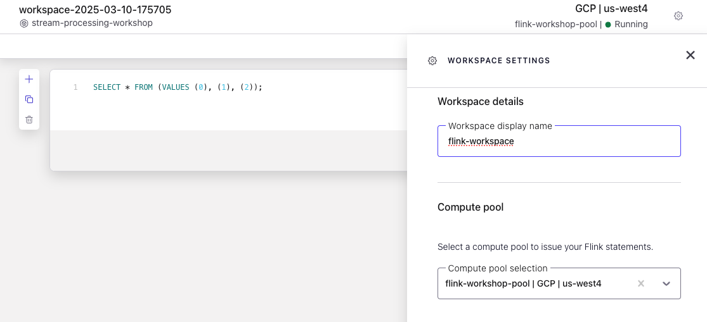
</div>

7. There are two *Use* labels above the Flink query window. For the left-most *Use* label, click the dropdown and select your new environment.
8. For the right-most *Use* label, click the dropdown and select your cluster.

<div align="center" padding=25px>
    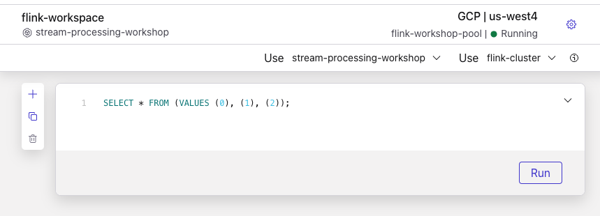
</div>

## <a name="step-4"></a>Create Topics

1. Click on the *Environments* icon that is second from the top in the left side icon navigation menu.
2. Select your workshop environment.
3. Click into your workshop cluster.

> [!Note]
> **Cluster Overview**
>
> This section shows Cluster Metrics, such as *Throughput* and *Storage*. This page also shows the number of *Topics*, *Partitions*, *Connectors*, and *ksqlDB Clusters*. Below is an example of the metrics dashboard once you have data flowing through Confluent Cloud.

<div align="center" padding=25px>
    
</div>

4. In the left navigation menu, select **Topics** and click **Create topic**.
5. Enter **users-topic** as the topic name, **1** as the number of partitions, do not toggle the *Enable infinite retention* for this topic, and then click **Create with defaults**.

<div align="center" padding=25px>
    
</div>

5. Click **Skip** on the Data Contract prompt.
6. Repeat the previous step and create a second topic named **stocks-topic** with **1** as the number of partitions.

> [!Note]
> **Topic Parameters**
>
> Topics have many configurable parameters. A complete list of those configurations for Confluent Cloud can be found [here](https://docs.confluent.io/cloud/current/topics/overview.html#cloud-topics-manage).
>
> If you are interested in viewing the default configurations, you can view them in the Topic Summary on the right side.

7. After topic creation, the **Topics UI** allows you to monitor production and consumption throughput metrics and the configuration parameters for your topics. When you begin sending messages to Confluent Cloud, you will be able to view those messages and message schemas.
8. Navigate to the **users-topic** to see that no data is being produced or consumed yet.

<div align="center" padding=25px>
    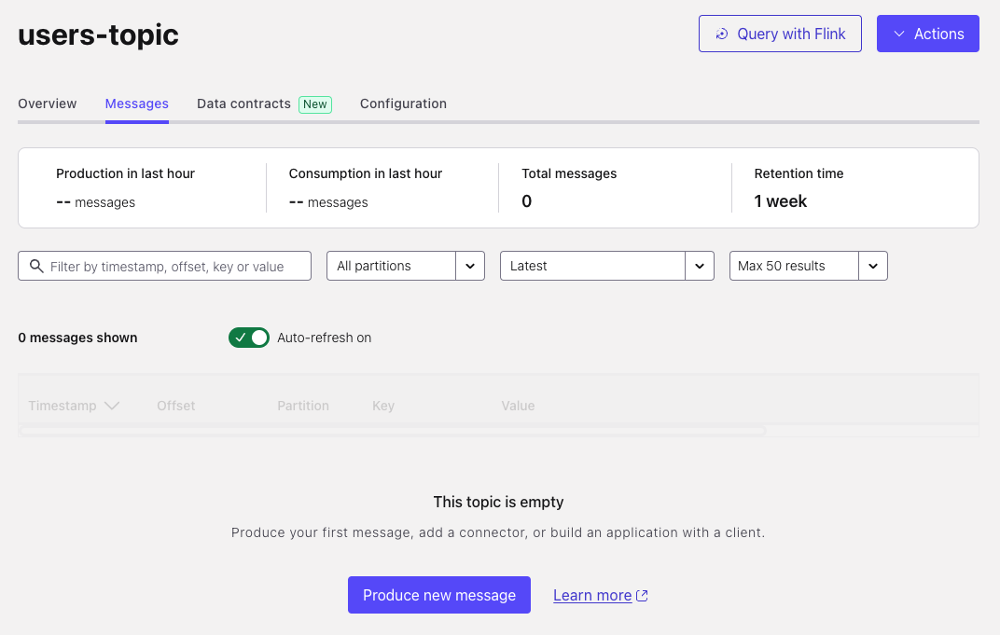
</div>

***

## <a name="step-5"></a>Create an API Key

1. Click on the hamburger icon (three horizontal lines) in the top right of the screen.
2. Click **API Keys** in the menu under *Administration*.
3. Click **Create Key** in order to create your first API Key. If you have an existing API Key, click **+ Add Key** to create another API Key.

<div align="center" padding=25px>
    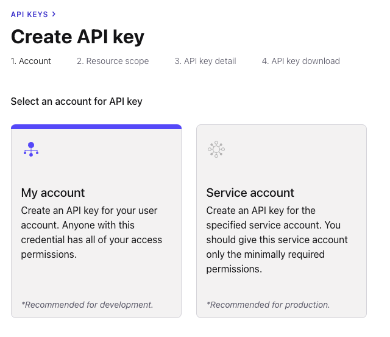
</div>

4. Select **My account** and then click **Next**.
5. Select **Kafka cluster**, then select your workshop environment and cluster under the *Specify Kafka cluster* dropdowns. Click **Next**.

<div align="center" padding=25px>
    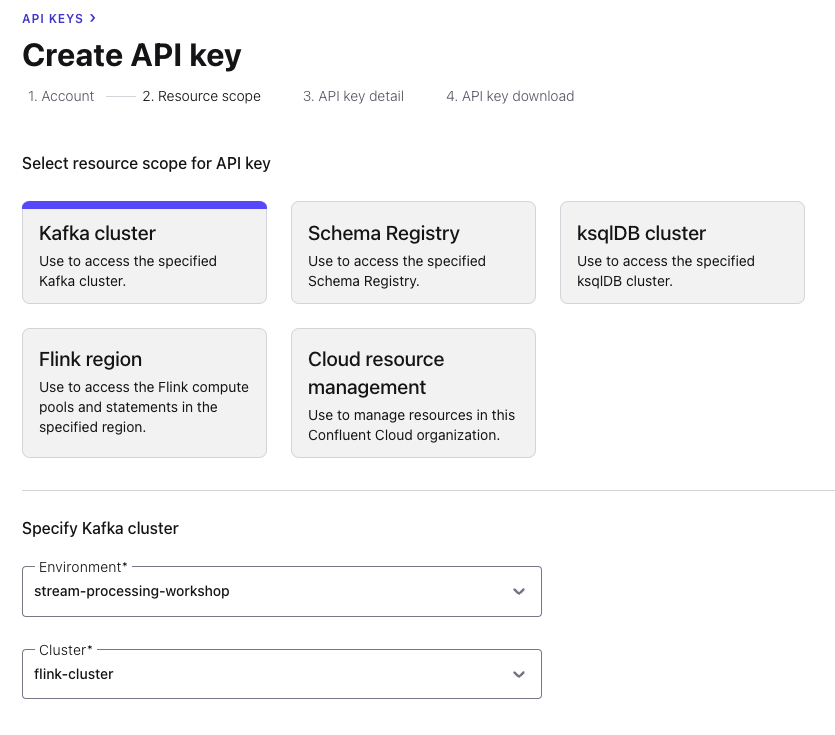
</div>

6. Give your API Key a name, something like `flink-workshop-apikey`.
7. Enter a description for your API Key (e.g. `API Key to source data from connectors`).
8. Click **Create API Key**.
9. Click **Download API key** to save both the *Key* and *Secret* to your computer.
10. Click **Complete**.
11. After creating and saving the API key, you will see this API key in the Confluent Cloud UI in the *API Keys* table. If you don't see the API key populate right away, try refreshing your browser.

## <a name="step-6"></a>Create Datagen Connectors for Users and Stocks

The next step is to produce sample data using the Datagen Source connector. You will create two Datagen Source connectors.

The first connector will send sample customer data to the **users-topic** topic, while the second connector will send sample product data to the **stocks-topic** topic.

1. First, navigate to your workshop cluster.
2. Next, click on the **Connectors** link on the navigation menu.
3. Now click on the **Datagen Source** icon.

<div align="center" padding=25px>
    
</div>

4. Click the **Additional Configuration** link.
5. Enter the following configuration details in the setup wizard. The remaining fields can be left blank or default.
<div align="center">

| Setting                            | Value                        |
|------------------------------------|------------------------------|
| Topic                              | users-topic                  |
| API Key                            | [*from step 5*](#step-5)     |
| API Secret                         | [*from step 5*](#step-5)     |
| Output message format              | AVRO                         |
| Quickstart                         | Users                        |
| Max interval between messages (ms) | 1000                         |
| Tasks                              | 1                            |
| Name                               | user-data-connector          |

</div>

<br>

<div align="center" padding=25px>
    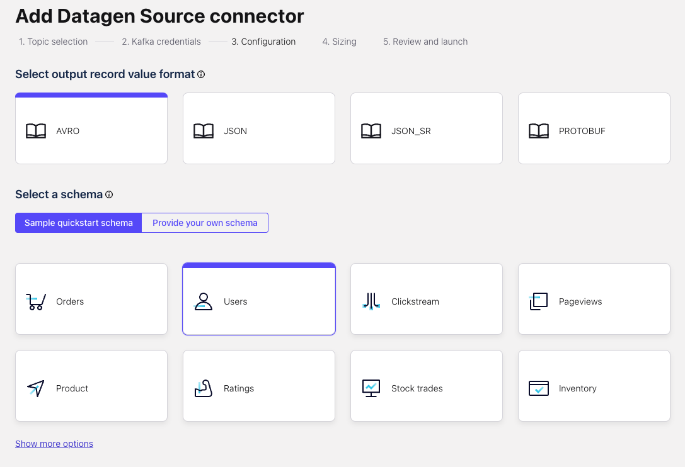
</div>

6. Continue through the setup wizard and click **Continue** to launch the wizard.

<div align="center" padding=25px>
    
</div>

7. Next, create the second connector that will send data to **stocks-topic**. Click on **+ Add Connector** and then the **Datagen Source** icon again.

8. Enter the following configuration details. The remaining fields can be left blank or default.

<div align="center">

| Setting                            | Value                        |
|------------------------------------|------------------------------|
| API Key                            | [*from step 5* ](#step-5)    |
| API Secret                         | [*from step 5* ](#step-5)    |
| Topic                              | stocks-topic                 |
| Output message format              | AVRO                         |
| Quickstart                         | Stocks trade                 |
| Max interval between messages (ms) | 1000                         |
| Tasks                              | 1                            |
| Name                               | stock-data-connector         |
</div>

<br>

9. Review your selections and then click **Launch**.

> **Note:** It may take a few moments for the connectors to launch. Check the status and when both are ready, the status should show *running*. <br> <div align="center">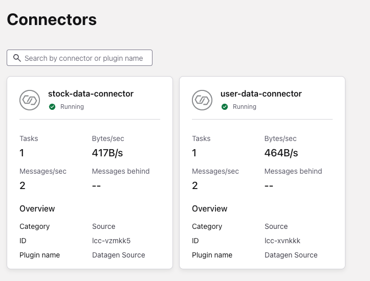</div>

> **Note:** If the connector fails, there are a few different ways to troubleshoot the error:
> * Click on the *Connector Name*. You will see a play and pause button on this page. Click on the play button.
> * Click on the *Connector Name*, go to *Settings*, and re-enter your API key and secret. Double check there are no extra spaces at the beginning or end of the key and secret that you may have accidentally copied and pasted.
> * If neither of these steps work, try creating another Datagen connector.


10. You can view the sample data flowing into topics in real time. Navigate to  the **Topics** tab and then click on the **users-topic**. You can view the production and consumption throughput metrics here.

11. Click on **Messages**.
12. Click on a row in the table and you should see something like this:

<div align="center">
    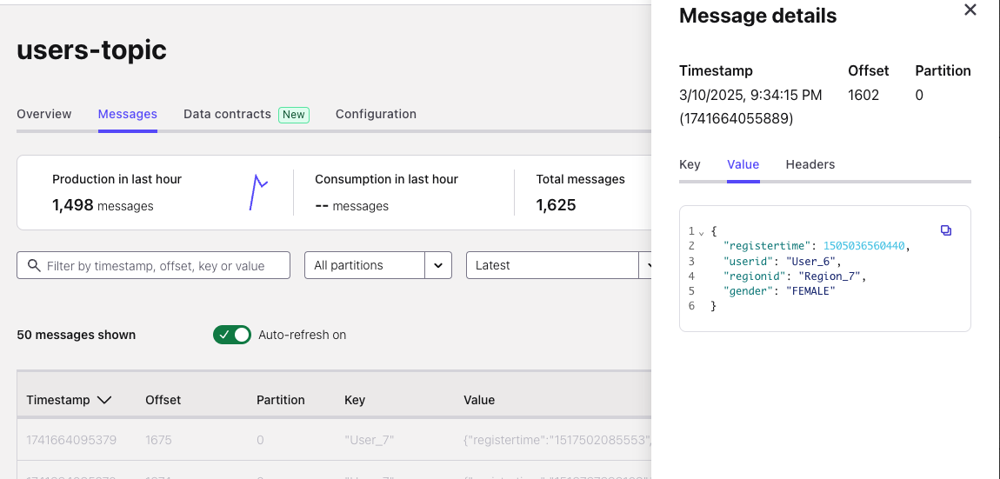
</div>

## <a name="step-7"></a>Flink Queries
Kafka topics and schemas are always in sync with our Flink compute pool. Any topic created in Kafka is visible directly as a table in Flink, and any table created in Flink is visible as a topic in Kafka.

**Effectively, Flink provides a SQL interface on top of Confluent Cloud.**

This table illustrates how Kafka and Flink resources map to each other.

| Kafka          | Flink     |
| ------------   | --------- |
| Environment    | Catalog   |
| Cluster        | Database  |
| Topic + Schema | Table     |

1. Navigate to your flink workspace by clicking on the **Stream Processing** icon on the very far left navigation sidebar.

<div align="center">
    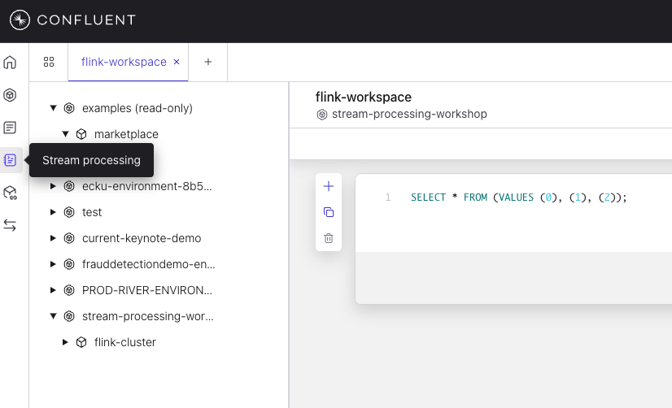
</div>

2. Familiarize yourself with **Flink SQL** Basics with these commands:

```sql
SHOW CATALOGS;
```

```sql
SHOW DATABASES;
```

```sql
SHOW TABLES;
```

Understand how the table `stocks-topic` was created:

```sql
SHOW CREATE TABLE `stocks-topic`;
```

You can find more information about all DDL Statements [here.](https://docs.confluent.io/cloud/current/flink/reference/statements/overview.html)

3. Check the table schema for your `stocks-topic` catalog. This should be the same as the topic schema in Schema Registry.

```sql
DESCRIBE `stocks-topic`;
```

4. Verify if any product records exist in the table.

```sql
SELECT * FROM `stocks-topic`;
```

5. Evaluate if the `users-topic` schema exists.

```sql
DESCRIBE `users-topic`;
```

6. Check the first five stocks trades for `User_8`.

```sql
SELECT side,
       quantity,
       symbol,
       $rowtime AS ingestion_time
  FROM `stocks-topic`
  WHERE userid = 'User_8'
  LIMIT 5;
```

7. Find the message timestamps for all stocks trades of one user.

```sql
SELECT side,
       quantity,
       symbol,
       $rowtime AS ingestion_time
  FROM `stocks-topic`
  WHERE userid = 'User_8';
```

8. Enrich Stocks Trades information with the `users-topic`. Create a new table for enriched order information.

```sql
CREATE TABLE stocks_trades_enriched_user_detail(
  userid STRING,
  regionid STRING,
  gender STRING,
  side STRING,
  quantity INT,
  symbol STRING,
  price INT,
  account STRING
)  DISTRIBUTED INTO 3 BUCKETS WITH (
    'changelog.mode' = 'retract'
);
```

9. Insert joined data from 2 tables into the new table. Keep this query running

```sql
INSERT INTO `stocks_trades_enriched_user_detail`
     SELECT ut.userid AS userid,
           regionid,
           gender,
           side,
           quantity,
           symbol,
           price,
           account
    FROM `stocks-topic` st
    LEFT JOIN `users-topic` ut
    ON st.userid = ut.userid;
```

10. Add Flink Statement cells by clicking (+). Check the enriched table by running this query.

```sql
SELECT * FROM `stocks_trades_enriched_user_detail`;
```

<div align="center">
    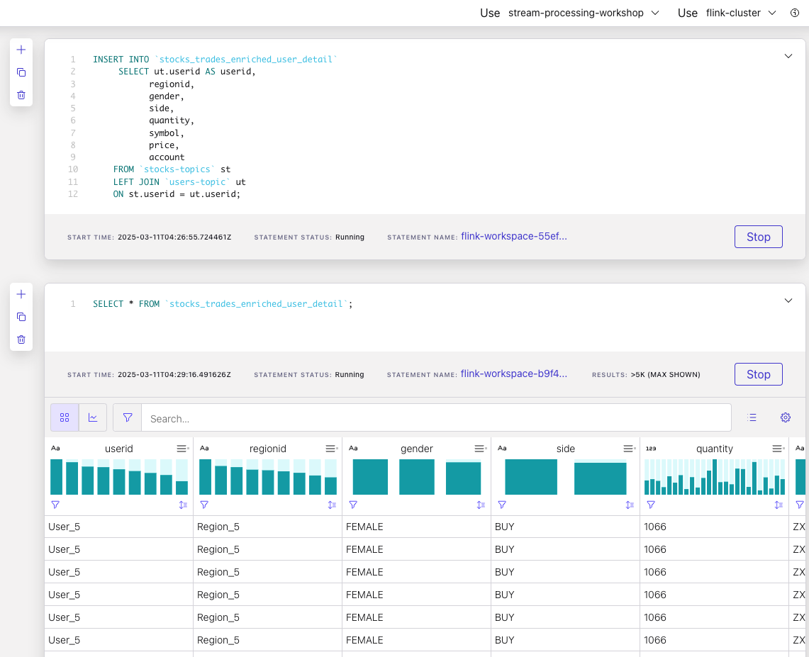
</div>

## <a name="step-8"></a>Flink Aggregations

1. Find the number of users records.

```sql
SELECT COUNT(userid) AS num_records
FROM `users-topic`;
```

2. Find the number of unique users records.

```sql
SELECT COUNT(DISTINCT userid) AS num_customers
FROM `users-topic`;
```

3. For each userid, find the number of stock symbol, average quantity and maximum model price.

```sql
SELECT userid AS user_id,
       COUNT(DISTINCT symbol) AS stock_by_symbol,
       ROUND(AVG(quantity),2) AS avg_quantity,
       MAX(price) AS max_price
FROM `stocks-topic`
GROUP BY userid;
```

4. Running query to aggregate the data by counting stock *BUY*s.

```sql
SELECT symbol,
       COUNT(quantity) AS total_times_bought
FROM `stocks-topic`
WHERE side = 'BUY'
GROUP BY symbol
```

5. Create new table `number_of_times_stock_bought` to store the result.

```sql
CREATE TABLE number_of_times_stock_bought(
  symbol STRING,
  total_times_bought BIGINT,
  PRIMARY KEY (symbol) NOT ENFORCED
) DISTRIBUTED INTO 3 BUCKETS;
```

6. Insert aggregate data by inserting *BUY*s of stocks into the number_of_times_stock_bought table. This query will continue executing.

```sql
INSERT INTO `number_of_times_stock_bought`
SELECT symbol,
    COUNT(quantity) AS total_times_bought
FROM `stocks-topic`
WHERE side = 'BUY'
GROUP BY symbol;
```

7. Run this query against the `number_of_times_stock_bought` table.

```sql
SELECT *
FROM `number_of_times_stock_bought`;
```

8. Next, create a table that calculates the total number of stocks purchased per symbol.

```sql
SELECT symbol,
    SUM(quantity) AS total_quantity
FROM `stocks-topic`
WHERE side = 'BUY'
GROUP BY symbol;
```

9. Create new table `total_stock_purchased` to store the result.

```sql
CREATE TABLE total_stock_purchased(
  symbol STRING,
  total_quantity BIGINT,
  PRIMARY KEY (symbol) NOT ENFORCED
) DISTRIBUTED INTO 3 BUCKETS;
```

10. Insert aggregate data by inserting the sum of *BUY*s of stocks to the `total_stock_purchased` table.

```sql
INSERT INTO `total_stock_purchased`
SELECT symbol,
       SUM(quantity) AS total_quantity
FROM `stocks-topic`
WHERE side = 'BUY'
GROUP BY symbol;
```

11. Check the result by running this query against the `total_stock_purchased` table.

```sql
SELECT *
FROM `total_stock_purchased`;
```

> [!Note]
> **Flink Aggregate Functions**
>
> Check this [link](https://docs.confluent.io/cloud/current/flink/reference/functions/aggregate-functions.html) for more information about Flink aggregation functions.

## <a name="step-9"></a>Flink Windowing Functions

*Windows* are central to processing infinite streams. Windows split the stream into “buckets” of finite size, over which you can apply computations.

The goal of this section is to describe how windowing is performed in Confluent Cloud for Apache Flink, and how you can benefit from windowed functions.

Flink provides several window *table-valued functions* (TVF) to divide the elements of your table into windows, including:

- [Tumble Windows](https://docs.confluent.io/cloud/current/flink/reference/queries/window-tvf.html#flink-sql-window-tvfs-tumble)
- [Hop Windows](https://docs.confluent.io/cloud/current/flink/reference/queries/window-tvf.html#flink-sql-window-tvfs-hop)
- [Cumulate Windows](https://docs.confluent.io/cloud/current/flink/reference/queries/window-tvf.html#flink-sql-window-tvfs-cumulate)

1. Find the amount of stocks trades for five minute intervals (tumbling window aggregation).

```sql
SELECT window_end,
       COUNT(side) AS num_orders
FROM TABLE(
  TUMBLE(TABLE `stocks-topic`, DESCRIPTOR(`$rowtime`), INTERVAL '5' MINUTES))
GROUP BY window_end;
```

2. Find the amount of stocks trades for ten minute intervals advanced by five minutes (hopping window aggregation).

```sql
SELECT window_start,
       window_end,
       COUNT(side) AS num_orders
FROM TABLE(
  HOP(TABLE `stocks-topic`, DESCRIPTOR(`$rowtime`), INTERVAL '5' MINUTES, INTERVAL '10' MINUTES))
GROUP BY window_start, window_end;
```

Visit this [link](https://docs.confluent.io/cloud/current/flink/reference/queries/window-tvf.html) for detailed information about Flink Window aggregations.

## <a name="step-10"></a>Fraud Detection

Now that you have gone through a few examples on how to use Flink for Windowing, including Tumble and Hop Windows, you will use it for anomaly/fraud detection.

Flink enables aggregation operations on tables, as you saw in the previous step, and you have the ability to set time boundaries named windows. A window has a start time and an end time, which you access in your queries by using `window_start` and `window_end`.

When using Windowing, aggregate functions are applied only to the records that occur within the specified time window.

1. Create a table for `stocks_purchased_today`

```sql
CREATE TABLE stocks_purchased_today(
  symbol STRING,
  window_start TIMESTAMP,
  window_end TIMESTAMP,
  quantity BIGINT,
  PRIMARY KEY (symbol, window_start,window_end) NOT ENFORCED
) DISTRIBUTED INTO 3 BUCKETS;
```

2. Insert data into the `stocks_purchased_today` table.

```sql
INSERT INTO `stocks_purchased_today`
SELECT symbol,window_start,
  window_end,
  COUNT(*) AS quantity
FROM TABLE(
  TUMBLE(TABLE `stocks-topic`, DESCRIPTOR(`$rowtime`), INTERVAL '5' MINUTES))
GROUP BY symbol,window_end,window_start;
```

3. Verify data is flowing into the `stocks_purchased_today` table.

```sql
SELECT *
FROM `stocks_purchased_today`;
```

4. Going along with the theme of fraud detection, create a table named `accounts_to_monitor` based on user activity during a given time frame. In your Flink workspace, paste the following statement and run the query.

```sql
CREATE TABLE accounts_to_monitor(
  window_start_key TIMESTAMP,
  window_end_key TIMESTAMP,
  accountid STRING,
  window_start TIMESTAMP,
  window_end TIMESTAMP,
  account STRING,
  quantity BIGINT,
  PRIMARY KEY (window_start_key,window_end_key,accountid) NOT ENFORCED
) DISTRIBUTED INTO 3 BUCKETS;
```

5. Insert data into the `accounts_to_monitor` table.

```sql
INSERT INTO `accounts_to_monitor`
SELECT window_start AS window_start_key,
  window_end AS window_end_key,
  account AS accountid,
  window_start,
  window_end,
  account,
  COUNT(*) AS quantity
FROM TABLE(
  TUMBLE(TABLE `stocks-topic`, DESCRIPTOR(`$rowtime`), INTERVAL '5' MINUTES))
GROUP BY window_end,window_start,account
HAVING COUNT(*)>10;
```

6. Verify the result.

```sql
SELECT *
FROM `accounts_to_monitor`;
```

## <a name="step-11"></a>Check Flink Queries

Building on the Fraud Detection example from the previous step, you want to check on high frequency accounts to monitor for and uncover potentially fraudulent activity.

1. Find accounts with a lot of activity.

```sql
SELECT *
FROM `accounts_to_monitor`
    WHERE quantity > 100;
```

2. Now that you have identified potential fraud, you can create an ephemeral push query to monitor future trades from our **stocks_enriched** stream. This will continue to push trades to the fraud service for further analysis until it is stopped.

<!-- TODO: Why selecting a hardcoded account id? why not join on -->

```sql
SELECT * FROM stocks_trades_enriched_user_detail
	WHERE account = 'ABC123';
```

## <a name="step-12"></a>(Optional) Connect BigQuery sink to Confluent Cloud

The next step is to sink data from Confluent Cloud into BigQuery using the [fully-managed BigQuery Sink connector](https://docs.confluent.io/cloud/current/connectors/cc-gcp-bigquery-storage-sink.html). The connector will send real time data on **accounts_to_monitor** into BigQuery.

1. First, you will create the connector that will automatically create a BigQuery table and populate that table with the data from the promotions topic within Confluent Cloud. From the Confluent Cloud UI, click on the Connectors tab on the navigation menu and select **+Add connector**. Search and click on the BigQuery Sink icon.

<div align="center">
    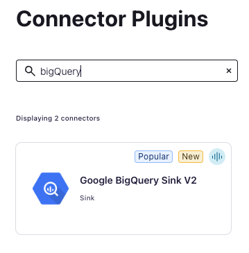
</div>

2. Enter the following configuration details. The remaining fields can be left blank.

<div align="center">

| Setting                | Value                              |
|------------------------|------------------------------------|
| `Topics `              | accounts_to_monitor_XXX            |
| `Kafka API Key`        | From step 5                        |
| `Kafka API Secret`     | From step 5                        |
| `Authentication method`| Google cloud service account       |
| `GCP Credential file`  | Upload your_gcp_credential_json_file |
| `Project ID `          | your_project_ID                    |
| `Dataset`              | accounts_to_monitor                |
| `Ingestion Mode`       | streaming                          |
| `Input Kafka format`   | AVRO                               |
| `Sanitize topics `     | true                               |
| `Sanitize field name`  | true                               |
| `Auto create table`    | PARTITION by INGESTION TIME        |
| `Partitioning type`    | DAY                                |
| `Max poll interval (ms)`| 60000                             |
| `Tasks`                | 1                                  |
| `Name`                 | BigQueryStorageSinkConnector_accounts_to_monitor    |


</div>

- Topic Selection
<div align="center">
    
</div>

<br>

- Authentication
<div align="center">
    
</div>

3. Click on **Next**.

4. Before launching the connector, you will be brought to the summary page. Once you have reviewed the configs and everything looks good, select **Launch**.

<div align="center">
    
</div>

5. This should return you to the main Connectors landing page. Wait for your newly created connector to change status from **Provisioning** to **Running**.

6. Shortly after, please switch over to the BigQuery page within Google Console to show that a table matching the topic name you used when creating the BigQuery connector in Confluent Cloud has been created within the dataset that you have provided. Clicking the table name should open a BigQuery editor for it.

<div align="center">
    
</div>

7. Query results in BigQuery.

<div align="center">
    
</div>

8. Explore data in Looker Studio.

<div align="center">
    
</div>

<br>

- Looker Studio
<div align="center">
    
</div>

***

## <a name="step-13"></a>Clean Up Resources

Deleting the resources you created during this workshop will prevent you from incurring additional charges.

1. The first item to delete is the Apache Flink Compute Pool. Select the **Delete** button under **Actions** and enter the **Application Name** to confirm the deletion.

<div align="center">
    
</div>

2. Delete the BigQuery sink connector by navigating to **Connectors** in the navigation panel, clicking your connector name, then clicking the trash can icon in the upper right and entering the connector name to confirm the deletion.

<div align="center">
    
</div>

3. Next, delete the Datagen Source connectors for **users** and **stocks**.

4. Delete the Cluster by going to the **Settings** tab and then selecting **Delete cluster**.

<div align="center">
    
</div>

5. Delete the Environment by expanding right hand menu and going to **Environments** tab and then clicking on **Delete** for the associated Environment you would like to delete

***

## <a name="step-14"></a>Confluent Resources and Further Testing

Here are some links to check out if you are interested in further testing:
- [Confluent Cloud Documentation](https://docs.confluent.io/cloud/current/overview.html)
- [Best Practices for Developing Apache Kafka Applications on Confluent Cloud](https://assets.confluent.io/m/14397e757459a58d/original/20200205-WP-Best_Practices_for_Developing_Apache_Kafka_Applications_on_Confluent_Cloud.pdf)
- [Stream Processing with Confluent Cloud for Apache Flink](https://docs.confluent.io/cloud/current/flink/overview.html)
