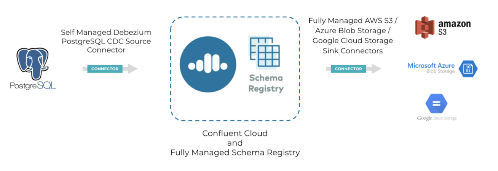
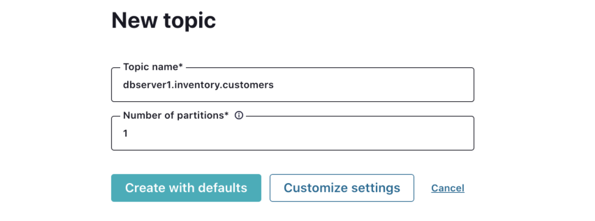
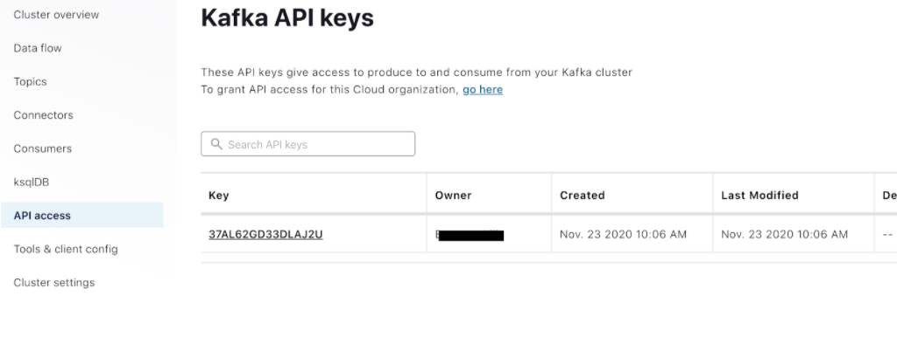
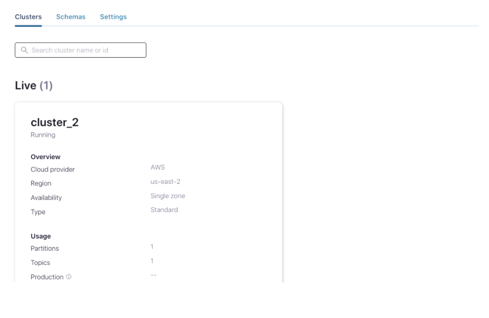

<div align="center">
    
</div>


# <div align="center">Seemlessly Connect Sources and Sink to Confluent Cloud with Kafka Connect</div>
## <div align="center">Lab Guide</div>

## **Agenda**
1. [Log into Confluent Cloud](#step-1)
1. [Create an Environment and Kafka Cluster](#step-2)
1. [Create a Topic and Cloud Dashboard Walkthrough](#step-3)
1. [Create an API Key Pair](#step-4)
1. [Enable Schema Registry](#step-5)
1. [Set up: Connect Self-Managed Services to Confluent Cloud](#step-6)
1. [Deployment: Connect Self Manged Services to Confluent Cloud](#step-7)
1. [Install: Self Managed Debezium PostgreSQL CDC Source Connector](#step-8)
1. [Launch: PostgreSQL Connector in Confluent Control Center](#step-9)
1. [Fully Managed AWS S3 Sink/Azure Blob Storage Sink/Google CLoud Storage Sink Connectors](#step-10)
1. [Confluent Cloud Schema Registry](#step-11)
1. [Clean Up Resources](#step-12)
1. [Confluent Resources and Further Testing](#step-13)
 
***

## **Architecture**

<div align="center">
    
</div>

***

## **Prerequisites**

1. Confluent Cloud Account
    * Sign-up for a free account [here](https://www.confluent.io/confluent-cloud/tryfree/).
    * Once you have signed up and logged in, click on the menu icon at the upper right hand corner, click on “Billing & payment”, then enter payment details under “Payment details & contacts”. A screenshot of the billing UI is included below.

    > **Note:** You will create resources during this lab that will incur costs. When you sign up for a Confluent Cloud account, you will get up to $200 per month deducted from your Confluent Cloud statement for the first three months. This will cover the cost of resources created during the lab.

1. Ports `443` and `9092` need to be open to the public internet for outbound traffic. To check, try accessing the following from your web browser:
    * portquiz.net:443
    * portquiz.net:9092

1. This lab requires access to a command line interface.
    * **Mac users:** The built in terminal works completely fine. iTerm2 is also a viable and recommend alternative. 
    
    * **Windows users:** The built in Command Prompt is recommended.  

1. This lab requires `docker`. Download *Docker Desktop* [here](https://www.docker.com/products/docker-desktop) and after installation, verify that you have the command line utility with the following command. 
    ```bash
    # Check the docker version
    docker --version
    ```
    > **Note**: We will be deploying Confluent Platform services and connecting them to Confluent Cloud. There are multiple ways to install Confluent Platform, which you can view in [On-Premises Deployments](https://docs.confluent.io/platform/current/installation/installing_cp/overview.html). In order to make the set up easier for those running different operating systems during the lab, we will walk through setting up Confluent Platform using Docker. You can accomplish the steps in this lab guide using any of the other deployment methods.

1. Git. If you don't already have it, down load it [here](https://git-scm.com/downloads). Check for successful installation using the following command. 
    ```bash
    # Check the git version
    git --version
    ```

1. An AWS/Azure/GCP account. You will be creating and using a **Confluent Fully Managed Sink Connector** and connecting it to object storage. You will need the following:
    * Access keys/credentials.
        * AWS: [Access Keys](https://docs.aws.amazon.com/general/latest/gr/aws-sec-cred-types.html#access-keys-and-secret-access-keys)
        * Azure: [Manage account access keys](https://docs.microsoft.com/en-us/azure/storage/common/storage-account-keys-manage?tabs=azure-portal)
        * GCP: [Creating and Managing Service Accounts](https://cloud.google.com/iam/docs/creating-managing-service-accounts)
    * Bucket/Container Name. Create the object storage in advance and have the name of the bucket/container ready for use later in this lab.
    * Region. Note which region you are deploying object storage in. You will need to know during this lab.
    * IAM Policy configured for bucket access.
        - AWS: Follow the directions outlined in [IAM Policy for S3](https://docs.confluent.io/cloud/current/connectors/cc-s3-sink.html#cc-s3-bucket-policy)
        - GCP: Your GCP service account role must have permission to create new objects in the GCS bucket. For example, the Storage Admin role can be selected for this purpose. If you are concerned about security and do not want to use the Storage Admin role, only use the storage.objects.get and storage.objects.create roles. 
            > **Note**: The Storage Object Admin role does not work for this purpose.

***

## **Objective**

Welcome to “*Seamlessly Connect Sources and Sinks to Confluent Cloud with Kafka Connect*”! In this lab, you will learn how to connect our external systems to Confluent Cloud using Connectors. Confluent offers 180+ pre-built connectors for you to start using today with no coding or developing required. To view the complete list of 180+ connectors that Confluent offers, please see [Confluent Hub](https://www.confluent.io/hub/).

If you've already completed the first lab in the Microservices Series, “*Getting Started with Microservices in Confluent Cloud*”, you walked through how to apply a microservices use case to the world of event streaming with Confluent Cloud. If you did not attend this previous session, do not worry! While the sessions relate, they are completely independent of each other.

Now, what if you have other systems you want to pull data from or push data to? This can be anything from a database, data warehouse, object storage, or software application. You can easily connect these systems to Kafka using one of the connectors.
 
During this lab, you will first set up our Confluent Cloud account, including creating your first cluster and topic, and setting up **Schema Registry**. 

Next, we will set up and deploy two different types of connectors: **Self Managed** and **Fully Managed**.

* **Self Managed Connectors** are installed on a self managed Kafka Connect cluster that is connected to your cluster in Confluent Cloud. You will be walking through how to set up a local Connect cluster by downloading Confluent Platform, installing the connector offered by Confluent, and then connecting it to your Kafka cluster running in Confluent Cloud.
* **Fully Managed Connectors** are available as fully managed and fully hosted in Confluent Cloud. You will be walking through how to launch a fully managed connector in the UI. Note that it can also be launched using the `ccloud` CLI. 

You will also learn more about **Schema Registry** and how we can use it in Confluent Cloud to ensure data compatibility and to manage our schemas. 

At the conclusion of this lab, you will have learned how to leverage both **Self Managed** and **Fully Managed** connectors to complete your data pipeline and how you can use them with your microservices!

***

## **<a name="log-into-confluent-cloud"></a>Log into Confluent Cloud**

1. Log into [Confluent Cloud](https://confluent.cloud) and enter in your *email* and *password*.

1. If you are logging in for the first time, you will see a self-guided wizard that walks you through spinning up a cluster. Please minimize this as you will walk through those steps in this lab. 

***

## **<a name="step-2"></a>Create an Environment and Kafka Cluster**

An environment contains Kafka clusters and its deployed components such as Connect, ksqlDB, and Schema Registry. You have the ability to create different environments based on your company's requirements. We’ve seen companies use environments to separate Development/Testing, Pre-Production, and Production clusters. 

1. Click **+ Add environment**. Specify an **Environment name** and click **Create**.

    > **Note**: There is a Default environment ready in your account upon account creation. You can use this Default environment for the purpose of this lab if you do not wish to create an additional environment.

1. Now that we have an environment, click **Create Cluster**.

    Confluent Cloud clusters are available in 3 types: **Basic**, **Standard**, and **Dedicated**. **Basic** is intended for development use cases so we will use that for your lab today. **Basic** clusters only support single zone availability. **Standard** and **Dedicated** clusters are intended for production use and support multi-zone deployments. If you are interested in learning more about the different types of clusters and their associated features and limits, refer to the documentation [here](https://docs.confluent.io/current/cloud/clusters/cluster-types.html).

1. Choose the **Basic** Cluster Type. 

    > **Note**: Confluent’s single tenant clusters, **Dedicated clusters**, are only available to customers on a Confluent Cloud commit or on PAYG through your cloud provider’s marketplace.

1. Click **Begin Configuration**.

1. Choose your preferred Cloud Provider, Region, and Availability Zone.
    - Here you have the ability to choose which cloud provider you want (AWS, GCP, or Azure). 
    - **Choose the cloud provider you have your object storage set up with** 
    - **Choose the same region where your object storage resource is deployed**

1. Specify a **Cluster Name**. Any name will work here. 

1. View the associated Configuration & Cost, Usage Limits, and Uptime SLA information before launching.

1. Click **Launch Cluster**.

***

## **<a name="step-3"></a>Create a Topic and Walk Through the Cloud Dashboard**

1. On the left hand side navigation menu, you will see **Cluster overview**. 

    This section shows Cluster Metrics, such as Throughput and Storage. This page also shows the number of Topics, Partitions, Connectors, and ksqlDB Applications.  Below is an example of the metrics dashboard once you have data flowing through Kafka. 

    <div align="center">
        
    </div>

1. Click on **Cluster Settings**. This is an important tab that should be noted. This is where you can find your cluster ID, bootstrap server, cloud details, cluster type, and capacity limits. 

1. **Important**: Copy and save the bootstrap server name. We will use it later in the workshop.

1. On that same navigation menu, select **Topics** and click **Create Topic**. Refresh the page if your cluster is still spinning up.

1. Enter `dbserver1.inventory.customers` as the **Topic name** and **1** as the Number of partitions, and then click on **Create with defaults**.

    `dbserver1.inventory.customers` is the name of the table within the Postgres database we will be setting up in a later section.

    Topics have many configurable parameters that dictate how Kafka handles messages. A complete list of those configurations for Confluent Cloud can be found [here](https://docs.confluent.io/cloud/current/using/broker-config.html).  If you are interested in viewing the default configurations, you can view them in the Topic Summary on the right side. 

    <div align="center">
        
    </div>

1. After creation, the **Topics UI** allows you to monitor production and consumption throughput metrics and the configuration parameters for your topics. When we begin sending messages through, you will be able to view messages and message schemas. 

    Creating a Schema will ensure messages are following a desired format and can be critical for Kafka production deployments. To learn more about Schema Registry, please see this document [here](https://docs.confluent.io/cloud/current/client-apps/schemas-manage.html#). We will also be going over Schema Registry during this workshop.

1. Below is a look at our topic, `dbserver1.inventory.customers`, but we need to send data to this topic before we see any metrics. 

    <div align="center">
        
    </div>

***

## **<a name="step-4"></a>Create an API Key Pair**

1. Select **API Access** on the navigation menu. 

1. If this is your first API key within your cluster, click **Create key**. If you have set up API keys in your cluster in the past and already have an existing API key, click **+ Add key**.

    <div align="center">
        
    </div>

1. Select **Global Access**, then click Next.

1. Save your API key and secret - you will need these during the workshop.

1. After creating and saving the API key, you will see this API key in the Confluent Cloud UI in the **API Access** tab. If you don’t see the API key populate right away, refresh the browser. 

    <div align="center">
        
    </div>

***

## **<a name="step-5"></a>Enable Schema Registry**

A Kafka topic contains messages, and each message is a key-value pair. Either the message key or the message value (or both) can be serialized as JSON, Avro, or Protobuf. A schema defines the structure of the data format. 

Confluent Cloud Schema Registry is used to manage schemas and it defines a scope in which schemas can evolve. It stores a versioned history of all schemas, provides multiple compatibility settings, and allows schemas to evolve according to these compatibility settings. 

We will be exploring Confluent Cloud Schema Registry in more detail towards the end of the workshop. First, we will need to enable Schema Registry within our environment.

1. Return to your environment either by clicking on the Confluent icon at the top left corner and then clicking your environment OR clicking on your environment name at the top left corner where it says *`HOME` > `your environment name` > `your cluster name`*.

    <div align="center">
        
    </div>

1. Click on **Schemas**. Select your cloud provider and region, and then click on **Enable Schema Registry**.

    <div align="center">
        
    </div>

1. Next, we will create an API Key for Schema Registry. From here, click on **Settings** and expand **Schema Registry API access**.

1. Click on **+ Create Key** and save your API key and secret - you will also need these during the workshop.

1. **Important**: Make note of where it says *“Make requests to the Schema Registry endpoint using your API key and secret for authentication”*. We will use this endpoint in one of the steps later in the workshop.

***

## **<a name="step-6"></a>Set up and Connect Self Managed Services to Confluent Cloud**

Let’s say you have a database, or object storage such as AWS S3, Azure Blob Storage, or Google Cloud Storage, or a data warehouse such as Snowflake. How do you connect these data systems to your microservices architecture?

There are 2 options: <br>

1. Develop your own connectors using the Kafka Connect framework (this requires a lot of development time and effort).  
2. You can leverage the 180+ connectors Confluent offers out-of-the-box which allows you to configure your sources and sinks to Kafka in a few, simple steps. To view the complete list of connectors that Confluent offers, please see [Confluent Hub](https://www.confluent.io/hub/).

With Confluent’s connectors, your data systems can communicate with your microservices, completing your data pipeline. 

If you want to run a connector not yet available as fully managed in Confluent Cloud, you may run it yourself in a self-managed Kafka Connect cluster and connect it to Confluent Cloud. Please note that Confluent will still support any self managed components. 

Now that we have completed setting up our Confluent Cloud account, cluster, topic, and Schema Registry, this next step will guide you how to configure a local Connect cluster backed by your Kafka cluster in Confluent Cloud that we created in Step 2. 

1. Click on **Connectors**, and then click on **Self Managed**. If you already have existing connectors running, click on **+ Add Connector** first.

    Self Managed connectors are installed on a local Connect cluster backed by a source Kafka cluster in Confluent Cloud. This Connect cluster will be hosted and managed by you, and Confluent will fully support it. 

    ## <div align="center">...</div>
    *<div align="center">Image</div>*
    ## <div align="center">...</div>

1. To begin setting up **Connect**, start by cloning Confluent's Commercial SE workshop repository.
    > **Note:** This repository contains **all** of the workshops and workshop series led by Confluent's Commercial SE team. Be sure to navigate to the correct sub-directory to access the right content. 
    ```bash
    # Clone Confluent's Commercial SE Workshop repo
    git clone https://github.com/confluentinc/commercial-workshops
    ```
    Then, navigate to the sub-directory for this lab.
    ```bash
    # Navigate to 'workshop-connectors'
    cd commercial-workshops/series-microservices/workshop-connectors
    ```

    This directory contains two important supporting files, `setup.properties` and `docker-compose.yml`. 

    You will use `setup.properties` in order to export values from your Confluent Cloud account as environment variables. `docker-compose.yml` will use the environment variables from there to create three containers: `connect`, `control-center`, and `postgres`. 

    You will use `control-center` to configure `connect` to do change data capture from `postgres` before sending this data Confluent Cloud. 

1. The next step is to replace the placeholder values surrounded in angle brackets within `setup.properties`. For reference, use the following table to fill out all the values completely.

    | property               | created in step                         |
    |------------------------|-----------------------------------------|
    | `BOOTSTRAP_SERVERS`      | [*create an environment and kafka cluster*](#create-an-environment-and-kafka-cluster) |
    | `CLOUD_KEY`              | [*create an api key pair*](#create-an-api-key-pair)                  |
    | `CLOUD_SECRET`           | [*create an api key pair*](#create-an-api-key-pair)                  |
    | `SCHEMA_REGISTRY_KEY`    | [*enable schema registry*](#enable-schema-registry)                  |
    | `SCHEMA_REGISTRY_SECRET` | [*enable schema registry*](#enable-schema-registry)                  |
    | `SCHEMA_REGISTRY_URL`    | [*enable schema registry*](#enable-schema-registry)                  |

