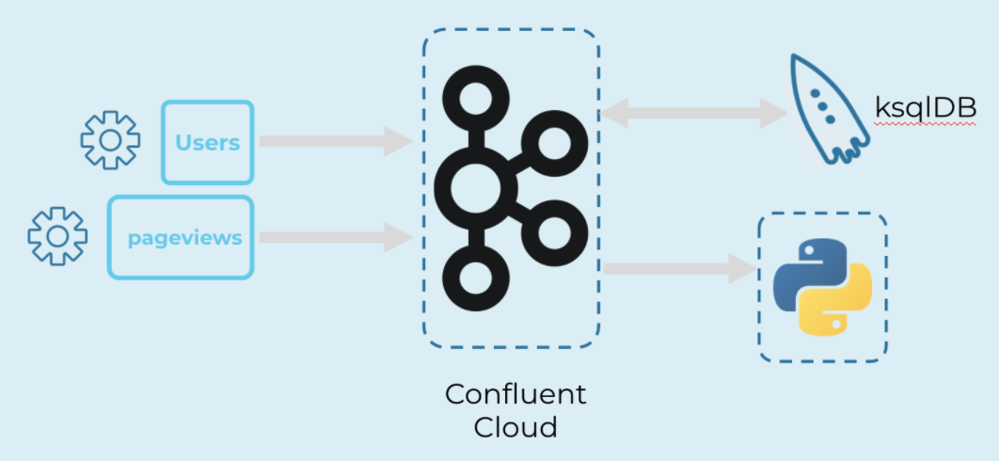

<div align="center" padding=25px>
    
</div>

# <div align="center">Getting Started with Microservices in Confluent Cloud</div>
## <div align="center">Lab Guide for Mac Users</div>

## **Agenda**
1. [Log Into Confluent Cloud](#log-into-confluent-cloud)
1. [Create an Environment and Cluster](#create-an-environment-and-cluster)
1. [Create a Topic using the Cloud UI](#create-a-topic-using-the-cloud-ui)
1. [Install CCloud CLI Utility](#install-ccloud-cli-utility)
1. [Create an API Key Pair](#create-an-api-key-pair)
1. [Create a Topic Using the CCloud Utility](#create-a-topic-using-the-ccloud-utility)
1. [Create a ksqlDB Application](#create-a-ksqldb-application)
1. [Create Datagen Connectors for your Topics](#create-datagen-connectors-for-your-topics)
1. [Consume Topics Using Python](#consume-topics-using-python)
1. [Create Streams and Tables using ksqlDB](#create-streams-and-tables-using-ksqldb)
1. [Clean Up Resources](#clean-up-resources)
1. [Confluent Resources and Further Testing](#confluent-resources-and-further-testing)

***

## **Architecture Diagram**

<div align="center">
    
</div>

***

## **Prerequisites**

This document outlines instructions on how to complete the prerequisites for Mac for the lab portion of the workshop. If you are not able to complete these prerequisites (corporate firewall rules, corporate IT does not allow new installations, did not find the time to complete, etc.), then you are welcome to watch our engineers walk through the lab during the workshop. We will also be providing you with the lab guide so you can review the lab again at any time. Finally, the workshop will be recorded so you can go back to view the lab. 

1. Confluent Cloud Account
    * Sign-up for a free account [here](https://www.confluent.io/confluent-cloud/tryfree/).
    * Once you have signed up and logged in, click on the menu icon at the upper right hand corner, click on “Billing & payment”, then enter payment details under “Payment details & contacts”. A screenshot of the billing UI is included below.

    > **Note:** We will create resources during this workshop that will incur costs. When you sign up for a Confluent Cloud account, you will get up to $200 per month deducted from your Confluent Cloud statement for the first three months. This will cover the cost of resources created during the workshop. We will send a copy of the workshop lab guide to all attendees, and it includes a section on how to clean up all resources created.

1. Ports 443 and 9092 need to be open to the public internet for outbound traffic. To check, try accessing the following from your web browser:
    * portquiz.net:443
    * portquiz.net:9092

1. This workshop requires access to a command line interface.

1. [Homebrew](https://brew.sh/#install). We will use this to help us install other prerequisites.
    > **Note:** This step might take a few minutes.
    ```bash
    /bin/bash -c "$(curl -fsSL https://raw.githubusercontent.com/Homebrew/install/HEAD/install.sh)"
    ```
1. [Python](https://www.python.org/downloads/). We will be using `python3` in this workshop. 
    > **Note:** Many versions of OSX come pre-installed with `python`. However, this installation uses version ~2.7 and is not always compatible. You can test this using the command `python --version`.
    
    Execute the following command to install `python3` using `homebrew`. 
    ```bash
    brew install python3
    ```

1. [Librdkafka](https://github.com/edenhill/librdkafka). We will using this Kafka Client in order to consume and produce events from/to Confluent Cloud.
    ```bash
    brew install librdkafka
    ```

1. [Confluent-Kafka Python Client](https://docs.confluent.io/clients-confluent-kafka-python/current/index.html). We'll use this in our Python scripts. 
    ```bash
    pip3 install confluent-kafka
    ```

***

## **Objective**

In this workshop, we will learn how to apply a simple microservices use case to the world of event streaming with Confluent Cloud. 

First, we will learn the basics of configuring a Kafka cluster, streaming data to a Topic created through the Cloud UI and the CCloud CLI, and then consume the data. On that note, we will download and use the Cloud CLI as an alternative method to creating and managing Kafka clusters outside of the Confluent Cloud UI. 

Microservices can be both producers and consumers. We will be creating the Datagen Source Connector to stream mock data to topics called users and pageviews. For the purpose of this workshop, the datagen connector can be thought of as any one of your microservices. We can view the data flowing into Kafka in real-time. We will also explore using Python scripts to consume these messages. 

Now that we have data from our microservices flowing through Kafka, we will then create a ksqlDB application to query against the topics we created. ksqlDB enables you to build real-time event streaming applications on top of Apache Kafka. You no longer need to spend time on coding complex applications. You can unlock use cases for streaming ETL, monitoring and analytics, anomaly detection, and data discovery and enrichment (just to name a few), all by using simple SQL statements.

***

## <a name="log-into-confluent-cloud"></a>Log Into Confluent Cloud

1. First, access Confluent Cloud sign-in by navigating [here](confluent.cloud).
1. When provided with the *username* and *password* prompts, fill in your credentials.
    > **Note:** If you're logging in for the first time you will see a wizard that will walk you through the some tutorials. Minimize this as we will walk through these steps in this guide. 

*** 

## <a name="create-an-environment-and-cluster"></a>Create an Environment and Cluster

An environment contains Kafka clusters and its deployed components such as Connect, ksqlDB, and Schema Registry. You have the ability to create different environments based on your company's requirements. We’ve seen companies use environments to separate Development/Testing, Pre-Production, and Production clusters. 

1. Click **+ Add environment**. 
    > **Note:** There is a *default* environment ready in your account upon account creation. You can use this *default* environment for the purpose of this workshop if you do not wish to create an additional environment.

    * Specify a meaningful `name` for your environment and then click **Create**. 
        > **Note:** It will take a few minutes to assign the resources to make this new environment available for use. 

1. Now that we have an environment, let's create a cluster. Select **Create Cluster**. 
    > **Note**: Confluent Cloud clusters are available in 3 types: **Basic**, **Standard**, and **Dedicated**. Basic is intended for development use cases so we will use that for our workshop today. Basic clusters only support single zone availability. Standard and Dedicated clusters are intended for production use and support Multi-zone deployments. If you’re interested in learning more about the different types of clusters and their associated features and limits, refer to this [documentation](https://docs.confluent.io/current/cloud/clusters/cluster-types.html).

    * Chose the **Basic** cluster type.
        > **Note:** PAYG customers will only see options for basic and standard cluster types. You will have access to the dedicated cluster with a Confluent Cloud commit or by signing up for a commit or PAYG via one of the cloud provider marketplaces (AWS, Azure, or GCP Marketplace). 

    * Click **Begin Configuration**.

    * Choose your preferred **Cloud Provider**, **Region**, and **Availability Zone**.
        > **Note:** Here you have the ability to choose which cloud provider you want (AWS, GCP, or Azure). If you have no preference, we’d recommend using AWS and the **Region** and **Availability Zone** closest to you. 

    * Specify a meaningful **Cluster Name** and then review the associated *Configuration & Cost*, *Usage Limits*, and *Uptime SLA* before clicking **Launch Cluster**. 

***

## <a name="create-a-topic-using-the-cloud-ui"></a>Create a Topic using the Cloud UI

1. On the left hand side navigation menu, you will see **Cluster overview**. 
    > **Note:** This section shows cluster metrics such as *Throughput* and *Storage*. This page also shows the number of *Topics*, *Partitions*, *Connectors*, and *ksqlDB Applications*.  Below is an example of the metrics dashboard once you have data flowing through Kafka. 

1. **Cluster Settings** is an important tab that should be noted. This is where you can find your *Cluster ID*, *Cloud Details*, *Cluster Type*, *Capacity Limits*, and *Bootstrap Servers*. 

1. On the navigation menu, select **Topics** and click **Create Topic**.
    > **Note:** Refresh the page if your cluster is still spinning up. 

1. Enter `users` as the *Topic Name*.
    > **Note:** Topics have many configurable parameters that dictate how Kafka handles messages. A complete list of those configurations for Confluent Cloud can be found [here](https://docs.confluent.io/cloud/current/using/broker-config.html).  If you’re interested in viewing the default configurations, you can view them in the *Topic Summary* on the right side. 

    * Click **Create with defaults**. 

    After creation, the **Topics UI** allows you to monitor production and consumption throughput metrics and the configuration parameters for your topics. When we begin sending messages through, you will be able to view messages and message schemas. Creating a **Schema** will ensure messages are following a desired format and can be critical for Kafka production deployments. To learn more about **Schema Registry**, please go [here](https://docs.confluent.io/cloud/current/client-apps/schemas-manage.html#).

***

## <a name="install-ccloud-cli-utility"></a>Install CCloud CLI Utility

1. Select **Tools & Client Config** on the navigation menu. This section lists instructions on how to install the Confluent Cloud CLI, which we will use in this workshop. 

1. Open your command line and download the Confluent Cloud CLI.
    > **Note:** This download may take a few minutes to complete. 

    ```bash
    # Download the binary
    curl -L --http1.1 https://cnfl.io/ccloud-cli | sh -s -- -b /usr/local/bin
    ```
    ```bash
    # Make sure 'ccloud' it up to date
    ccloud update
    ```

1. Now that the CCloud CLI utility is installed, we can log into our Confluent Cloud Account to gain access. The following command will prompt you to enter your **email** and **password**. 
    ```bash
    # Log in as your user
    ccloud login --save
    ```

1. You have the ability to `list` the environments in your Confluent Cloud Account. Select the environment we created in [*Create an Environment and Cluster*](#create-an-environment-and-cluster). We will use the `environment_id` to connect to our cluster.  
    ```bash
    # List the environments in the account
    ccloud environment list
    ```
    ```bash
    # Configure 'ccloud' to use a specific environment
    ccloud environment use <environment_id>
    ```
    > **Note:** When replacing statements in a command, replace everything including the angle brackets. From the command above, we would change `<environment_id>` to `env-rjk73d`. For example: 
    > ```bash
    > ccloud environment use env-rjk73d
    > ```

1. We can also `list` and `use` the Kafka Cluster we created in [*Create an Environment and Cluster*](#create-an-environment-and-cluster). Here, we need to specify the Kafka Cluster we will use. Identify the `kafka_cluster_id` by running the first command. Use the second command to `use` that as your Kafka Cluster. 

    ```bash
    # List the clusters in your current environment
    ccloud kafka cluster list
    ```
    ```bash
    # Configure 'ccloud' to use a specific cluster
    ccloud kafka cluster use <kafka_cluster_id>
    ```

1. In order to create and manage resources from the CCloud CLI, you are required to `create` and `use` an **API Key**. This command will create an **API Key** pair for you.
    > **Note:** It's very important to write the **API Key Secret** somewhere. It's value will be shown once and once only. If you don't save the value somewhere safe, you'll have no ability to see it again. 

    ```bash
    # Create an API key pair
    ccloud api-key create --resource <kafka_cluster_id>
    ```
    ```bash
    # Configure 'ccloud' to use your API key with your cluster
    ccloud api-key use <api_key> --resource <kafka_cluster_id>
    ```

    You will see this **API Key** in the Confluent Cloud UI in the **API Access** tab. If you don't see the **API Key** populate right away, refresh the browser. 

***

## <a name="create-a-topic-using-the-ccloud-utility"></a>Creating a Topic using the CCloud Utility

1. Now, back to the CLI. With the **API Key** created, we can now create and manage topics from the CLI.  Next, we will create another topic named `pageviews` using the CLI this time and it will be created with the default configuration. After we create it, we can check the list of topics in our Kafka Cluster. You will see the `users` topic we created through the UI here as well.

    ```bash
    # Create the 'pageviews' topic
    ccloud kafka topic create pageviews
    ```
    ```bash
    # List the topics in the cluster
    ccloud kafka topic list
    ```

1. We can also *produce* simple messages to the `pageviews` topic. This command will prompt you to manually enter messages. Feel free to produce a few messages to test this out. 

    ```bash
    # Use the console producer to produce messages to a topic
    ccloud kafka topic produce pageviews
    ```
    Use **CTRL+C** to exit the console producer. 

1. We can also *consume* those test messages we sent to the `pageviews` topic. The `-b` flag indicates we want to start reading from the beginning of the topic. 

    ```bash
    # Use the console consumer to consumer messages from a topic
    ccloud kafka topic consumer -b pageviews
    ```
    Use **CTRL+C** to exit the console consumer. 

1. In the Confluent Cloud UI locate the **Topics** tab within your **cluster** and **environment**. Here, we can see the `pageviews` topic we just created. 

***

## <a name="create-a-ksqldb-application"></a>Create a ksqlDB Application

1. In the navigation of your cluster, select **ksqlDB** and then click **Add Application**.

1. Keep the default name and streaming units at 4. Select **Launch**.
    > **Note:** A streaming unit, also known as a *Confluent Streaming Unit (CSU)*, is the unit of pricing for Confluent Cloud ksqlDB. A CSU is an abstract unit that represents the linearity of performance. 

    The ksqlDB application will take some time to provision. While that is taking place, we can move on to another step. 

***

## <a name="create-datagen-connectors-for-your-topics"></a>Create Datagen Connectors for your Topics

Microservices can be both *producers* and *consumers*. In this step, we will be creating the Datagen Source Connector to stream mock data to the `users` and `pageviews` topics. For the purpose of this workshop, the datagen connector can be thought of as any one of your microservices. Our goal here is to produce data into Kafka and view the messages in real-time as they are being produced.

1. From the Confluent Cloud UI, click on the **Connectors** tab on the navigation menu. 

1. Click on the **Datagen Source** icon. 

1. First, we will create the datagen connector that will send data to our `pageviews` topic. Use the following table to fill out the parameters of the new connector.
    <div align="center">

    | setting                            | value                            |
    |------------------------------------|----------------------------------|
    | name                               | DatagenSourceConnector_pageviews |
    | api key                            | [*from this step* ](#create-an-api-key-pair)|
    | api secret                         | [*from this step* ](#create-an-api-key-pair)|
    | topic                              | pageviews                        |
    | output message format              | JSON                             |
    | quickstart                         | PAGEVIEWS                        |
    | max interval between messages (ms) | 1000                             |
    | tasks                              | 1                                |
    </div>

    > **Note:** If the connectors fails, there are a few different ways to troubleshoot the error:
    > * Click on the *Connector Name*. You will see a play and pause button on this page. Click on the play button.
    > * Click on the *Connector Name*, go to *Settings*, and re-enter your API key and secret. Double check there are no extra spaces at the beginning or end of the key and secret that you may have accidentally copied and pasted.
    > * If neither of these steps work, try creating another Datagen Connector.

1. Second, we will create the connector that will send data to our `users` topic. Click on the Datagen Source icon again. Same as above, use the following table to fill out the parameters of the new connector. 

    <div align="center">

    | setting                            | value                            |
    |------------------------------------|----------------------------------|
    | name                               | DatagenSourceConnector_users     |
    | api key                            | [*from this step* ](#create-an-api-key-pair)|
    | api secret                         | [*from this step* ](#create-an-api-key-pair)|
    | topic                              | users                            |
    | output message format              | JSON                             |
    | quickstart                         | USERS                            |
    | max interval between messages (ms) | 1000                             |
    | tasks                              | 1                                |
    </div>

1. Switch to the CCloud CLI and run the following consumer commands to view the data being produced to our topics.  
    > **Note:** The `-b` flag tells the consumer to start consuming from the beginning of the topic. 
    
    ```bash
    # Consume messages from the 'pageviews' topic
    ccloud kafka topic consume -b pageviews
    ```
    ```bash
    # Consume messages from the 'users' topic
    ccloud kafka topic consume -b users
    ```
    
    Use **CTRL+C** to stop the console consumers. Then, take a moment to review the messages consumed. You should see new-line delimited JSON for the individual events in the console. 

    The data produced to the `pageviews` topic represents how long users are spending on each page of a given website. The `users` topic is collecting information on when *users* registered for a website and also contains information on those *users*. These types of data could represent a simple microservice. 

*** 

## <a name="consume-topics-using-python"></a>Consume Topics using Python

In this step, we will explore using Python scripts to consume these messages. Think of this Python script as a simple example of what your microservice could look like. Our goal here is to show the end-to-end flow of data as it moves through Kafka. We produced data in a previous step, viewed the messages in real-time as they were being produced, and now we’re ready to set up our own consumer. 

1. From the command line, clone the following Git Repository.

    ```bash 
    # Clone Confluent's Commercial SE team's workshops repo
    git clone https://github.com/confluentinc/commercial-workshops.git
    ```

    > **Note:** This repository contains **all** of the commercial workshops and workshop series. Be sure to navigate to the correct folder within it. 

    ```bash
    # Navigate to the 'Getting Started' workshop folder in the 'Designing Event-Driven Microservices' series folder.
    cd series-microservices/workshop-getting-started
    ```

1. Open the `setup.properties` file and add the values for `BOOTSTRAP_SERVERS`, `API_KEY`, and `API_SECRET`. Save and close when finished. 
    > **Note:** Make sure to replace the **complete** placeholder values including the angle brackets but preserving the double quotes. 

1. When you've replaced all the placeholder values with your values, `source` the file to export the values to the environment, making them accessible to our script. 
    
    ```bash
    # Source the values into environment variables
    source setup.properties
    ```

    Sanity check your work by using `echo`.

    ```bash 
    # Check for values
    echo $BOOTSTRAP_SERVERS
    ```
    This should return the value to the console. If you get a blank, repeat the `source` command. 

1. With the environment variables set, we can run our script. 

    ```bash
    # Execute the python script
    python3 consumer.py
    ```

    We should see output similar, but not identical to, the output we saw before when we used the console consumer. 

1. **(Optional)** Open the contents of `consumer.py` in the text editor or IDE of your choice and take a moment to try to understand what's happening. 
    
    Once you get a sense of what the code is doing, try to consume from the `pageviews` topic instead of the `users` topic. 

***

## <a name="create-streams-and-tables-using-ksqldb"></a>Create Streams and Tables using ksqlDB

Now that we have data from your microservices flowing through Kafka, we can now easily build stream processing applications using ksqlDB. You are able to continuously transform, enrich, join, and aggregate your data using simple SQL syntax. You can gain value from your data directly from Kafka in real-time. Also, ksqlDB is a fully managed service within Confluent Cloud with a 99.9% uptime SLA. You can now focus on developing your microservices and building your data pipeline while letting Confluent manage your Kafka resources for you.

With ksqlDB, you have the ability to leverage streams and tables from your topics in Kafka. A Stream in Kafka is a topic with a schema and it records the history of what has happened in the world as a sequence of events. Tables are similar to traditional RDBMS tables. If you’re interested in learning more about ksqlDB and the differences between Streams and Tables, I recommend reading these two blogs [here](https://www.confluent.io/blog/kafka-streams-tables-part-3-event-processing-fundamentals/) and [here](https://www.confluent.io/blog/how-real-time-stream-processing-works-with-ksqldb/).

1. From the Confluent Cloud UI, click on the **ksqlDB** tab on the navigation menu and select the application you create in [*Create a ksqlDB Application*](#create-a-ksqldb-application).

1. Begin by creating a new **stream** in the editor. Copy the follow statement into the editor and click **Run Query**. 

    ```sql
    CREATE STREAM pageviews (
        viewtime bigint, 
        userid varchar, 
        pageid varchar
    ) 
    WITH (kafka_topic='pageviews', value_format='JSON');
    ```

    This will throw an error. The error tells us that we need to configure an *Access Control List (ACLs)* before we’re able to query topics with ksqlDB. 
    
    To learn more about how to configure ACLs for ksqlDB using the CCloud CLI, please reference this [documentation](https://docs.confluent.io/cloud/current/access-management/acl.html).


1. Let's head back to the command line and configure the ACLs using the `ccloud` utility. We'll need the Kafka cluster ID again in addition to the ksqldb cluster ID. 

    ```bash
    # List the clusters in your current environment
    ccloud kafka cluster list
    ```
    ```bash
    # List the ksqldb clusters in your current environment
    ccloud ksql app list
    ```

1. Now, let's create the ACLs for our ksqlDB application. We need to do this fo both the `users` and `pageviews` topics. 

    ```bash
    # Configure access for the 'users' topic between your ksqlDB cluster and Kafka cluster
    ccloud ksql app configure-acls <ksqldb_cluster_id> users --cluster <kafka_cluster_id>
    ```
    ```bash
    # Configure access for the 'pageviews' topic between your ksqlDB cluster and Kafka cluster
    ccloud ksql app configure-acls <ksqldb_cluster_id> pageviews --cluster <kafka_cluster_id>
    ```

1. Let's create our `pageviews` stream again using the same query in the editor. 

    ```sql
    CREATE STREAM pageviews (
        viewtime bigint, 
        userid varchar, 
        pageid varchar
    ) 
    WITH (KAFKA_TOPIC='pageviews', VALUE_FORMAT='JSON');
    ```

1. Now, if we want to check the messages coming through, we can view the **Streams** tab and select the stream we created, `pageviews`. If you click on the name, it will take you to the stream information and give you the option to **Query stream** or **Drop stream**. Click on **Query stream** and run the select statement in the **Editor** tab. A sample output may already appear in the **Editor**. Alternatively, just copy the statement from below. 

    ```sql
    SELECT * FROM pageviews EMIT CHANGES;
    ```

    Wait a moment for results to be returned below the editor. The results should exemplify the persistent nature of querying a stream. There will be an unbounded, continuous stream of results returned.

    After you've taken a look at the results, stop the query. 

1. Now let's create a **table** for our `users` topic. Copy the following statement into the editor and execute. 
    > **Note:** Compared to a **stream**, a **table** represents the state of the world at a particular point in time. Typically *now*. 

    ```sql
    CREATE TABLE users (
        userid VARCHAR PRIMARY KEY, 
        registertime BIGINT, 
        gender VARCHAR, 
        regionid VARCHAR
    ) 
    WITH(KAFKA_TOPIC='users', VALUE_FORMAT='JSON');
    ```

    We used the `CREATE TABLE` statement to create a table from an underlying Kafka topic, `users`.

1. Next, let's view the data populating our new **table**, `users`. Enter the following into the **Editor** and execute the statement. 

    ```sql
    SELECT * FROM users EMIT CHANGES;
    ```

    You should be able to view this data in real-time below the editor, similarly to when you queried the stream before. 

    > **Note:** The results could take a minute to populate. Once you've observed the results, stop the query. 

1. Create a **persistent query** by joining the previously created `pageviews` stream with the `users` table. This query will run until terminated with `TERMINATE`. Copy the following statement into the **Editor** and click **Run query**. 

    ```sql
    CREATE STREAM pageviews_enriched AS
        SELECT users.userid AS userid, 
               pageid, 
               regionid, 
               gender
        FROM pageviews
        LEFT JOIN users
            ON pageviews.userid = users.userid
    EMIT CHANGES;
    ```

    We can view this in the **Running Queries** tab. This will show you details related to this stream. Click **Explain** to read more information. 

1. As more things are being connected, visualizing the relationship between individual parts can be useful. Click on the **Data Flow** tab, and take a look at the flow of data we have so far. 

    This visualization can be used to understand what was accomplished in this section and how the piece fit together. Click around and get an understanding of what was accomplished. 

***

## <a name="clean-up-resources"></a>Clean Up Resources

Since resources were created in this lab that will incur charges if left running, it's important to tear them down once you are done using them. 

1. Remove the **ksqlDB** application by selecting **ksqlDB** from the navigation menu, selecting the name of your application, and selecting **Delete** under the **Actions** column. 

1. Remove the Datagen Source connectors by selecting **Connectors** from the navigation menu, selecting the name of the connector, and selecting the "**trashcan**" icon at the top left of the window. Do this for both of the connectors. 

1. Remove the **cluster** itself by selecting **Cluster Settings** from the navigation menu, then selecting **Delete cluster** below the listed details. 

***

## <a name="confluent-resources-and-further-testing"></a>Confluent Resources and Further Testing

* Confluent Cloud [documentation](https://docs.confluent.io/cloud/current/overview.html) is a great resource for documentation.
* Interested in learning more about connectors? The [Confluent Hub](https://www.confluent.io/hub/) lists all 180+ fully managed and self managed connectors that Confluent supports. 
* Interested in learning more about ksqlDB? The [KSQL Recipes Guide](https://www.confluent.io/stream-processing-cookbook/) is useful to continue hands-on learning. 
* Interested in learning more about Schema Registry? Take a look at [Manage Schemas in Confluent Cloud](https://docs.confluent.io/cloud/current/client-apps/schemas-manage.html#).
* Interested in connecting your applications to Confluent Cloud? Check out [Best Practices for Developing Apache Kafka Applications on Confluent Cloud](https://assets.confluent.io/m/14397e757459a58d/original/20200205-WP-Best_Practices_for_Developing_Apache_Kafka_Applications_on_Confluent_Cloud.pdf) to get started.

## Conclusion

We have accomplished quite a few steps. 

First, we learned how to set up our clusters and topics within Confluent Cloud, and saw that this process is easy to complete within the cloud dashboard or ccloud CLI. 

Once we had everything set up, we used the Datagen Connector to produce data to Confluent Cloud and we viewed the messages flowing into Kafka in real-time. Next, we deployed a Python application that acted as a consumer. This is a simple example of how your microservices can connect to Kafka and how they can act as either a producer or consumer. At this point, we have established an end-to-end flow of our data within Confluent Cloud! 

We then built stream processing applications using ksqlDB and saw how we were able to instantly gain value from our data that is directly in Kafka, all by using simple SQL statements. We only covered some simple ksqlDB examples during this workshop, so we encourage you to test it out more! 

Finally, we briefly looked at the pre-built connectors and how you can easily connect your other data systems to Confluent Cloud. This last step completes our data pipeline by connecting the data from your microservices as well as the data from your external systems to Kafka.
